# Lesson 06: Designing a Trucking Dashboard Using SQL and Structured Data

### Estimated Timing: 60 Minutes

## Lab overview

In this lab,

## Lab objectives

In this exercise, you will perform the following tasks:

- Task 1: Analyzing Trucking Data Using SQL and Structured Data

## Task 1: Analyzing Trucking Data Using SQL and Structured Data

In this task,

1. On the Azure portal, search for **Azure SQL Database (1)**. From the search results under **Services**, click on **Azure SQL Database (2)**.

    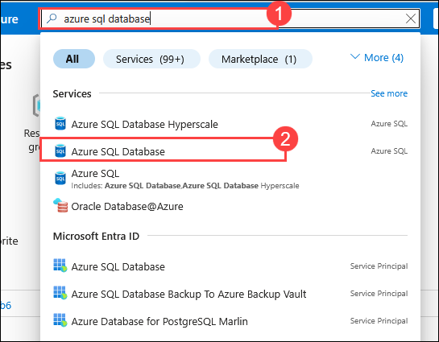

1. On the **SQL databases** page, under the list of databases, click on **truck_dashboard_db (smartcity-sqlserver-<inject key="DeploymentID" enableCopy="false" />)** to open the database overview page.

     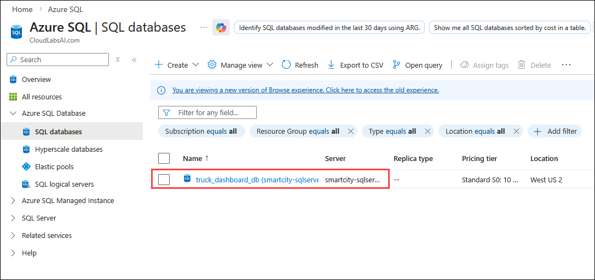

1. On the **truck_dashboard_db** page, select **Query Editor (1)** from the left navigation pane and click on **Classic experience (2)**.

    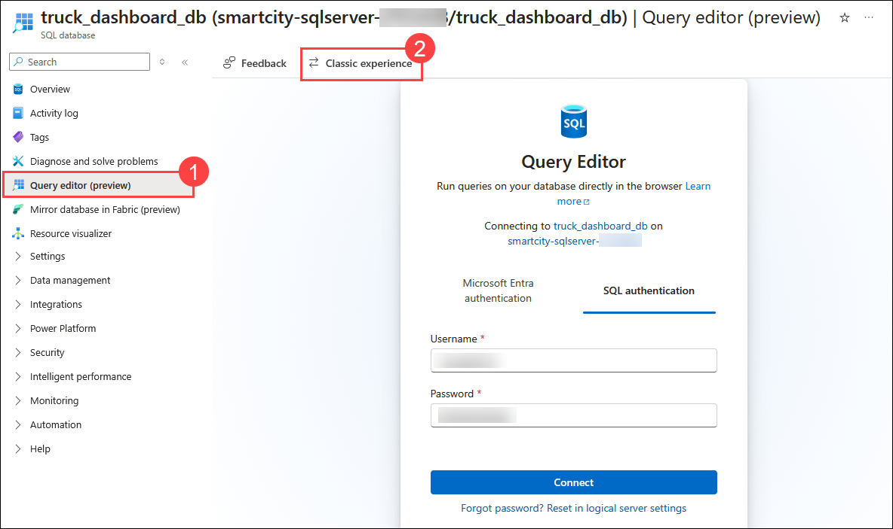

1. On the **truck_dashboard_db** page, enter the following login credentials: 
    - **Login:** **<inject key="SQL Admin Login" enableCopy="false" /> (2)**
    - **Password:** **<inject key="SQL Admin Password" enableCopy="false" /> (3)** 
    - Click **OK (4)**

        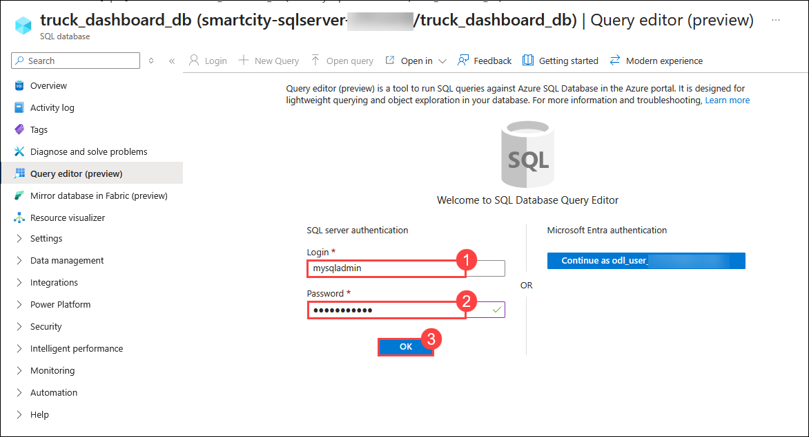

1. Click on **Tables (1)** from the left folder's pane, there will be two tables, **cargo_data (2)** and **route_data (3)**. Expand both of the tables and check the rows present.

    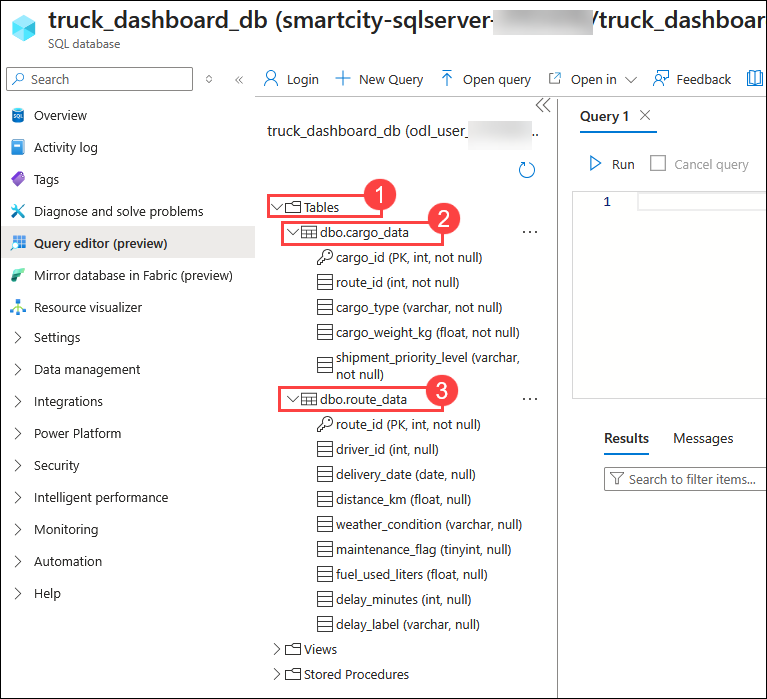

1. In the Query Editor, type the SQL query provided below **(1)**, click **Run (2)** to execute it, and review the output in the **Results (3)** pane.

    ```sql
    SELECT * FROM route_data;
    ```

     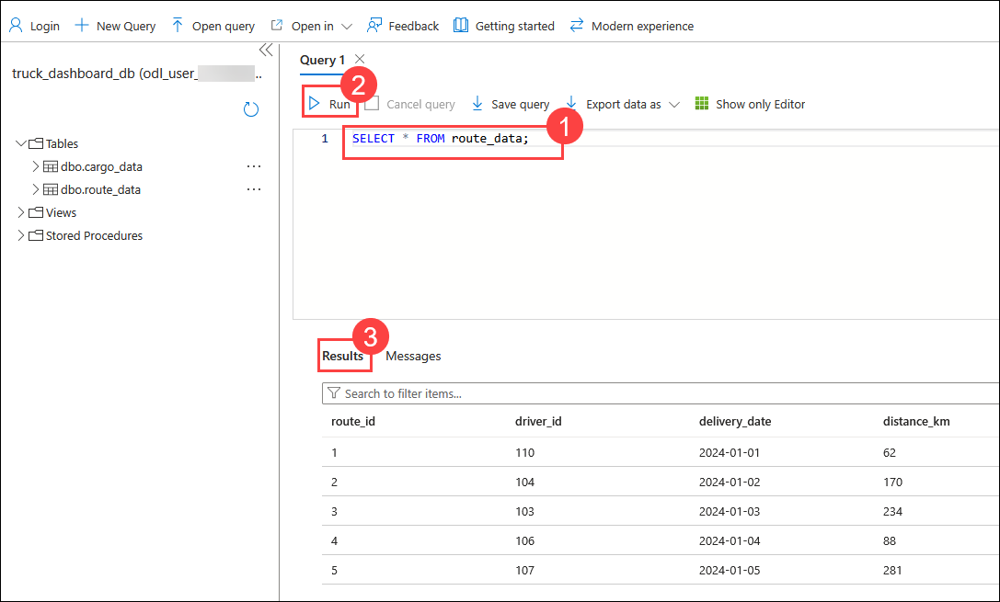

1. In the Query Editor, type the SQL query provided below **(1)**, click **Run (2)** to execute it, and review the output in the **Results (3)** pane.

    ```sql
    SELECT weather_condition, COUNT(*)
    FROM route_data
    GROUP BY weather_condition;
    ```

     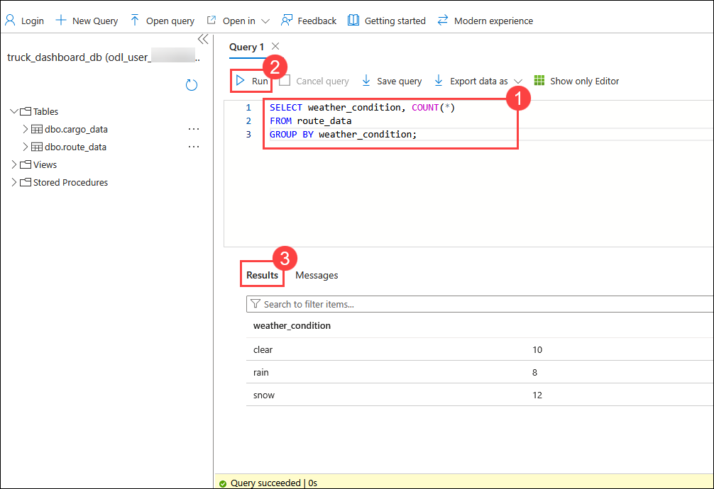

1. In the Query Editor, type the SQL query provided below **(1)**, click **Run (2)** to execute it, and review the output in the **Results (3)** pane.

    ```sql
    SELECT delay_label, COUNT(*)
    FROM route_data
    GROUP BY delay_label;
    ```

     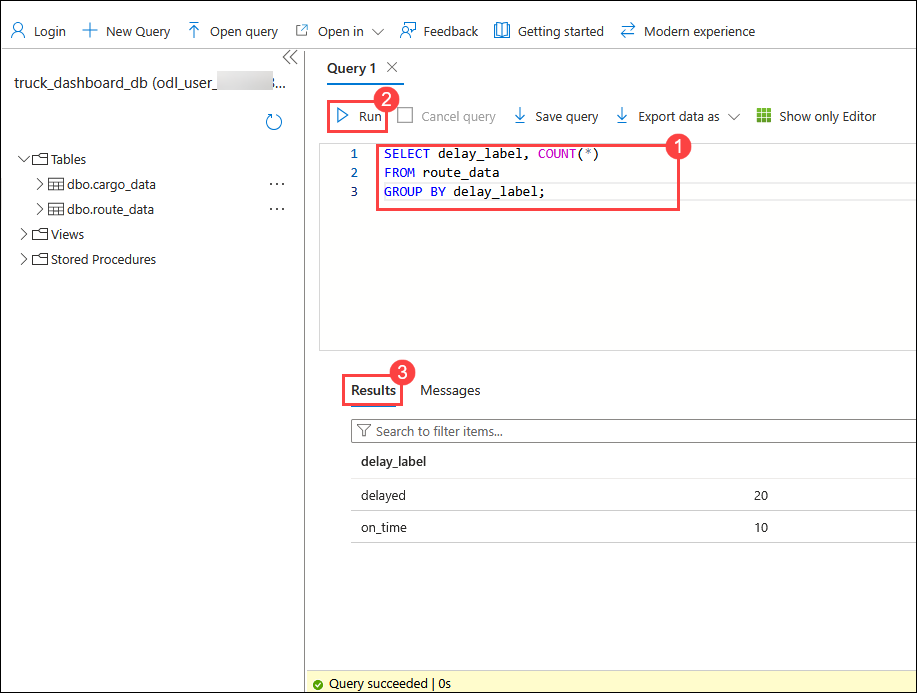

1. In the Query Editor, type the SQL query provided below **(1)**, click **Run (2)** to execute it, and review the output in the **Results (3)** pane.

    ```sql
    SELECT route_id, distance_km, delay_minutes
    FROM route_data
    ORDER BY distance_km DESC;
    ```

     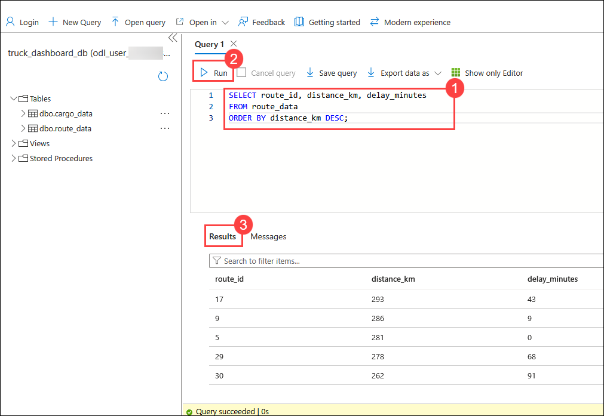

1. In the Query Editor, type the SQL query provided below **(1)**, click **Run (2)** to execute it, and review the output in the **Results (3)** pane.

    ```sql
    SELECT r.route_id, r.delay_minutes, r.delay_label,
       c.cargo_type, c.cargo_weight_kg, c.shipment_priority_level
    FROM route_data r
    JOIN cargo_data c ON r.route_id = c.route_id;
    ```

     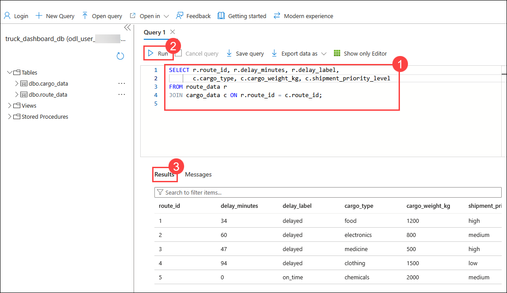

1. In the Query Editor, type the SQL query provided below **(1)**, click **Run (2)** to execute it, and review the output in the **Results (3)** pane.

    ```sql
    SELECT c.cargo_type, AVG(r.delay_minutes) AS avg_delay
    FROM route_data r
    JOIN cargo_data c ON r.route_id = c.route_id
    GROUP BY c.cargo_type;
    ```

     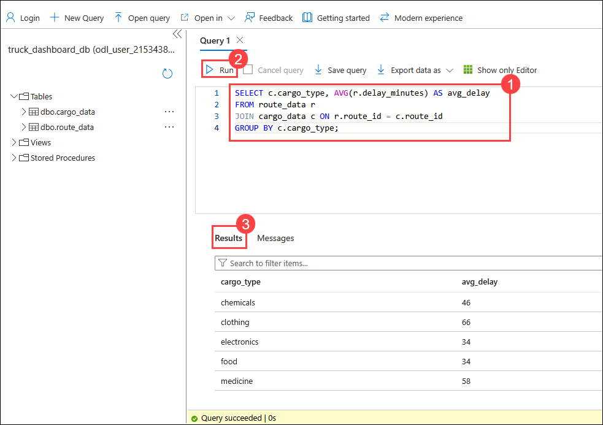

1. In the Query Editor, type the SQL query provided below **(1)**, click **Run (2)** to execute it, and review the output in the **Results (3)** pane.

    ```sql
    SELECT c.cargo_weight_kg, r.delay_minutes
    FROM route_data r
    JOIN cargo_data c ON r.route_id = c.route_id
    ORDER BY c.cargo_weight_kg DESC;
    ```

     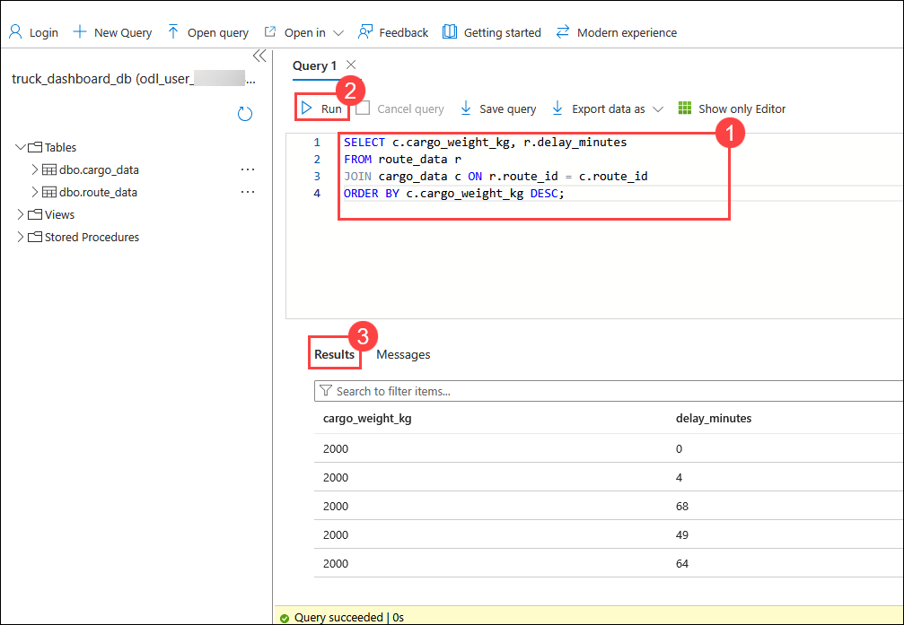

1. In the Query Editor, type the SQL query provided below **(1)**, click **Run (2)** to execute it, and review the output in the **Results (3)** pane.

    ```sql
    SELECT c.shipment_priority_level, AVG(r.delay_minutes) AS avg_delay
    FROM route_data r
    JOIN cargo_data c ON r.route_id = c.route_id
    GROUP BY c.shipment_priority_level;
    ```

     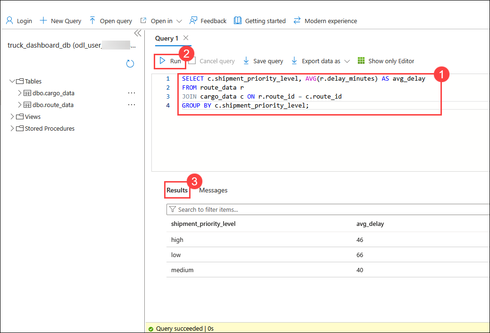

1. Enter the SQL query provided below **(1)**, click **Run (2)** to execute it, and review the output in the **Results (3)** pane.

    ```sql
    SELECT r.weather_condition, c.cargo_type, AVG(r.delay_minutes) AS avg_delay
    FROM route_data r
    JOIN cargo_data c ON r.route_id = c.route_id
    GROUP BY r.weather_condition, c.cargo_type;
    ```

     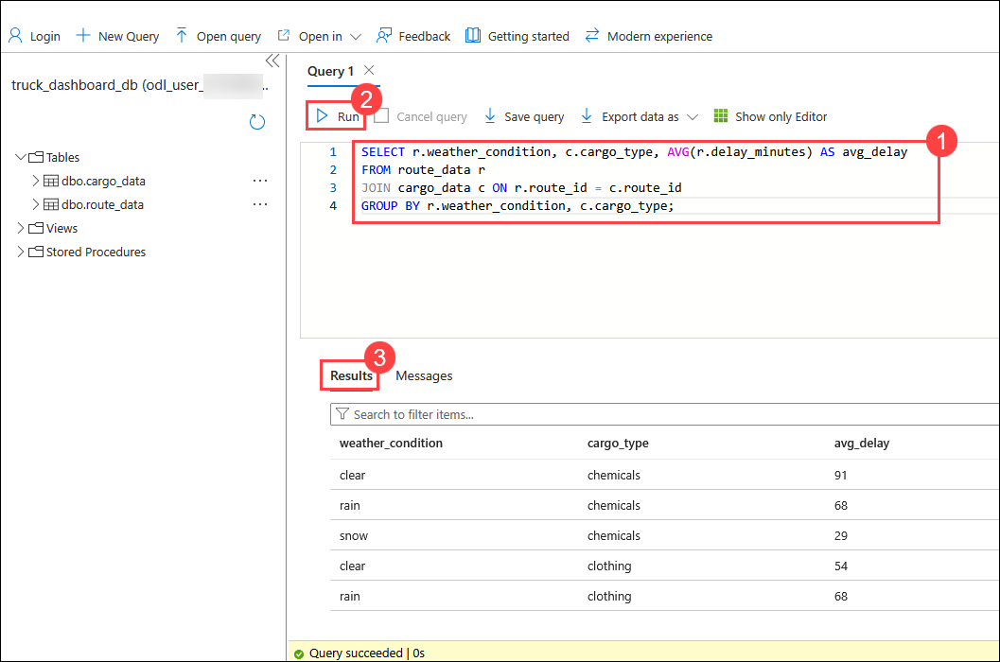

## Summary

In this lab, 

### Congratulations, you’ve successfully completed the hands-on lab!