# Lesson 08: Introduction to Computer Vision

### Estimated Timing: 60 Minutes

## Lab Overview

In this hands-on lab, you will use Azure AI Custom Vision to build an image classification model that identifies different traffic conditions from highway CCTV images. You will create and configure Custom Vision resources, upload and tag training images, train a multiclass classification model, and evaluate its performance by testing it with new traffic images. This process demonstrates how AI can be used to automatically classify visual data and support traffic monitoring scenarios.

## Lab Objectives

In this lab, you will be able to complete the following tasks:

- Task 1: Create a Custom Vision resource
- Task 2: Creating a New Project in Custom Vision
- Task 3: Upload and Tag Images
- Task 4: Training the Model
- Task 5: Test the Model with New Images

## Task 1: Create a Custom Vision resource

In this task, you will create Azure AI Custom Vision training and prediction resources in Azure. These resources provide the infrastructure required to build, train, and test image classification models.

1. On the **Azure portal**, search for **Custom vision (1)** and selct **Custom vision (2)**.

    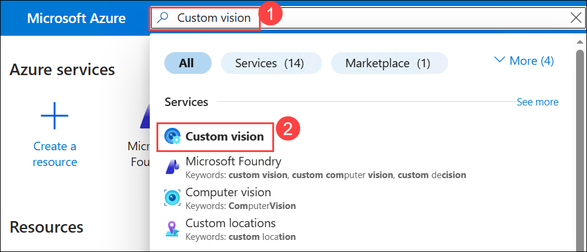 

1. On **Microsoft Foundry | Custom vision** blade, click on **+ Create**.

   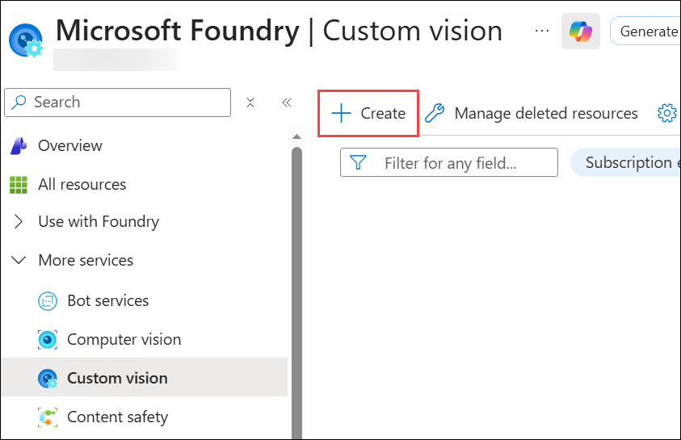 

1. On the **Create Custom Vision** page, provide the following details and then **Review + Create (8)**.

   - Create Options: **Both (1)** 
 
   - Subscription: Leave the deafult one **(2)**
   
   - Resource group: Select **SREB-U3-Lab7 (3)**
   
   - Region: **<inject key="Region" enableCopy="false"/>** **(4)**
   
   - Name: Enter **traffic-cv-demo-<inject key="DeploymentID" enableCopy="false"/> (5)**
   
   - Training pricing tier: Select **Free F0** (2 Transactions per second, 2 Projects) **(6)**
   
   - Prediction pricing tier: Select **Free F0 (7)** 

     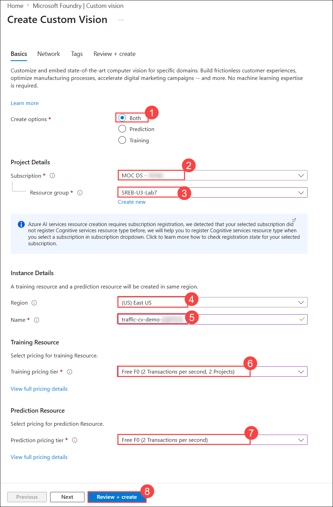

1. On the **Review + create** tab, click **Create** to provision the resource.

   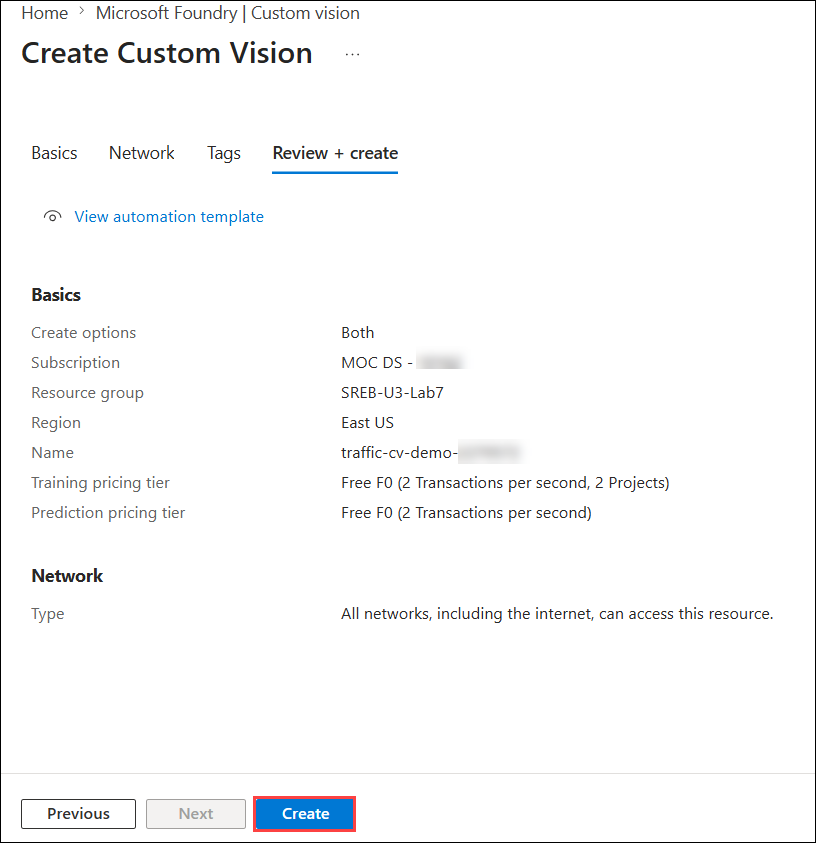 

1. Wait for the deployment to complete.

   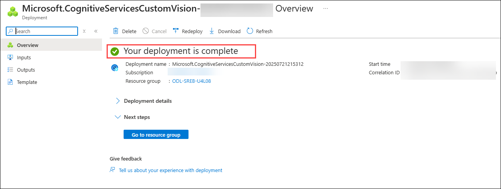 

> **Congratulations** on completing the task! Now, it's time to validate it. Here are the steps:
>
> - Hit the Validate button for the corresponding task. If you receive a success message, you can proceed to the next task.
> - If not, carefully read the error message and retry the step, following the instructions in the lab guide.
> - If you need any assistance, please contact us at cloudlabs-support@spektrasystems.com. We are available 24/7 to help.

<validation step="" />

---   

## Task 2: Creating a New Project in Custom Vision

In this task, you will sign in to the Custom Vision portal and create a new image classification project. You will configure the project settings, select the appropriate classification type and domain, and prepare the environment for model training.

1. Login to **Custom Vision portal** by copy and paste the following link [Custom Vision portal](https://customvision.ai/) in the new tab of the LabVM browser.

     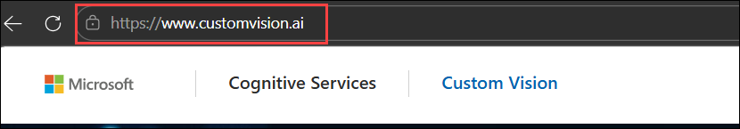

1. Click on **Sign in**.

   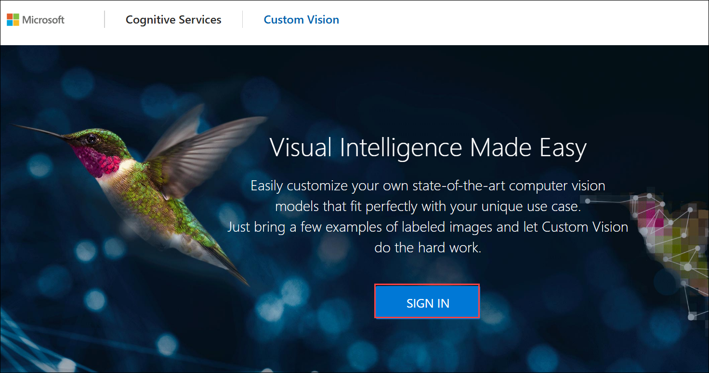 

1. If prompted, login with the below credentials:

    - **Email/Username:** <inject key="AzureAdUserEmail"></inject>

    - **Password:** <inject key="AzureAdUserPassword"></inject>

1. Select the Terms of Service checkbox **(1)**  and then click on **I Agree (2)**.

   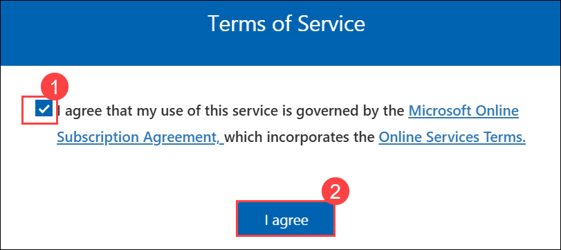 

1. On the **Projects** page, click **+ NEW PROJECT** to create your first project.

   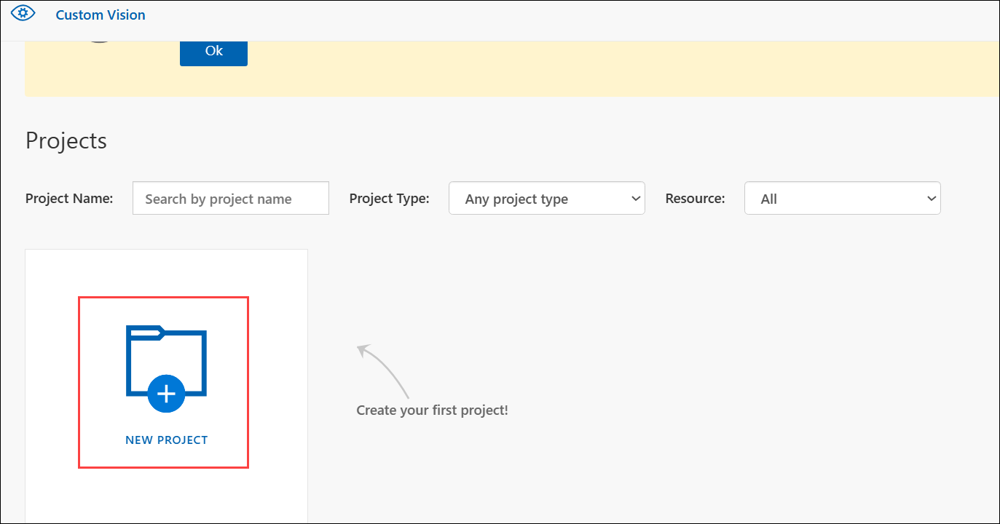 

1. On the **Create New Project** page, provide the following details:

    - Name: Enter **Traffic Congestion Classifier (1)**
    - Description: **Classifies highway CCTV images as free_flow, congested or highway_traffic (2)**
    - Resource: **trafficcvdemo<inject key="DeploymentID" enableCopy="false"/> [F0] (3)**
    - Project Types: Ensure **Classification** is selected (not Object Detection), as 
you're identifying overall labels for entire images **(4)**
    - Classification Types: Choose **Multiclass** (Single tag per image) because each image belongs to only one category: either Defect or Non-Defective **(5)**

   - Domains: Choose **General (compact) (6)**

    - Then select **Create project (7)**

      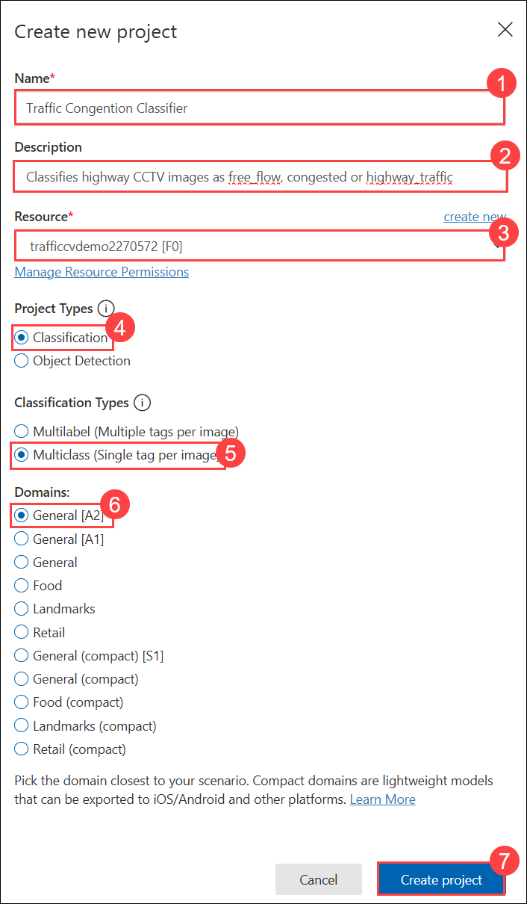 

1. Wait for the project to be created and opened in the browser.

> **Congratulations** on completing the task! Now, it's time to validate it. Here are the steps:
>
> - Hit the Validate button for the corresponding task. If you receive a success message, you can proceed to the next task.
> - If not, carefully read the error message and retry the step, following the instructions in the lab guide.
> - If you need any assistance, please contact us at cloudlabs-support@spektrasystems.com. We are available 24/7 to help.

<validation step="" />

---      

## Task 3: Upload and Tag Images

In this task, you will upload traffic images representing different traffic conditions and assign classification tags to each image set. Proper tagging enables the model to learn the visual characteristics associated with each traffic category.

1. In the Custom Vision portal, click on the **Add Images** button.

    

1. In the **Open** window, navigate to the `C:\AllFiles\Unit 3-Lesson 7-Introduction to Computer Vision\traffic_dataset\free_flow` **(1)** folder. Click on one image and press **Ctrl+A** to select all the images **(2)** and then **Open (3)**.   

1. In the **Image upload** dialog, enter **free_flow (1)** in the **My Tags** field, and then click **Upload 20 files (2)**.

    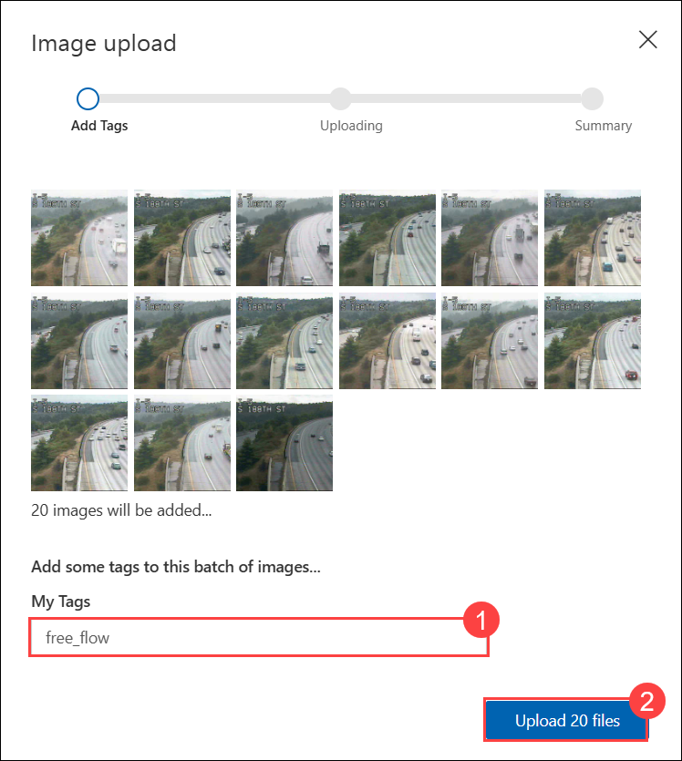

1. After the upload completes, verify that the message **20 images uploaded successfully** is displayed, and then click **Done**.

    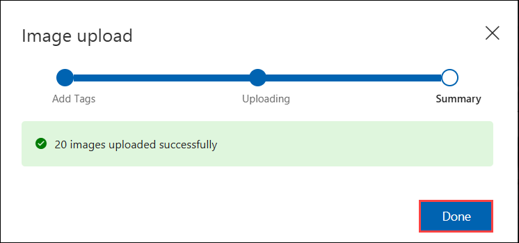

1. On the **Training Images** page, click **Add images** to upload a new set of traffic images representing congested traffic conditions.

    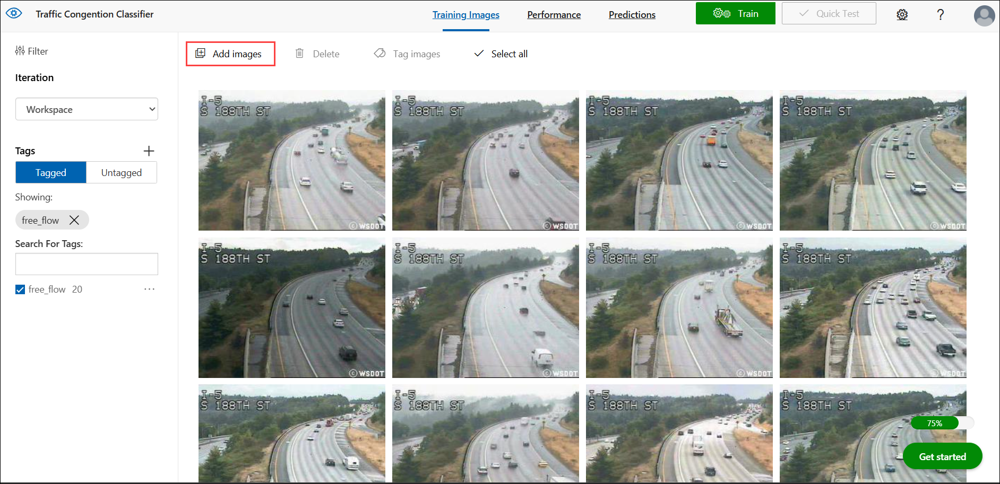

1. In the **Open** window, navigate to the `C:\AllFiles\Unit 3-Lesson 7-Introduction to Computer Vision\traffic_dataset\congested` **(1)** folder. Click on one image and press **Ctrl+A** to select all the images **(2)** and then **Open (3)**.   

1. In the **Image upload** dialog, enter **congested (1)** in the **My Tags** field, and then click **Upload 20 files (2)**.

    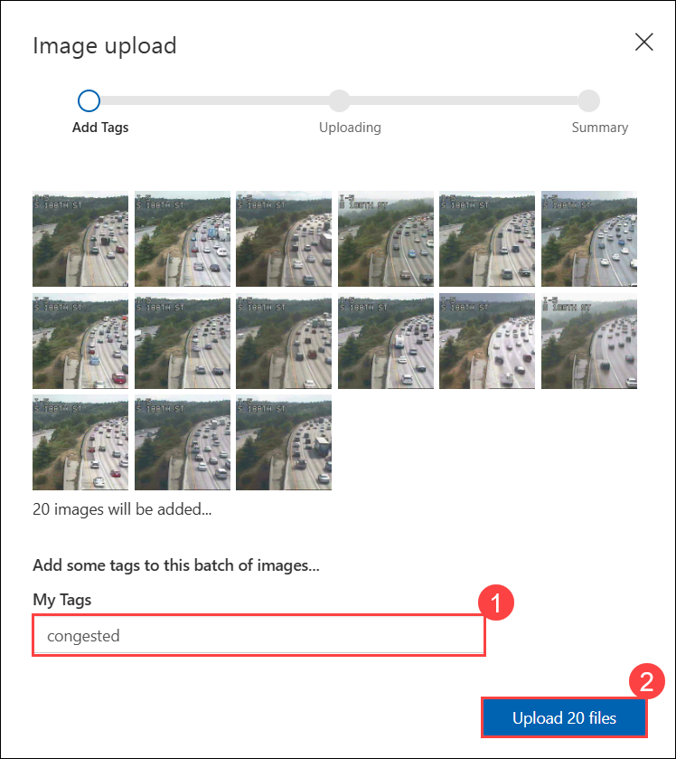

1. After the upload completes, verify that the message **20 images uploaded successfully** is displayed, and then click **Done**.

    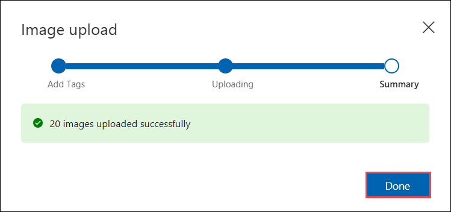

1. On the **Training Images** page, click **Add images** to upload another set of traffic images that represent heavy traffic conditions.

    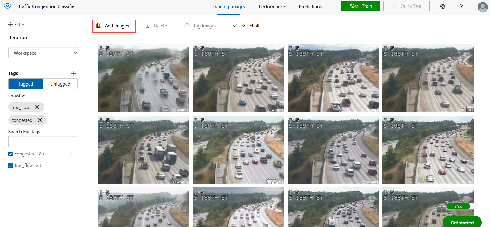

1. In the **Open** window, navigate to the `C:\AllFiles\Unit 3-Lesson 7-Introduction to Computer Vision\traffic_dataset\heavy_traffic` **(1)** folder. Click on one image and press **Ctrl+A** to select all the images **(2)** and then **Open (3)**.   

1. In the **Image upload** dialog, enter **heavy_traffic (1)** in the **My Tags** field, and then click **Upload 20 files (2)**.

    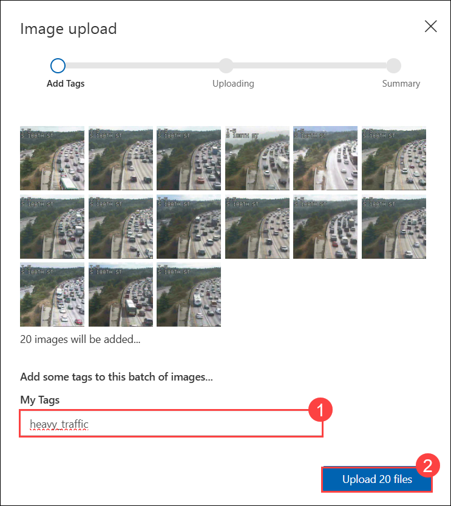

1. After the upload completes, confirm that the message **20 images uploaded successfully** is displayed, and then click **Done**.

    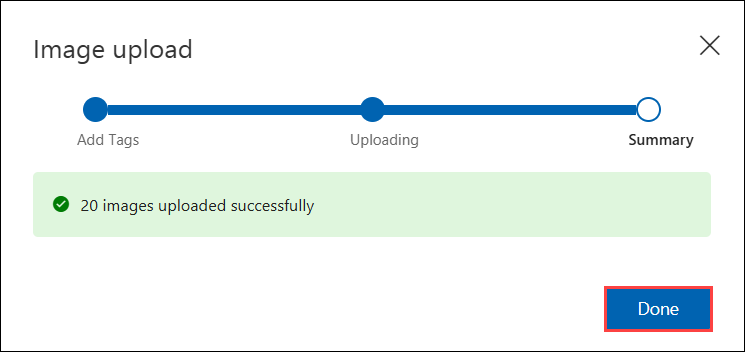

## Task 4: Training the Model

In this task, you will train the Traffic Congestion Classifier using tagged traffic images and evaluate its performance using model metrics, then test the trained model with new images to verify its ability to accurately classify different traffic conditions.

1. Verify that all three image tags (**free_flow**, **congested**, and **heavy_traffic**) **(1)** are available and contain 20 images each. Then, click **Train (2)** to start training the Traffic Congestion Classifier model.

    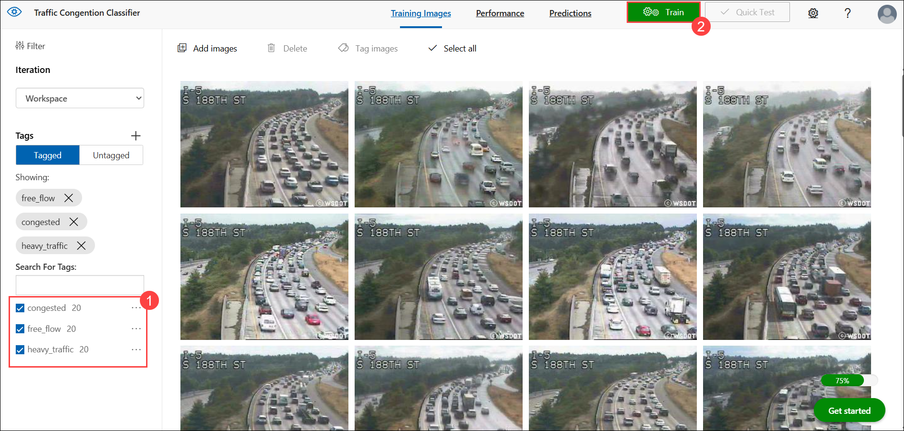

1. In the **Choose Training Type** dialog, select **Quick Training (1)**, and then click **Train (2)**.

    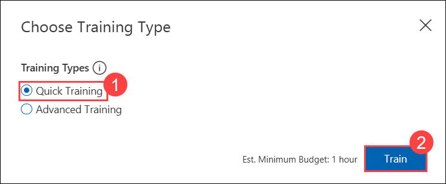

1. Wait for the training process to complete. During training, the iteration status displays **Training**.

    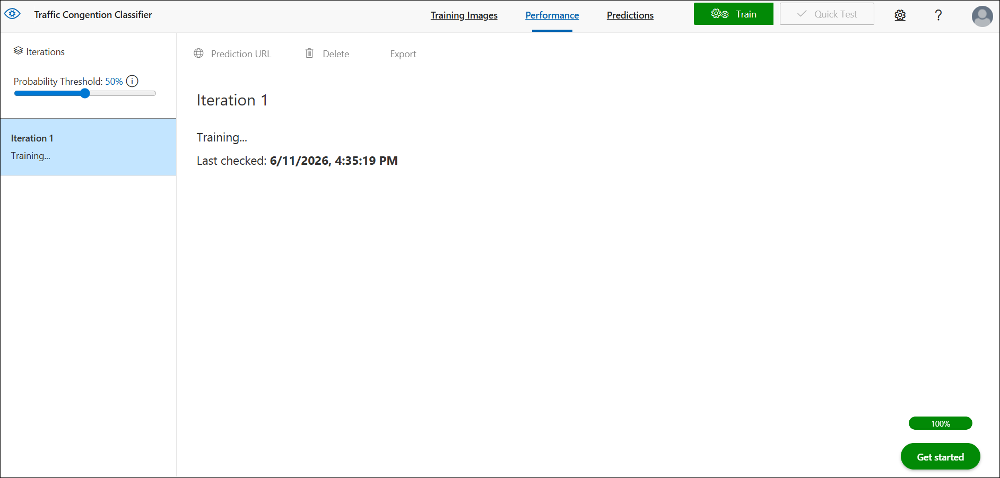

    > **Note:** Model training can take **5–8 minutes** to complete. Wait until the training finishes before continuing with the lab.

1. After training completes, review the model performance metrics, including **Precision**, **Recall**, and **Average Precision (AP)**, on the **Performance** page.

    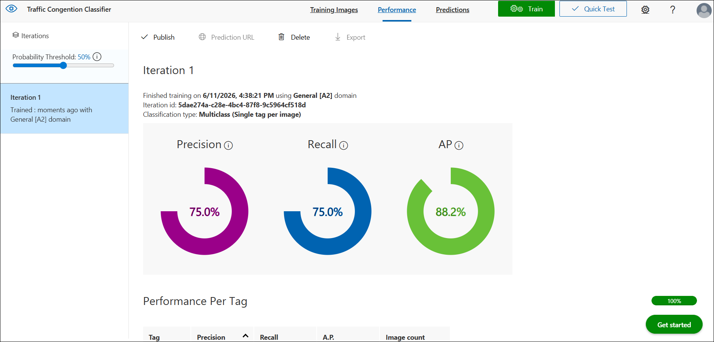

1. Review the model performance metrics and confirm that the classifier has been successfully trained. Then, click **Quick Test** to test the model with a new traffic image.

    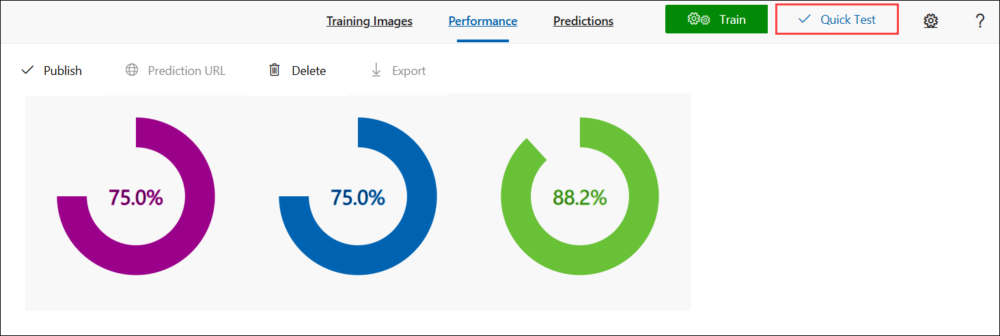

1. In the **Quick Test** panel, click **Browse local files** and select a traffic image that was not used during training.

    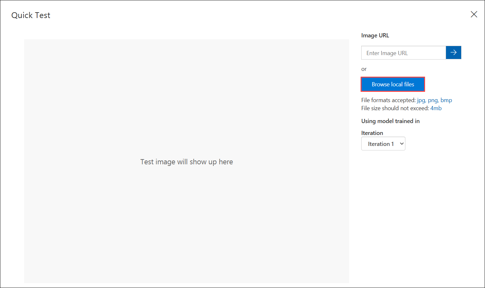

1. In the **Open** window, navigate to the `C:\AllFiles\Unit 3-Lesson 7-Introduction to Computer Vision\traffic_dataset\test` **(1)** folder. Click on one image and press **Ctrl+A** to select all the images **(2)** and then **Open (3)**.   

1. Wait for the model to analyze the image and generate predictions.

1. Review the prediction results displayed under **Predictions**, including the predicted tag and confidence scores for each traffic category.

    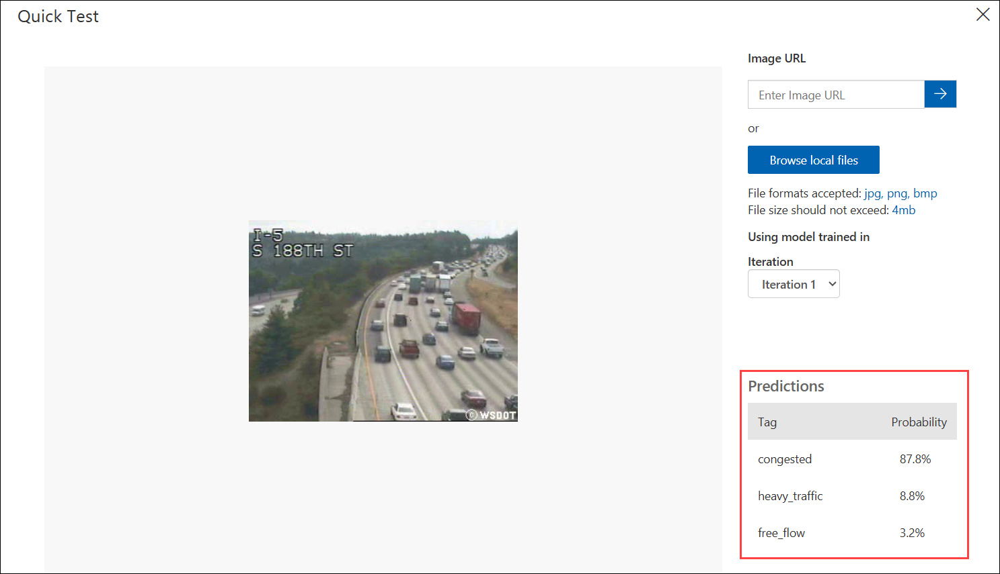

## Summary

In this lab, you used Azure AI Custom Vision to create an image classification solution for traffic congestion detection. You provisioned Custom Vision resources, created a classification project, uploaded and tagged traffic images, trained a multiclass model, and evaluated its performance using new test images. The completed solution demonstrates how machine learning can be applied to automatically classify traffic conditions from images and support intelligent traffic monitoring systems.

## You have successfully completed the lab

     