# Lesson 05: Spot Robot OCR & Predictive Maintenance

### Estimated Timing: 60 Minutes

## Lab overview

In this lab,

## Lab objectives

In this exercise, you will perform the following tasks:

- Task 1: Running the End-to-End Predictive Maintenance Pipeline

## Task 1: Running the End-to-End Predictive Maintenance Pipeline

In this task,

1. Open the link below in your browser to access **Azure Machine Learning Studio**:

    ```
    https://ml.azure.com/
    ```

1. If prompted to sign in, enter your credentials.
 
   - **Email/Username:** <inject key="AzureAdUserEmail"></inject>
 
     .png)
 
   - **Password:** <inject key="AzureAdUserPassword"></inject>
 
     .png)
 
1. If prompted to stay signed in, you can click **No**.

   .png)

1. From the left navigation pane, select **Workspaces (1)** and then click on workspace **Manufacturing (2)**.

    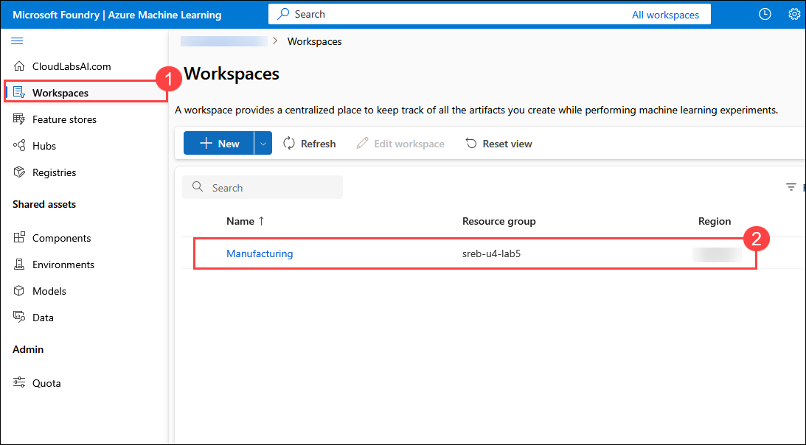

1. Select **Compute (1)** from left navigation pane and select **TestComputeMg<inject key="Deployment ID" enableCopy="false"/>** **(2)**

    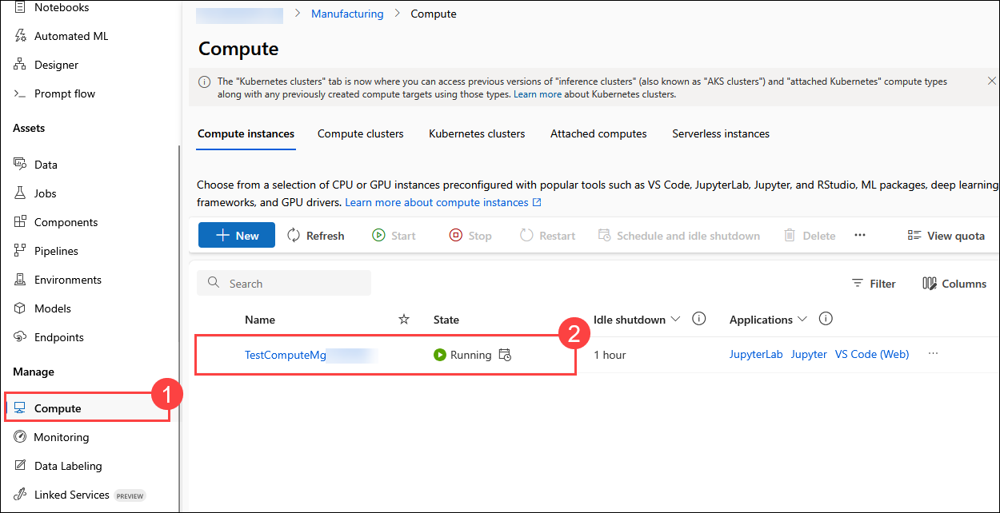

1. In the compute instance details page, under **Applications**, select **VS Code (Web)**. This opens a browser-based version of Visual Studio Code connected directly to this compute instance.

    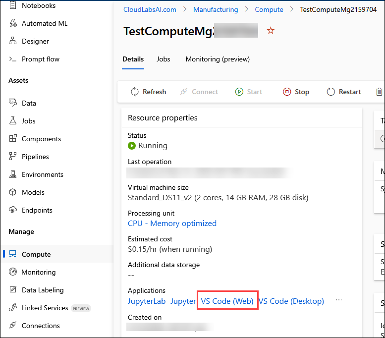

1. An important note window will show up, select check box of **Yes, I understand (1)** and click on **Continue (2)**.

    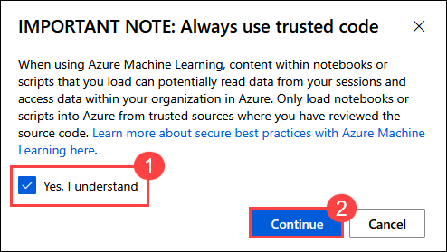

1. The browser-based version of Visual Studio Code will open and displays a pop-up to sign in using the provided credentials. Click on **Allow**.

    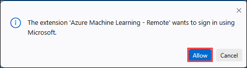

1. If prompted to sign in, enter your credentials.
 
   - **Email/Username:** <inject key="AzureAdUserEmail"></inject>
 
     .png)
 
   - **Password:** <inject key="AzureAdUserPassword"></inject>
 
     .png)

1. After signing in, another pop-up window appears whether to trust the author of the files in this folder. Click on the **checkbox** to trust author and click on **Yes, I trust the authors**.

    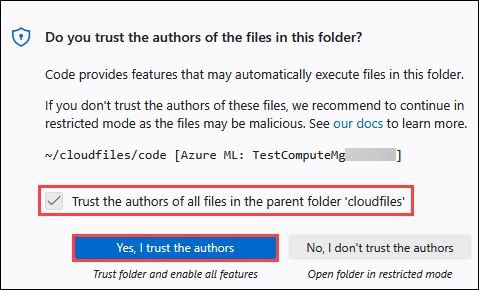

1. From the left pane in the explorer section, right click on **Users/odl_user_<inject key="Deployment ID" enableCopy="false"/>** **(1)** folder and select **Upload... (2)** from the list.

    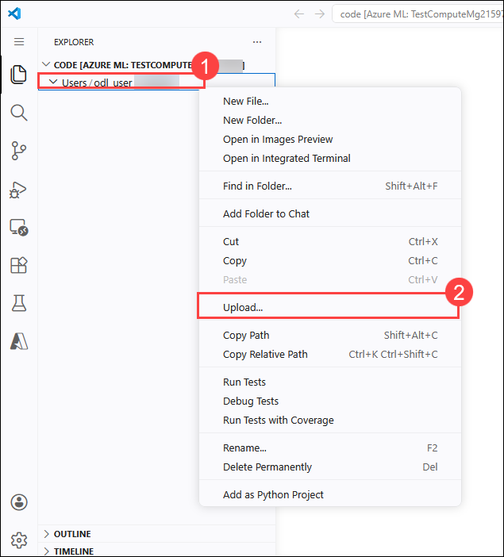

1. Navigate to **C:\AllFiles (1)** folder, select **Manufacturing (2)** zip file and click on **Open (3)**.

    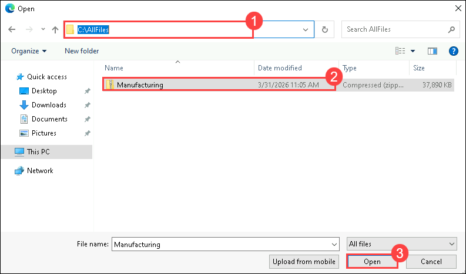

1. Click on **hamburger menu (1)** from left pane, select **Terminal (2)** from the list and select **New Terminal (3)**.

    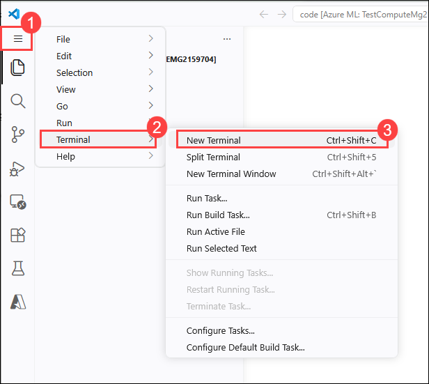

1. In the terminal, run the below provided commands one after another.

    ```
    cd /home/azureuser/cloudfiles/code/Users/odl_user_<inject key="Deployment ID" enableCopy="false"/>
    ```

    ```
    unzip Manufacturing.zip
    ```

    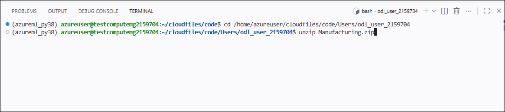

1. Wait for the zip file to get extracted and after extracting, a new folder with name **Manufacturing** will be created with several files present which will be used for this experiment.

    > **Note:** Please wait for 10-15 minutes for the zip file to get extracted.

    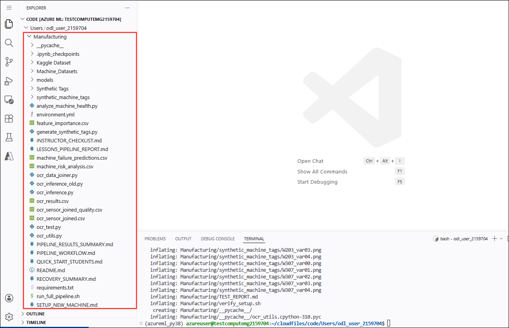

1. Next, in the terminal run the below commands one after another. Here, we are navigating to Manufacturing folder and running **student_labs.sh** file which runs the entire pipeline in a guided-only mode. You are not expected to modify code during this step. The goal is to observe how the pipeline executes and understand how the different components connect.

    ```
    cd Manufacturing\
    ```

    ```
    bash student_lab.sh
    ```

    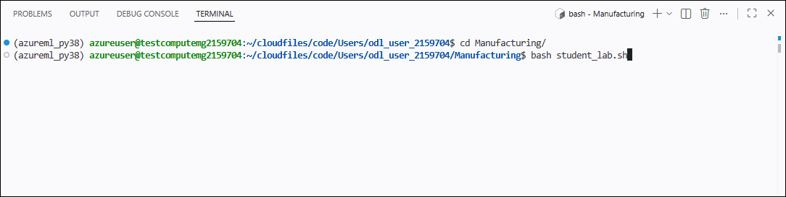

1. In the terminal when prompted, press **ENTER** to allow the pipeline to start.

    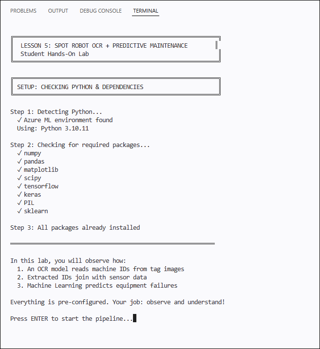

### Understanding the Data Inventory Summary

1. This screen shows a summary of all the data sources and models that the pipeline will use before any predictions are made. Think of this as a checklist that confirms everything needed for the analysis is available and ready.

    - **Kaggle Dataset (OCR Training Data)**
        - You are shown the location of the OCR training dataset inside the project workspace. This dataset contains 20,629 labeled character images representing digits (0–9) and letters (A–Z). These images were used earlier to train the OCR model so it can recognize individual characters on machine tags.
    - **Pre-trained OCR Model**
        - The pipeline confirms which OCR model will be used and where it is stored. The model file models/char_cnn_augmented.h5 is already trained and ready to run. The accuracy shown reflects how well the model performed on test images during training. You are not retraining the model here—you are applying it to new images.
    - **Synthetic Machine Tags**
        - This section lists the folder containing simulated machine tag images. Each machine ID (such as M101 or A215) has multiple tag images created with different fonts, sizes, and lighting conditions. This simulates how a robot might see tags differently in real factory environments.
    - **Sensor Data**
        - The pipeline confirms the location of the sensor dataset that will be joined with OCR results. This file contains time-series sensor readings for each machine, collected over a two-hour window. These readings include temperature, vibration, pressure, acoustic signals, battery level, WiFi strength, and LiDAR data.
    - When you press **ENTER**, the pipeline will move from data verification into actually running OCR on the tag images.    

    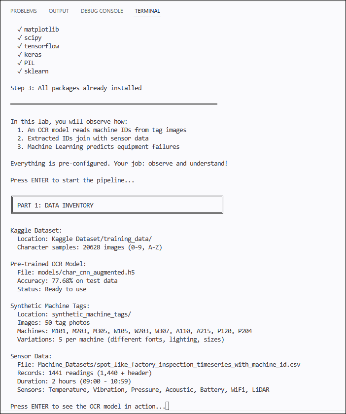

### OCR Pipeline in Action: Reading Machine IDs from Tag Images

1. This screen shows the OCR pipeline actively running on the synthetic machine tag images. At this stage, the system is no longer preparing data—it is using the trained OCR model to extract machine IDs from images, just like a real inspection robot would.

    -   What the pipeline is doing
        - The OCR inference process starts by loading the trained character recognition model.
        - The model recognizes individual characters (letters and numbers) and combines them to form machine IDs.
        - All 50 synthetic tag images are processed automatically from the synthetic_machine_tags folder.
    - Understanding the OCR setup
        - The pipeline confirms the full set of character labels it can recognize (0–9 and A–Z).
        - Each character prediction is made independently, then assembled into a machine ID.
        - Fuzzy matching is applied to handle small visual variations in fonts, spacing, and lighting.
    - How to read the accuracy results
        - Overall accuracy shows how many tag images were successfully matched to the correct machine ID.
        - Direct matches mean the OCR read the full machine ID exactly as expected.
        - Fuzzy matches mean the OCR output was close enough to be confidently mapped to the correct machine.
        - Failed matches represent cases where the tag image could not be reliably interpreted.
    - Why this step matters
        This is the critical bridge between images and data. Without correctly identifying machine IDs:
        - Sensor data cannot be linked to the correct machine.
        - Failure prediction becomes impossible.
        - Maintenance decisions would be based on incomplete information.
    - What happens next
        - The extracted machine IDs are saved to a file called ocr_results.csv. This file will be used in the next stage to join OCR results with sensor readings, allowing machine health and failure risk to be analyzed.
    -  Press **ENTER** to continue further continue pipeline.   
    
    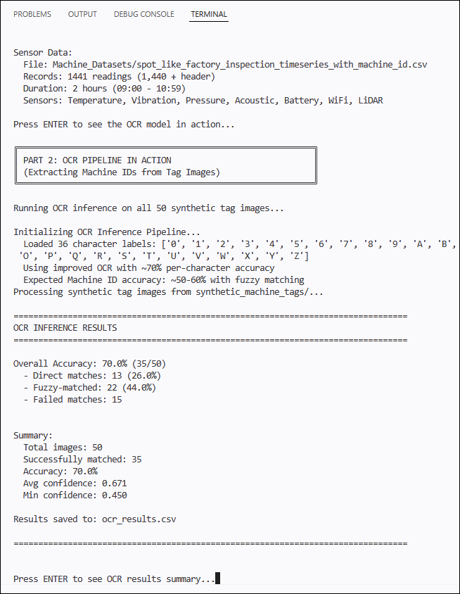

### Analyzing OCR Results: Which Machines Were Identified

1. This screen shows the analysis of the OCR results after machine IDs have been extracted from the tag images. At this point, the system has finished reading the images and is summarizing what it recognized.

    - What this table represents
        -	Each row corresponds to a synthetic tag image processed by the OCR model.
        -	The table compares what the model predicted versus what the expected machine ID was for that image.
        -	Only the first few results are displayed here; the full output is saved in ocr_results.csv.
    - Key columns you should understand
        -	filename: The image file that was analyzed.
        -	predicted_machine_id: The machine ID read by the OCR model.
        -	expected_machine_id: The correct machine ID for that image.
        -	match: Indicates whether the OCR result was considered a successful match.
        -	match_type: Shows whether the match was exact or achieved using fuzzy matching.
        -	avg_confidence / min_confidence: Confidence scores that reflect how sure the model was about its predictions.
    - Summary metrics explained
        - Unique Machine IDs detected shows how many different machines were successfully identified.
        - Average confidence gives an overall sense of how reliable the OCR predictions were.
        - Processed images confirm that all synthetic tag images were analyzed.
    - Machine ID distribution
        - The list of machine IDs and image counts shows how often each machine appeared in the tag images.
        - This matters because machines with more detected tags will later have more sensor data linked to them.
        - Uneven counts can affect how confidently failure risk is estimated for each machine.
    - Why this step matters
        - This step verifies that machine IDs have been successfully extracted and organized. From this point forward:
        - Each detected machine ID becomes a key for joining OCR results with sensor data.
        - The quality of this step directly impacts the accuracy of predictive maintenance decisions.
        - You are now ready to connect visual inspection data with real machine performance metrics.
    -  Press **ENTER** to continue further continue pipeline. 


    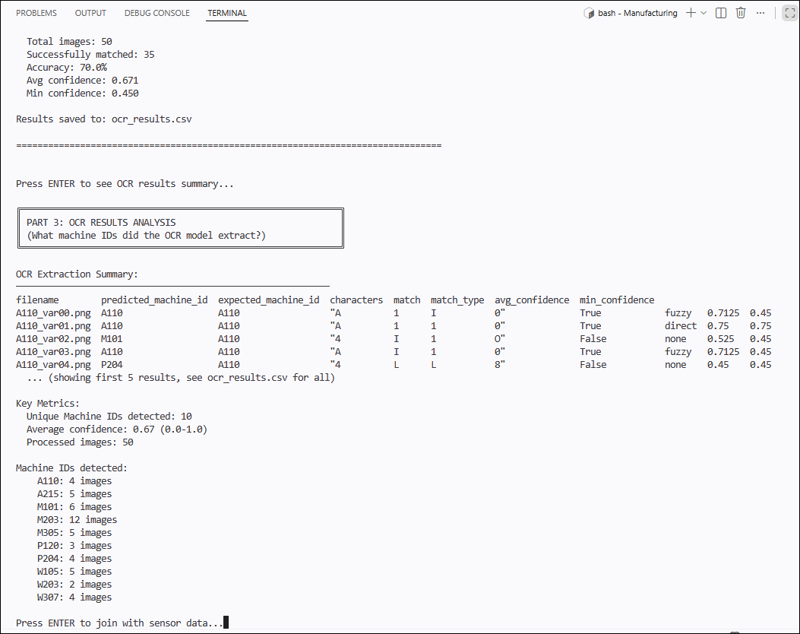

### Joining OCR Results with Sensor Data

1. This screen shows the step where machine IDs extracted from images are connected to real sensor measurements. At this point, visual data (OCR output) and operational data (sensor readings) are brought together into a single dataset.

    - What is happening in this step
        -	The system loads the OCR results, which contain machine IDs extracted from tag images.
        -	It then loads the sensor dataset containing 1,440 time-series records collected by the robot.
        -	Both datasets are joined using the machine ID as the common key.
    - Understanding the OCR quality check
        - The pipeline first checks whether OCR predictions are valid.
        - All 50 OCR predictions are valid, meaning every tag image produced a usable machine ID.
        - This confirms that the OCR output is safe to use for data integration.
    - What the join results tell you
        - 10 unique machine IDs were detected by OCR.
        - These IDs exactly match the 10 machine IDs present in the sensor dataset.
        - All 1,440 sensor records were successfully joined.
        - No sensor records were lost, and no machine IDs were missing.
    - Why this is important
        - This step proves that OCR is not just reading text—it is enabling data integration:
        - Without a machine ID, sensor data cannot be grouped or analyzed correctly.
        - With this join complete, every sensor reading now belongs to a specific machine.
        - This makes it possible to analyze machine behavior over time and detect risk patterns.
    - Saved outputs you should know
        - ocr_sensor_joined.csv: The combined dataset used for analysis and modeling.
        - ocr_sensor_joined_quality.csv: A quality report showing how reliable the join was.
    - Sample joined data
        - The preview at the bottom shows:
            1.	Timestamped sensor readings
            1.	The associated machine ID
            1.	Key sensor values such as vibration and temperature
            1.	An anomaly indicator
        - This confirms that machine identity + sensor behavior are now unified.
    - What comes next
        With this joined dataset, you are ready to analyze machine health and predict which machines are most likely to fail.
    -  Press **ENTER** to continue further continue pipeline.
        
    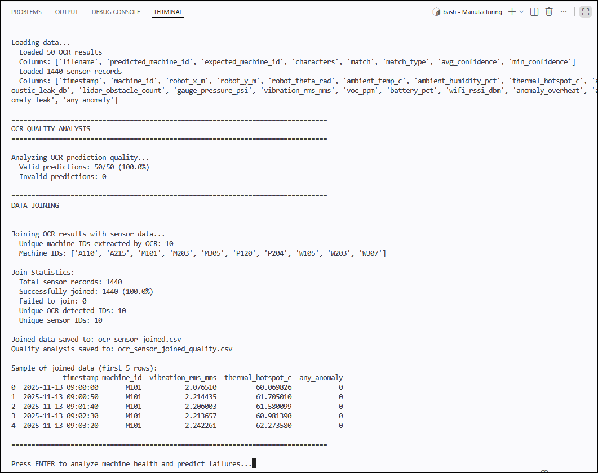

### Analyzing Machine Health and Predicting Failures

1. This screen shows the final and most important step of the pipeline—using machine learning to identify which machines are at the highest risk of failure.

    - At this stage, all earlier steps have already happened:
        - Machine IDs were read from tag images using OCR
        - Sensor data was successfully joined using those IDs
        - Each machine now has a complete set of sensor readings over time
    - Now, the system analyzes that data to support maintenance decisions.
    - What is happening in this step
        - The pipeline loads 1,440 sensor records collected over a two-hour inspection window.
        - A machine learning model evaluates sensor patterns such as vibration, temperature, and anomaly frequency.
        - Each machine is assigned a risk score and ranked from highest to lowest risk.
    - Understanding the machine risk rankings
        - Machines are listed from most critical to least critical.
        - Each machine shows:
            i.	A risk score
            ii.	The percentage of readings flagged as anomalies
            iii. How often high vibration and high temperature were detected
        - Machines labeled CRITICAL require immediate attention.
    - This ranking helps answer the question: **“If maintenance resources are limited, which machines should be checked first?”**
    - Why this is not just a list of numbers
        - The model does not simply flag individual sensor spikes.
        - It looks at patterns across time, combining multiple sensor signals.
        - This allows the system to identify machines that are consistently operating under risky conditions.
    - Training the failure prediction model
        - The model is trained using:
            i.	1,440 data samples
            ii.	10 sensor-based features
        - About two-thirds of the data represents abnormal operating conditions.
        - The performance metrics shown confirm that the model can clearly separate normal and anomalous behavior for this dataset.
    - How this supports real-world decisions
        -This output does not automatically shut down machines. Instead, it:
        1. Highlights risk
        1. Prioritizes inspections
        1. Supports human decision-making
        - Engineers and technicians still decide:
        1.	When to schedule maintenance
        1.	Whether to shut down equipment
        1.	How to reduce future risk
    - What you should take away
        - OCR enabled machine identification
        - Data integration enabled analysis
        - Machine learning enabled prediction
        - Humans remain responsible for action
    - This completes the full pipeline from robot image → AI analysis → maintenance insight.
    -  Press **ENTER** to continue further continue pipeline.    


    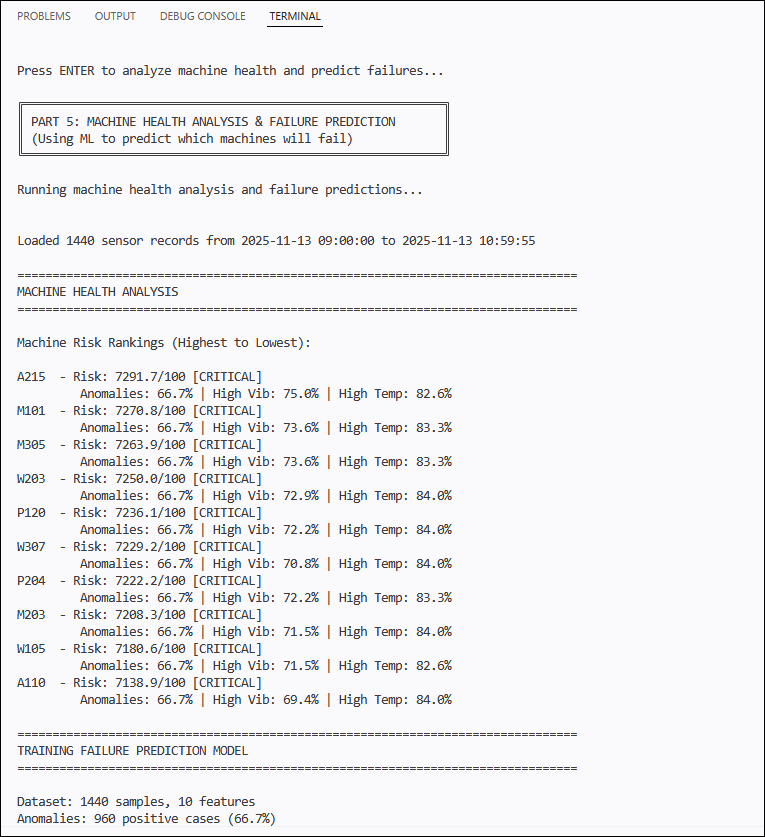

### Interpreting Feature Importance and Failure Risk

- At this stage, you are seeing how the machine learning model explains why certain machines are at higher risk of failure.

- The Top 5 Most Important Features section shows which sensor readings contributed the most to failure predictions. Features such as battery percentage, thermal hotspot temperature, pressure, and vibration appear at the top. This tells you that the model is not guessing randomly — it is learning from meaningful physical signals produced by the machines.

- This is important because predictive maintenance systems must be explainable. Engineers need to understand which signals are driving risk, not just the final prediction.


    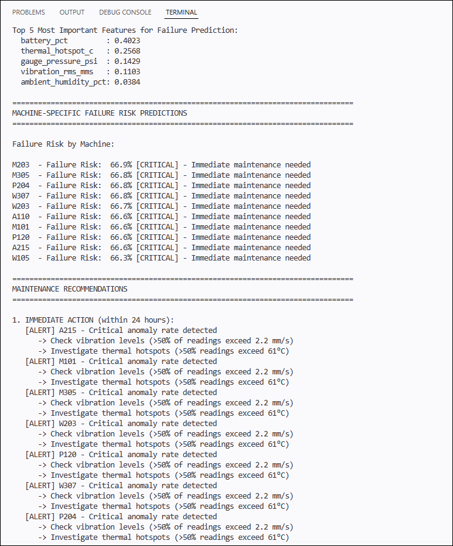

### Understanding Machine-Specific Failure Risk

- The Machine-Specific Failure Risk Predictions section lists each machine and its predicted failure risk level.

- Every machine is labeled with:
    - A failure risk percentage
    - A risk category (such as CRITICAL)
    - A recommended urgency level for action

- When you see many machines marked as CRITICAL, it indicates that the environment or operating conditions are stressing multiple systems at the same time. This reflects real industrial scenarios where problems often affect groups of machines, not just one.

### Maintenance Recommendations Generated by the System

- Next, the pipeline converts predictions into actionable maintenance guidance.

- You can see recommendations grouped into:
    - Immediate action (within 24 hours)
    - Scheduled maintenance (within 1 week)
    - Ongoing monitoring strategies

- These recommendations connect sensor thresholds (like excessive vibration or overheating) to specific inspection tasks. The system supports human decision-making by organizing complex data into clear priorities, highlighting which machines need attention first, and providing evidence-based reasoning (sensor patterns and risk scores) that maintenance teams can use to justify scheduling decisions, allocate resources, and plan interventions.

### Role of OCR in the Final Outcome

- The OCR Integration section confirms how accurately machine IDs were detected from tag images and how that accuracy affected the downstream analysis.
- You can see that:
    - OCR accuracy is high when fuzzy matching is applied
    - Machine IDs were successfully recovered for nearly all machines
    - Sensor readings could be reliably linked to the correct equipment
- This reinforces a key lesson: without accurate identification, even perfect sensor data cannot be used effectively.

### Reviewing the Saved Analysis Results

- At the end of the lab, the system saves multiple output files for you to review.

- These files allow you to inspect each stage of the pipeline:
    -  OCR extraction results
    -  Data join quality
    -  Machine risk rankings
    -  Failure probability predictions
    -  Feature importance analysis

- You are encouraged to open these CSV files to examine specific details such as which sensor readings contributed to each machine's risk score, how OCR accuracy affected data coverage, and whether the feature importance rankings align with the patterns you observed during the pipeline execution.

### Lab Completion Reflection

1. When you see LAB COMPLETE, it means you have successfully followed the entire workflow:
    - Machine tags were read using OCR
    - Extracted IDs were linked to sensor data
    - Machine health was analyzed
    - Failure risks were predicted
    - Maintenance actions were generated

    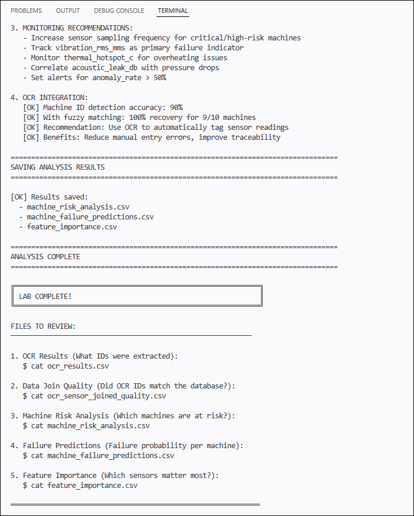

-   You are now thinking like an AI systems engineer — understanding how data flows, how models influence decisions, and how AI supports real-world maintenance planning.

## Summary

In this lab, 

### Congratulations, you’ve successfully completed the hands-on lab!