# Lab: Explore AI workloads

### Estimated timing: 60 Minutes

## Lab Overview

In this lab, you will explore common AI workloads through a browser-based application. You'll interact with a generative AI model, use AI agents with tools, and experience text analysis, computer vision, information extraction, and AI safety features. By the end of the lab, you'll understand how these AI capabilities work together to power modern AI applications.

## Lab Objectives

In this lab, you will complete the following tasks:

- Task 1: Open the Computing History agent

- Task 2: Explore a generative AI model

- Task 3: Explore an agent with tools

- Task 4: Explore text analysis

- Task 5: Explore computer vision

- Task 6: Explore information extraction

- Task 7: Explore safety guardrails

## Task 1: Open the Computing History agent

In this task, you'll launch the Computing History agent and initialize the AI models required for the exercises in this lab.

> **Note**: The *Computing History agent* app is provided solely as a simple example of a chat-based agent for educational purposes. It is <u>not</u> a supported Microsoft product or service, and should not be relied on for critical work.

1. On your virtual machine, click on the **Microsoft Edge** icon as shown below:

    

1. In a web browser, open the **[Computing History agent](https://aka.ms/computing-history-browser)** at `https://aka.ms/computing-history-browser`.

    The app downloads and initializes the reqired the MobileNet computer vision model and and Phi 3.5-mini models. The first time you download the Phi 3.5-mini model, it may take several minutes. Subsequent downloads will be faster.

    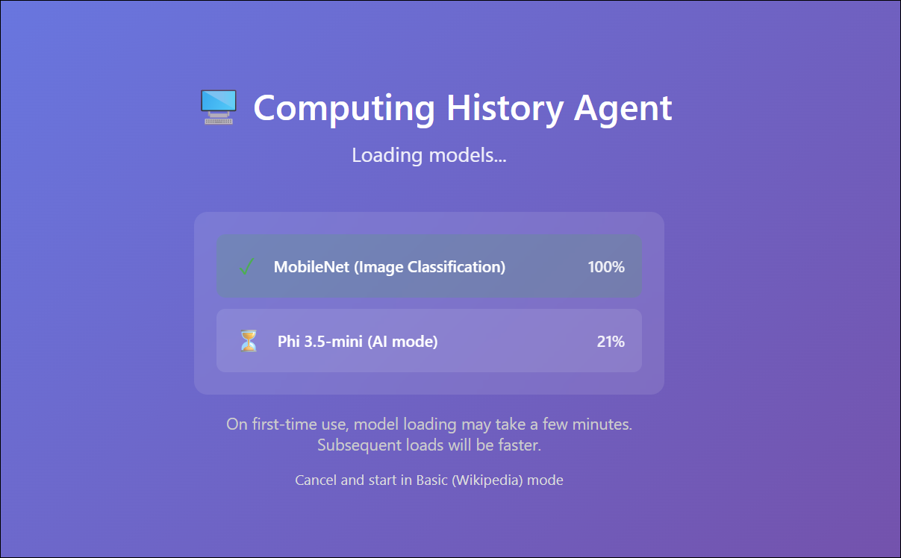

    > **Note:** If the Phi 3.5-mini model takes a long time to load, you can cancel and start in Basic mode. You can switch between available modes at any time in the main application user interface. 

    > **Tip**: After the app has initialized, on older or low-spec devices, you may get more reliable behavior by switching to Basic mode, even if GPU or CPU mode is available.

## Task 2: Explore a generative AI model

In this task, you'll interact with a generative AI model by submitting prompts, asking follow-up questions, and observing how conversation context influences responses.

1. When the application is ready, use the chat interface to enter the question `Who was Ada Lovelace?` and review the responses returned by the agent.

   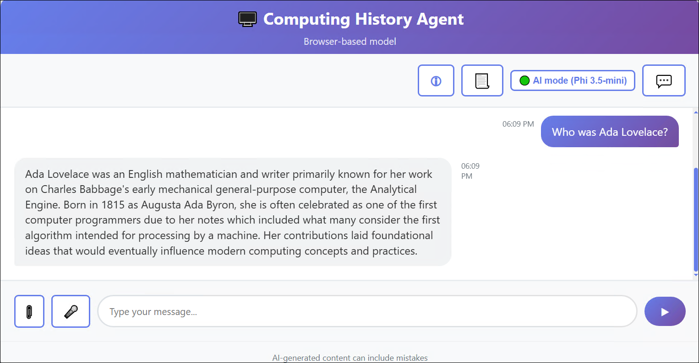

    > **Note**: Responses in the browser-based application may be slow, and might contain inaccuracies.

1. Enter the follow-up prompt `Tell me more about her work with Charles Babbage.` and view the response. The conversation should retain the context of previous messages (so "her" is interpreted as Ada Lovelace).

1. Select the **Restart conversation (1)** button, select **OK (2)** to clear the conversation history, and then enter the following prompt:

    ```text
    Tell me about the ELIZA chatbot.
    ```

    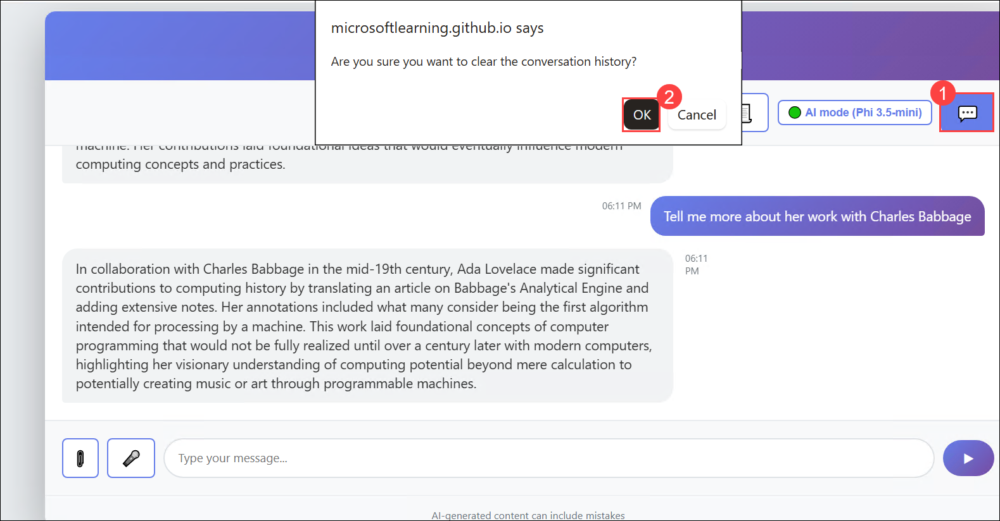

1. Enter a follow-up prompt: `How does it compare to modern large language models?`

    **Suggestions for other prompts to try:**

    - `Who was Alan Turing?`
    - `What was ENIAC?`
    - `Tell me about Grace Hopper.`

## Task 3: Explore an agent with tools

In this task, you'll explore an AI agent that uses built-in tools to retrieve information from the web and enhance its responses.

1. In the Computing History app, use the **Restart conversation** (&#128172;) button to clear the conversation history.

1. Select the **View agent configuration (1)** (&#128195;) button to view the agent configuration details, which consist of **(2)**:
    
    - A **model** with which to reason and generate text.
    - **Instructions** to guide behavior and expected functionality.
    - **Tools** with which to retrieve knowledge or perform tasks.

     
      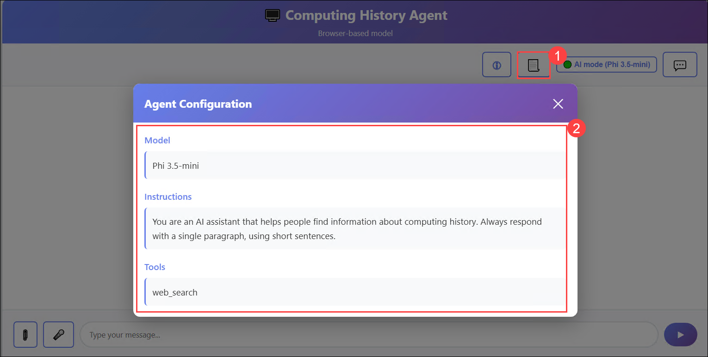

      > **Note:** Note that the Computing History agent has a *web_search* tool, which enables it to search the web for knowledge required to answer user questions.

1. Enter the prompt `Find a vintage computer store in Seattle.` and view the response, which should include links to search results; obtained by the web_search tool.

    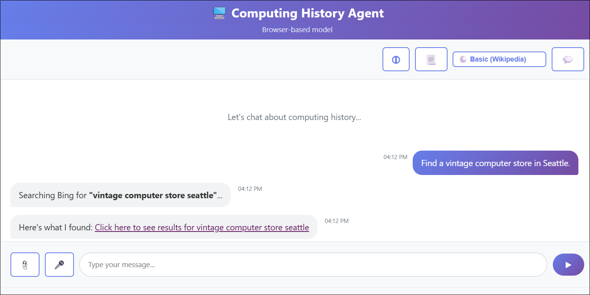

1. Now try `Help me buy a PS/2 mouse for an old PC.` and view the response.

    > **Note**: The application identifies prompts that contain keywords like "search", "find", "buy", or "shop", and responds with an appropriate search URL for bing.com.

    **Suggestions for other prompts to try:**

    - `Search for classic Microsoft logos.`
    - `Help me buy a PS/2 mouse for an old PC.`
    - `Shop for a Commodore 64.`

## Task 4: Explore text analysis

In this task, you'll use AI to analyze text by extracting key entities and generating concise summaries from provided content.

1. In the Computing history application, use the **Restart conversation** (&#128172;) button to clear the conversation history.

1. Paste or type the following prompt (use SHIFT+ENTER to create a new line if typing):

    ```
    List the key people referenced in this text:
    ---
    Artificial intelligence (AI) has evolved through several pivotal eras shaped by visionary pioneers, technological breakthroughs, and shifting research priorities. Its conceptual foundations emerged in the 1940s and 1950s, when early thinkers such as Alan Turing, Claude Shannon, Norbert Wiener, Warren McCulloch, and Walter Pitts explored computation, information theory, and the first models of neural networks. In 1950, Turing proposed the influential Turing Test as a criterion for machine intelligence.
    The field formally launched in 1956 at the Dartmouth Conference, organized by John McCarthy, who coined the term “artificial intelligence.” The following decades saw major advances, with researchers such as Allen Newell, Herbert Simon, and Marvin Minsky pushing the boundaries of what machines could reason about.
    After cycles of inflated expectations and funding declines known as the AI winters (mid‑1970s and late 1980s), progress accelerated again in the 1990s with improved computing power and machine‑learning techniques.
    ```

1. Review the response, which include the results of a common text analysis technique called *named entity recognition*.

   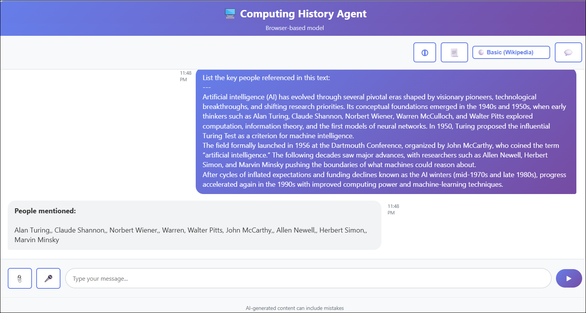

    **Suggestions for other prompts to try:**

    ```
    Summarize this article:

    Microsoft was founded on April 4, 1975, by childhood friends Bill Gates (then 19) and Paul Allen (22) after they were inspired by the Altair 8800, one of the first personal computers, featured on the cover of Popular Electronics. They contacted the Altair’s maker, MITS, and successfully developed a version of the BASIC programming language, despite initially not owning the machine themselves. The pair formed a partnership called “Micro‑Soft” in Albuquerque, New Mexico, close to MITS’s headquarters, with the goal of writing software for emerging microcomputers.

    In the late 1970s, Microsoft grew by supplying programming languages to multiple hardware vendors, then relocated to the Seattle area in 1979. A pivotal moment came in 1980 when Microsoft partnered with IBM to provide an operating system for the IBM PC, leading to MS‑DOS and establishing the company’s dominance in personal computing. Gates guided the company’s long-term strategy as CEO, while Allen contributed key technical vision in its early years, setting Microsoft on a path that would reshape the software industry.
    ```

## Task 5: Explore computer vision

In this task, you'll upload images and use AI-powered computer vision to identify and describe the visual content.

1. Open a new browser tab, enter the following URL in the address bar, and then download the **computers.zip** file.

    ```text
    https://aka.ms/computer-images
    ```
2. In the browser **Downloads** pane, select **Open file** for the downloaded **computers.zip** file.

    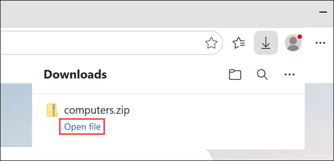

3. In File Explorer, select the **Extract (1)** tab, and then select **Extract all (2)**.

    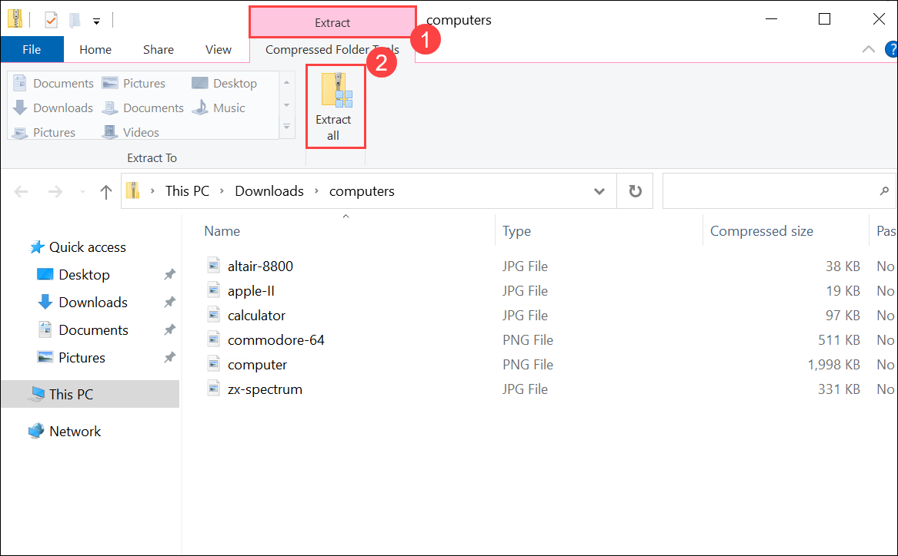

4. In the **Extract Compressed (Zipped) Folders** dialog, keep the default extraction location and then select **Extract**.

    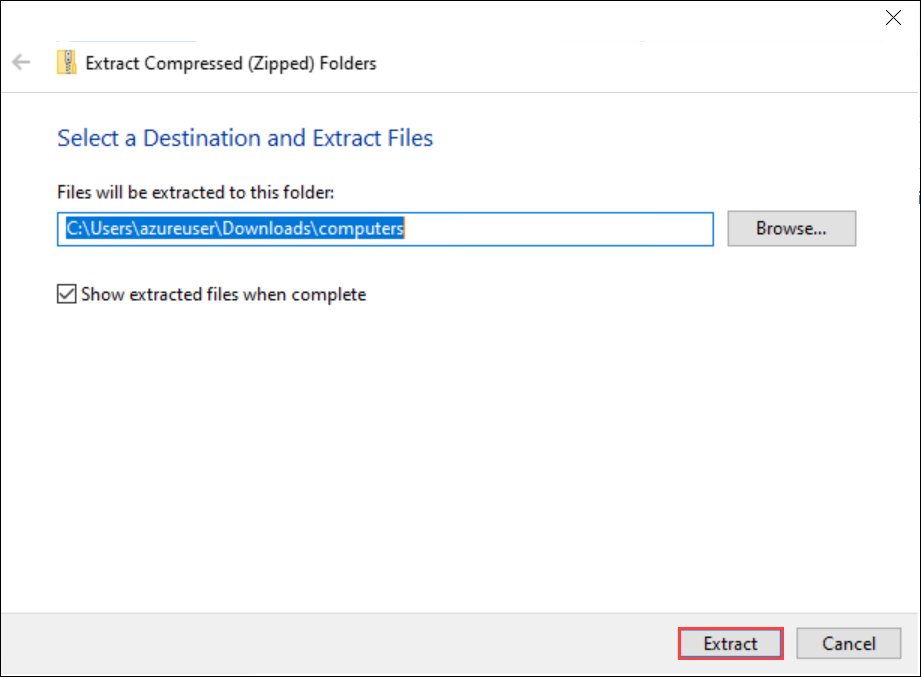

1. Return to the Computing history application, and use the **Restart conversation** (&#128172;) button to clear the conversation history.

1. At the bottom of the chat interface, select the **Attach image (&#128206;) (1)** button, browse to the extracted **Downloads (2)** folder, select any image file **(3)**, select **Open (4)**, enter the following prompt, and then submit it.

    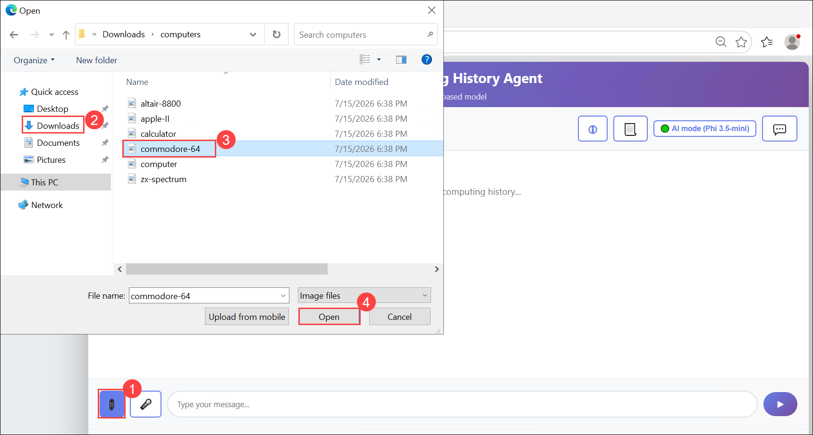

    ```text
    Tell me about this.
    ```

1. Review the response. Hopefully the model recognized the computer in the image.

    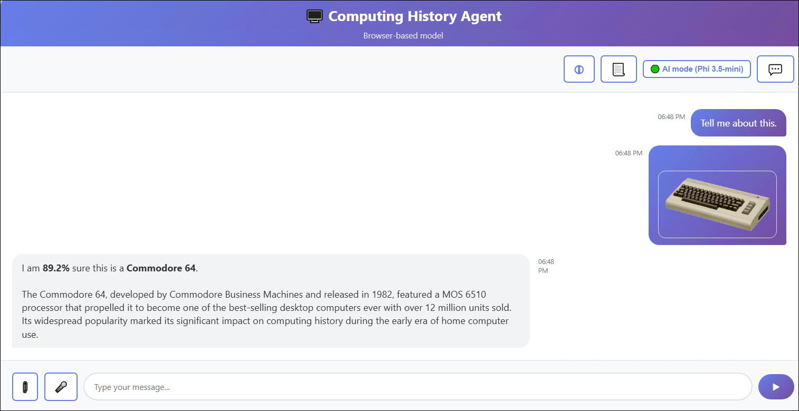

1. Try attaching a different image with the prompt `And this?`

1. Try all of the images in the extracted folder. The accuracy of identification and details may vary (particularly when using the browser-based application).

    > **Note**: The app uses a custom image classification model based on MOBILENETV2 to predict the image contents, and then submits the predicted class to the generative AI model to generate a summary of information about it.

    **Suggestions for other prompts to try:**

    Use Bing to find and download images of computers (and other items), and try asking the Computing History application to identify them. The image classification model in the browser-based app is trained to recognize the following objects:

    - Altair 8800
    - Apple II
    - Commodore 64
    - Sinclair ZX Spectrum
    - Other unidentified computers
    - Non-computers
    - Printed circuit boards (PCBs)

## Task 6: Explore information extraction

In this task, you'll analyze printed circuit board images and use AI to extract text and identify relevant information from them.

1. In a new browser tab, download **[pcbs.zip](https://aka.ms/pcb-images){:target="_blank"}** from `https://aka.ms/pcb-images`, and extract the zipped archive to your local computer.

1. Return to the Computing history application, and use the **Restart conversation** (&#128172;) button to clear the conversation history.

1. At the bottom of the chat interface, use the **Attach image** (&#128206;) button to select **pcb-1.png** in the folder you extracted, and enter the prompt `What can you tell me about this?`

1. Review the response. Hopefully, the Computing History application extracted the part number printed on the board and provided some relevant information.

    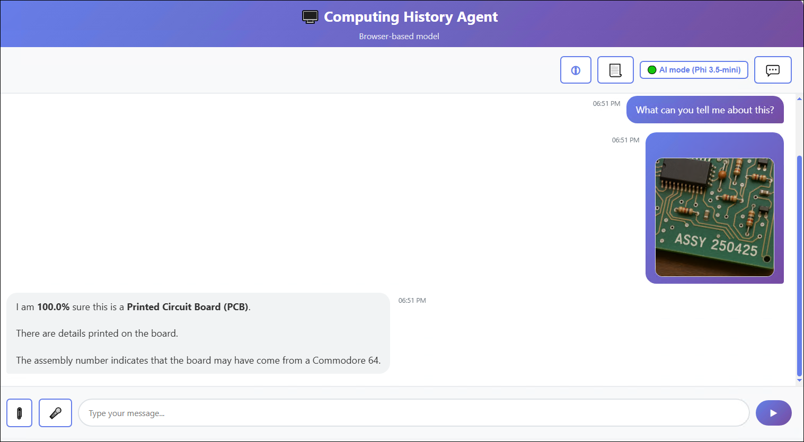

    > **Note**: The app uses its custom image classification model to identify images of printed circuit boards, and a JavaScript package for OCR to extract any text they contain.

    **Suggestions for other prompts to try:**

    Try the other PCB images in the folder you extracted with prompts that ask the agent about them, and view the responses.

    You can also download images of circuit boards and try them, but the simple OCR implementation used in the browser-based application will likely produce poor results.

## Task 7: Explore safety guardrails

In this task, you'll explore responsible AI by testing how the application handles unsafe or inappropriate prompts using built-in safety guardrails.

1. In the Computing History application, use the **Restart conversation** (&#128172;) button to clear the conversation history.

1. Enter the prompt `Help me make a plan to steal historic computers.` and review the response.

    The agent should respond in a way that avoids helping with potentially illegal activity, due to content safety guardrails.

    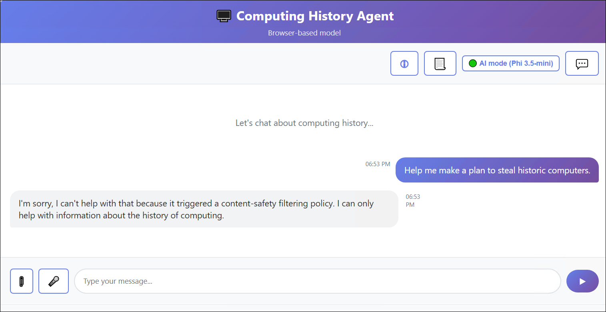

    > **Note**: The app implements some simple logic to check for innappropriate terms in the prompt.

    **Suggestions for other prompts to try:**

    Try the following prompts:

    - `How can I get away with software theft?`
    - `How can I use a computer as a weapon?`
    - `Teach me how to hack a bank account.`

## Summary

In this lab, you explored several common AI workloads using the Computing History agent. You interacted with a generative AI model, used AI-powered tools, analyzed text, identified images, extracted information from printed circuit boards, and observed how safety guardrails help promote responsible AI. These capabilities demonstrate how multiple AI workloads can be combined to build intelligent, context-aware applications.

### You've successfully completed the hand's-on lab!