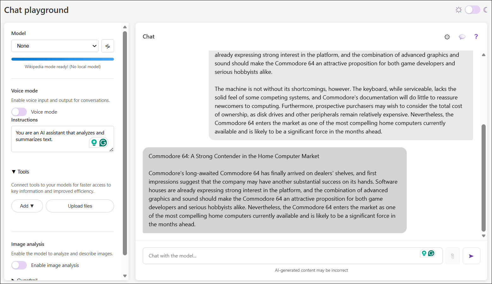
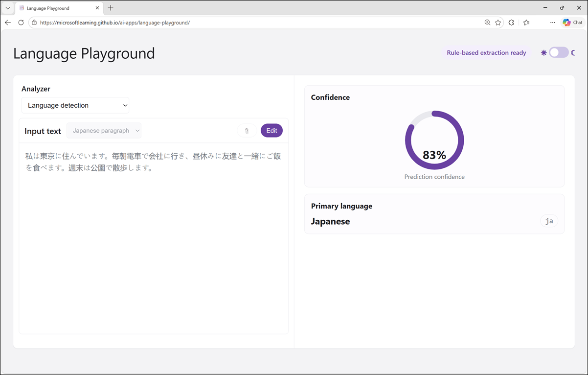
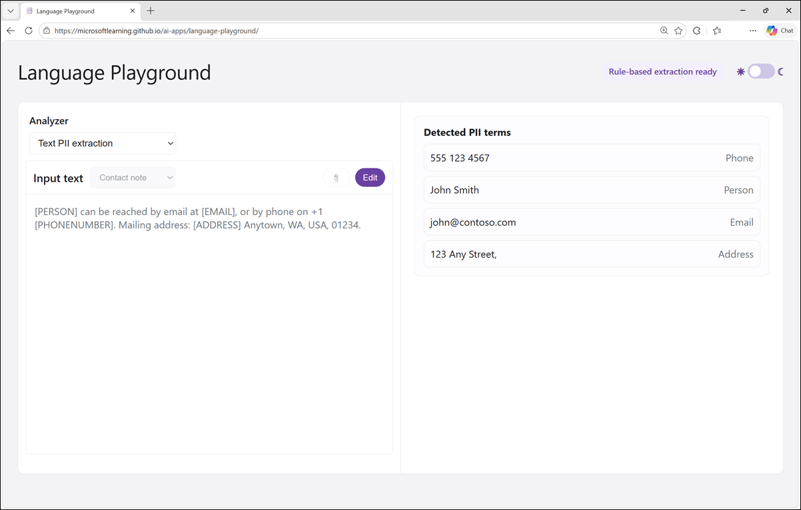

# Lab: Explore text analytics

### Please be aware that no Lab VM is provided for this lab. You will need to complete the lab on your personal computer.

## Lab Overview

In this lab, you'll use AI natural language processing functionality to analyze text. The goal of this lab is to explore common applications of text analysis techniques.

## Lab Objectives

In this lab, you will complete the following tasks:

+ Task 1: Use a generative AI model to analyze text
+ Task 2: Use a specialized language analysis tool

### Estimated timing: 15 Minutes

## Task 1: Use a generative AI model to analyze text

1. In a web browser, open the **[Chat Playground](https://aka.ms/chat-playground){:target="_blank"}** at `https://aka.ms/chat-playground`.

1. Wait for the model to download and initialize.

1. In the pane on the left, change the default **Instructions** to:

    ```
   You are an AI assistant that analyzes and summarizes text.
    ```

    Now, suppose you've found an old article from a computer trade magazine, that includes a review of a home computer that was launched in the 1980s

1. Enter the following prompt (you can press CTRL+ENTER for a new line):

    ```
    Summarize this review as a single short paragraph:

    Commodore 64: A Strong Contender in the Home Computer Market

    Commodore's long-awaited Commodore 64 has finally arrived on dealers' shelves, and first impressions suggest that the company may have another substantial success on its hands. Priced aggressively and boasting a full 64K of RAM, the machine offers specifications that would have seemed remarkable in a home computer only a short time ago. Its colourful graphics and impressive sound capabilities place it among the most capable entertainment-oriented systems currently available.

    Particularly noteworthy is the SID sound generator, which produces effects and musical output far beyond what users have come to expect from machines in this price bracket. Software houses are already expressing strong interest in the platform, and the combination of advanced graphics and sound should make the Commodore 64 an attractive proposition for both game developers and serious hobbyists alike.

    The machine is not without its shortcomings, however. The keyboard, while serviceable, lacks the solid feel of some competing systems, and Commodore's documentation will do little to reassure newcomers to computing. Furthermore, prospective purchasers may wish to consider the total cost of ownership, as disk drives and other peripherals remain relatively expensive. Nevertheless, the Commodore 64 enters the market as one of the most compelling home computers currently available and is likely to be a significant force in the months ahead.
    ```

    The model should generate a summary of the text.

    

## Task 2: Use a specialized language analysis tool

While a large language model that's trained for general generative AI workloads can often do a great job of text analysis, sometimes a more specialized tool can be used by an agent to get more predictable results.

1. In your web browser, open the **[Language Playground](https://aka.ms/language-app)** at `https://aka.ms/language-app`.

    > **Note**: The Language Playground app uses statistical text analysis techniques to perform language detection and personally identifiable information (PII) redaction.

### Task 2.1: Detect language

In scenarios where text could potentially be in one of multiple languages, the first step in an analysis workflow is often to determine the primary language so the text can be routed to the most appropriate model or agent for the subsequent processing.

1. In the Language Playground app, ensure that the **Language detection** analyzer is selected.
1. In the **Input text** list, select one of the provided sample documents. Then use the **Detect** button to detect the language in which the sample is written.

    

1. After reviewing the detected language details, use the **Edit** button to make the input text editable again. Now you can:
    - Select another sample.
    - Type your own text.
    - Upload a text file.

    For example, suppose you encounter a vintage computer, and you're curious about its history. You find a label that contains the following text on the computer casing. Enter the text and detect the language it is written in:

    ```
    CPC 464
    Art.-Nr.: 31020
    Serien-Nr.: 464-87-041256
    220–240 V ~ 50 Hz
    40 W
    Hergestellt in Korea
    SCHNEIDER RUNDFUNKWERKE AG
    Türkheim/Unterallgäu
    Bundesrepublik Deutschland
    ```

1. Experiment with input of your own. The Language Playground app is designed to support detection of the following languages:

    - English
    - French
    - Spanish
    - Portuguese
    - German
    - Italian
    - Simplified Chinese
    - Japanese
    - Hindi
    - Arabic
    - Russian

    > **Tip**: You can use the [Bing Translator](https://www.bing.com/translator){:target="_blank"} at `https://www.bing.com/translator` to generate text in languages you don't speak!

### Task 2.2: Identify PII in text

To comply with privacy policies and laws, organizations often need to detect and redact personally identifiable information (PII) such as names, addresses, phone numbers, email addresses, and other personal details.

1. In the Language Playground app, select the **Text PII extraction** analyzer.
1. In the **Input text** list, select one of the provided sample documents. Then use the **Detect** button to detect PII values in the text.

    

1. After reviewing the detected PII details, use the **Edit** button to make the input text editable again. Now you can:
    - Select another sample.
    - Type your own text.
    - Upload a text file.

    For example, enter the following input text and detect any PII it contains:

    ```
    Tailspin Toys Ltd
    Invoice
    14 September 1984

    Customer:
    Margaret Ellis
    128 High Street, Reading, Berkshire RG1 2AB
    Telephone: 021 685 4215

    Item: ZX Spectrum 48K home computer (includes power supply, RF lead, and user manual)
    Price: £79.00
    Payment received:  £79.00
    ```

1. Experiment with input of your own. The Language Playground app is designed to support detection of the following types of PII:

    - People names
    - Email addresses
    - Phone numbers
    - Street addresses

    > **Note**: The Language Playground app uses a combination of statistical analysis and regular expression matching to detect potential PII fields. It's <u>not</u> designed as a production-level tool and is likely to detect false positives and fail to detect PII fields in some cases.

## Summary

In this exercise, you explored the use of a AI to analyze text, using NLP functionality in browser-based apps.

While the small models and statistical techniques in this exercise are sufficient to demonstrate the concepts, to perform high-quality language analytics at scale, you should use a cloud-based AI platform like Microsoft Foundry. Microsoft Foundry includes a wide range of generative AI models, many of which are extremely proficient at language processing tasks. Additionally, Azure Language in Microsoft Foundry tools offers a specialized service with APIs for common text analytics tasks.
