# Lab: Explore text analytics

## Lab Overview

In this lab, you will explore the text analytics capabilities of AI using browser-based applications. You will use the **Chat Playground** to generate concise summaries from text and the **Language Playground** to perform specialized language analysis tasks, including language detection and personally identifiable information (PII) extraction. By completing this lab, you will gain hands-on experience with common natural language processing (NLP) techniques and learn how AI can be used to analyze and process text efficiently.

## Lab Objectives

In this lab, you will complete the following tasks:

+ Task 1: Use a generative AI model to summarize text
+ Task 2: Use a specialized language analysis tool

### Estimated timing: 15 Minutes

## Task 1: Use a generative AI model to summarize text

In this task, you will use the Chat Playground to interact with a generative AI model and perform text summarization. You will provide a detailed review as input and use a prompt to generate a concise summary, demonstrating how generative AI can quickly extract the key points from large amounts of text.

1. On your virtual machine, click on the **Microsoft Edge** icon as shown below:

    

1. In a web browser, open the **[Chat Playground](https://aka.ms/chat-playground)** at `https://aka.ms/chat-playground`.

1. Wait for the model to download and initialize.

    > **Tip**: The first time you download a model, it may take a few minutes. Subsequent downloads will be faster. If your browser or operating system does not support WebGPU models, the fallback CPU-based model will be selected (which provides slower performance and reduced quality of response generations). If *that* fails, a basic mode with no model and responses retrieved from Wikipedia is used.    

1. In the pane on the left, change the default **Instructions** to:

    ```
   You are an AI assistant that analyzes and summarizes text.
    ```
    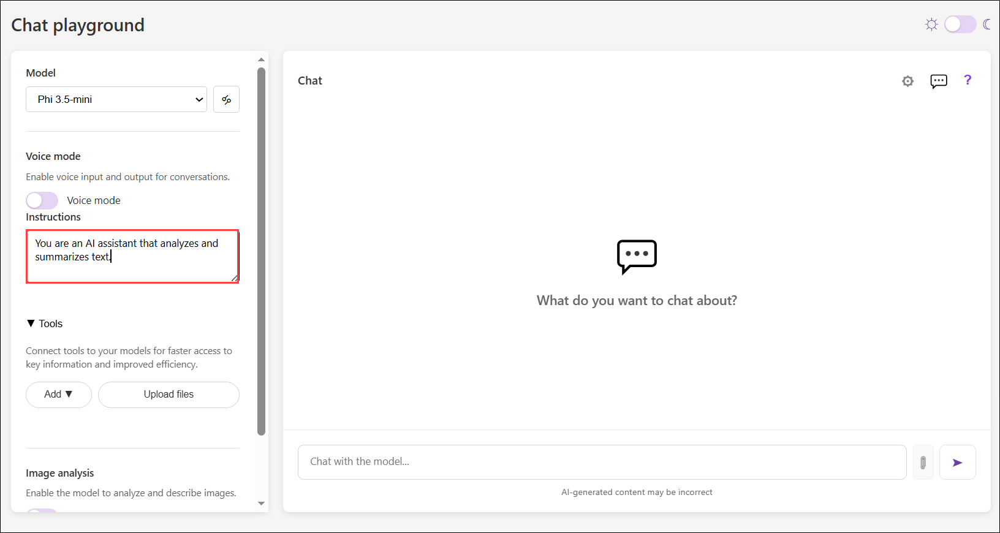

1. At the top of the chat pane, use the **New chat** (&#128172;) button to restart the conversation. This removes all conversation history.

    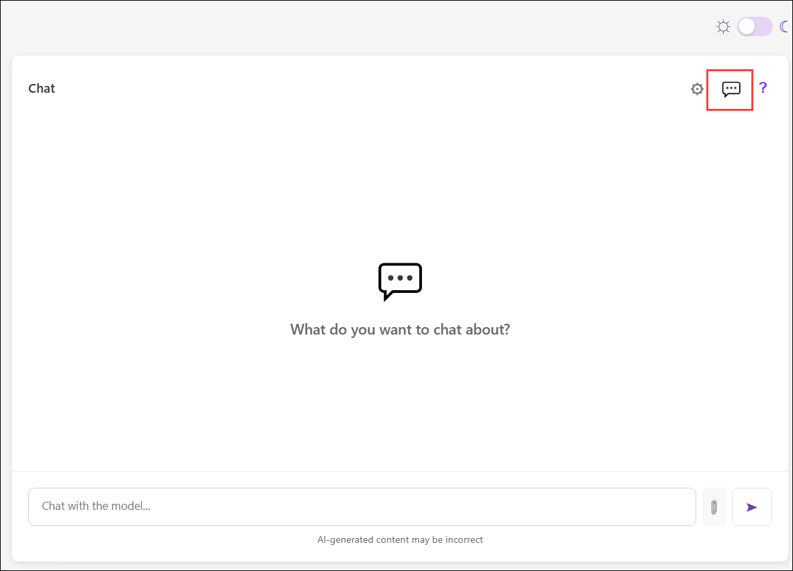

1. Enter the following prompt (you can press CTRL+ENTER for a new line):

    ```
   Summarize this review as a single, short paragraph:

   This AI training course provides a clear and engaging introduction to core concepts such as machine learning, neural networks, and generative AI, making it accessible even to learners with limited prior experience. The course consistently reinforces key ideas through practical examples and hands-on exercises, which helps learners build confidence while applying AI techniques in real-world scenarios.
    
   Another strength is the emphasis on modern tools and workflows, including prompt design and model evaluation, which are highly relevant for current industry needs. The instructors communicate complex topics in a simple, structured way, and the course materials are well organized to support progressive learning. I particularly appreciated how the course revisits important themes like model accuracy, responsible AI, and iterative improvement across multiple modules, reinforcing their importance.
    
   Overall, this course offers a highly practical and well-rounded learning experience for anyone looking to develop foundational and applied skills in AI.
    ```
    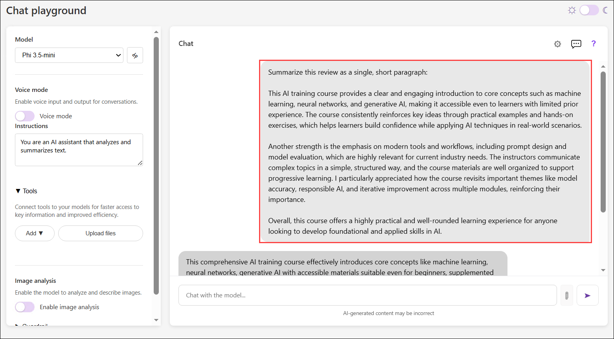

1. The model should generate a summary of the text.

    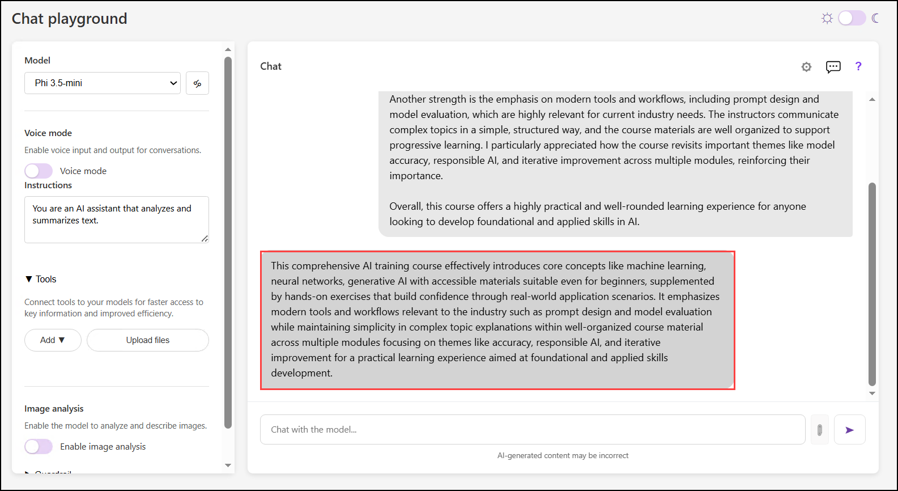


## Task 2: Use a specialized language analysis tool

In this task, you will use the Language Playground to perform specialized text analysis. You will detect the language of input text and identify personally identifiable information (PII), such as names, phone numbers, email addresses, and street addresses, demonstrating how AI-powered language tools can analyze and protect sensitive information.

1. In your web browser, navigate to the **Language Playground** app at `https://aka.ms/language-app`.

1. Wait until the model is ready.

    > **Note**: The Language Playground app uses the same Phi 3.5-mini model as the Chat Playground app, with a fallback Basic mode that uses statistical text analysis techniques to perform language detection and personally identifiable information (PII) redaction.

### Detect language

In this task, you will use the Language Detection analyzer to identify the primary language of sample and custom text. You will review the detection results and explore how AI can automatically determine the language of a document.

1. In the Language Playground app, ensure that the **Language detection (1)** analyzer is selected.

1. In the **Input text (2)** list, select one of the provided sample documents, then select **Detect (3)** button to detect the language in which the sample is written.

    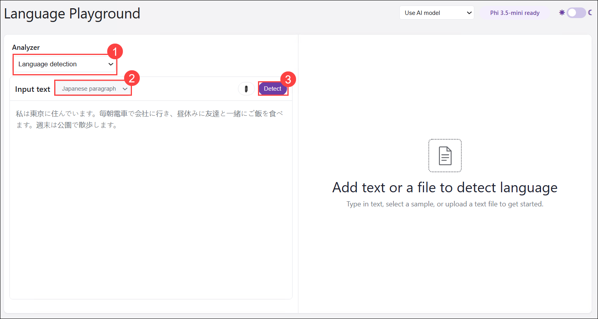

    > **Tip**: You can switch between *light* and *dark* themes using the &#x263C; / &#x263E; toggle at the top right.

1. The model should generate a output of the text.

    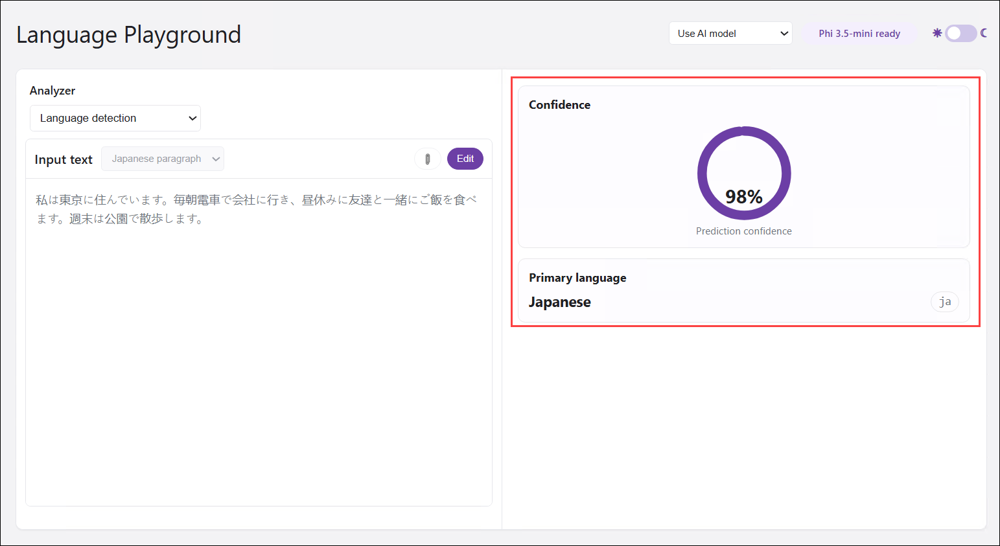

1. After reviewing the detected language details, use the **Edit** button to make the input text editable again. Now you can:
    - Select another sample.
    - Type your own text.
    - Upload a text file.

    Enter the following input text and detect the language it is written in **(1)**, then select **Detect (2)**:

    ```
   ¡Hola! Me llamo Josefina y vivo en Madrid, España. Soy doctora en un hospital, ¡lo que me mantiene muy ocupada!
    ```
    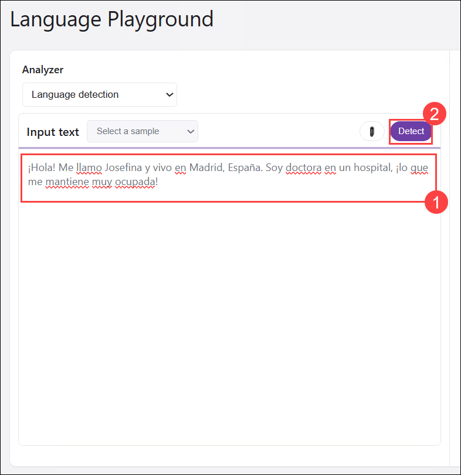

1. The model should generate a output of the text.

    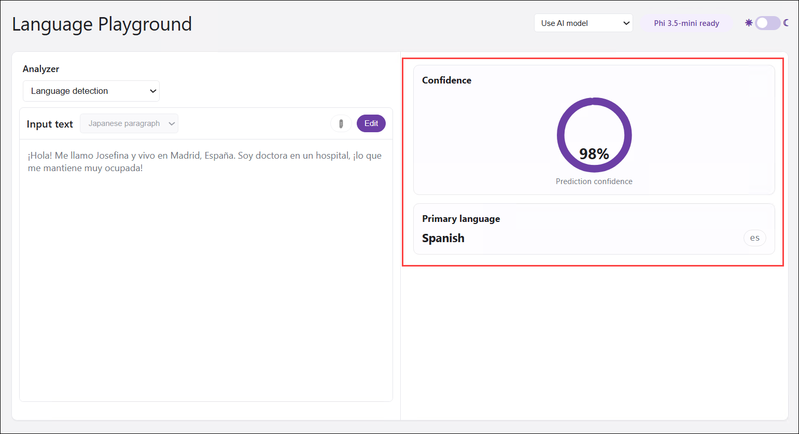

1. Experiment with input of your own. The Language Playground app is designed to support detection of the following languages:

    - English
    - French
    - Spanish
    - Portuguese
    - German
    - Italian
    - Simplified Chinese
    - Japanese
    - Hindi
    - Arabic
    - Russian

    > **Tip**: You can use the [Bing Translator](https://www.bing.com/translator){:target="_blank"} at `https://www.bing.com/translator` to generate text in languages you don't speak!

### Identify PII in text

In this task, you will use the Text PII Extraction analyzer to detect personally identifiable information (PII), such as names, phone numbers, email addresses, and street addresses, in sample and custom text. You will review the detected PII results to understand how AI identifies sensitive information.

1. In the Language Playground app, select the **Text PII extraction (1)** analyzer.

1. In the **Input text (2)** list, select one of the provided sample documents, then select **Detect (3)** button to detect PII values in the text.

    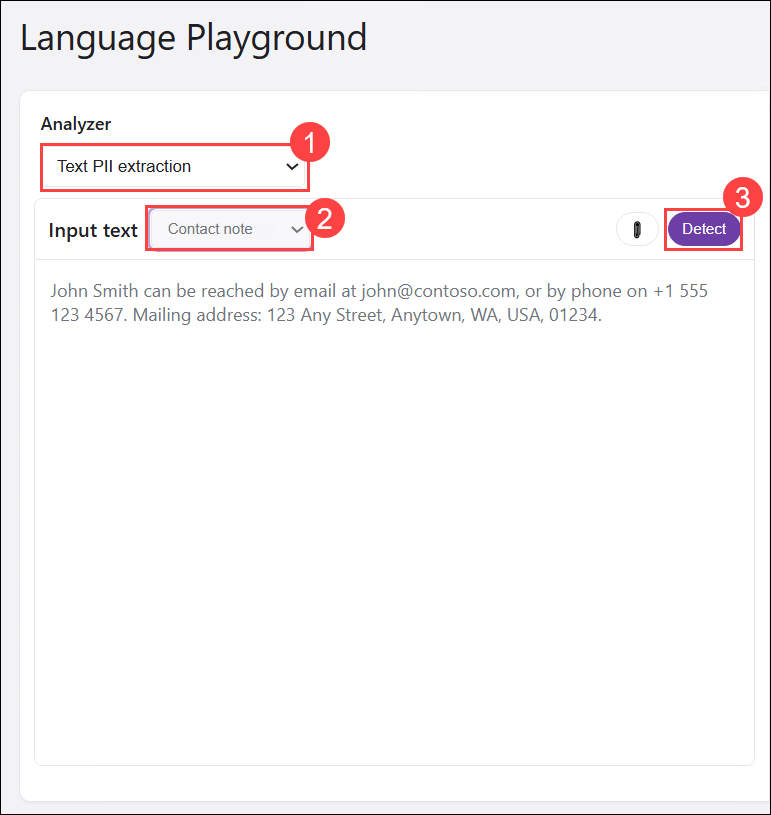

1. The model should generate a summary of the text.

    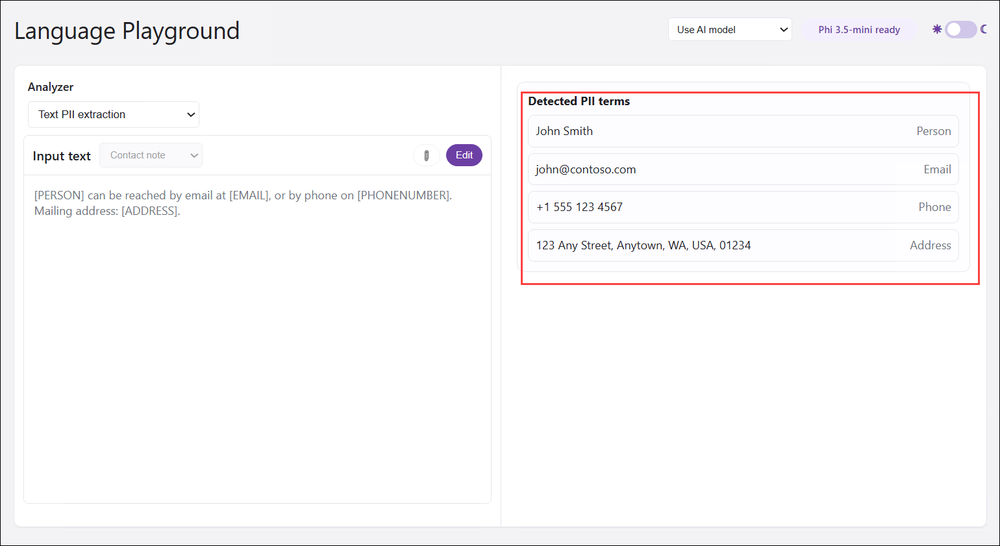

1. After reviewing the detected PII details, use the **Edit** button to make the input text editable again. Now you can:
    - Select another sample.
    - Type your own text.
    - Upload a text file.

    Enter the following input text and detect any PII it contains **(1)**, then select **Detect (2)**:

    ```
   A customer named Mary Jones called from 021 946 0958 and asked us to send her documents to 42 Market Road, London, UK, SW1A 1AA.
    ```
    

    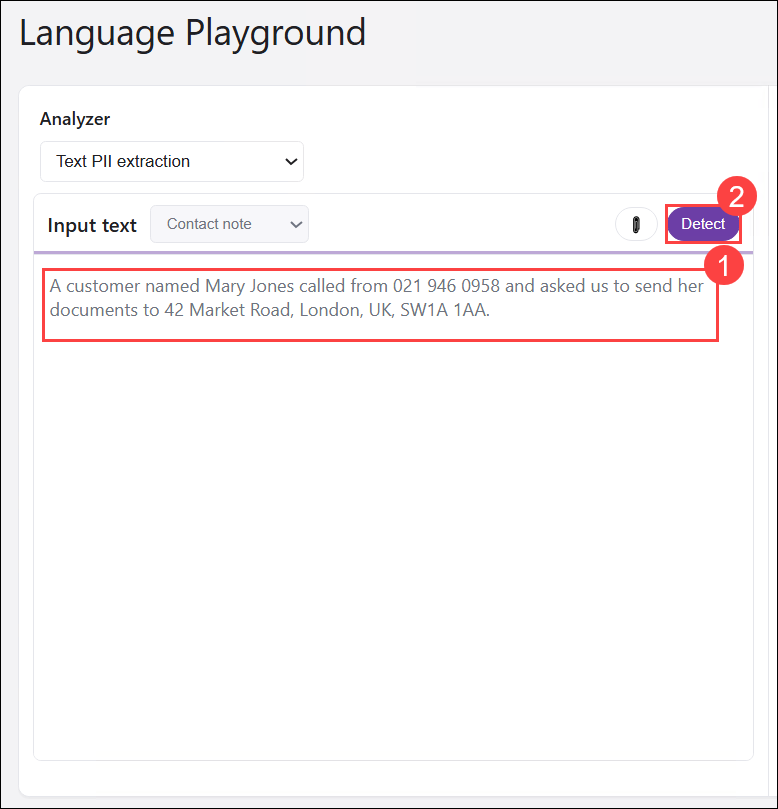


1. The model should generate a output of the text.

    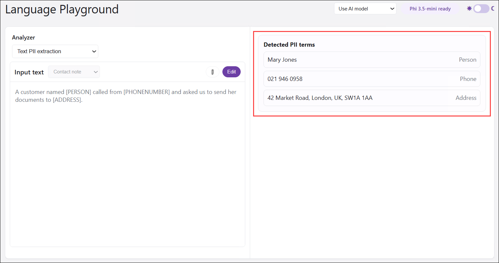

1. Experiment with input of your own. The Language Playground app is designed to support detection of the following types of PII:

    - People names
    - Email addresses
    - Phone numbers
    - Street addresses

    > **Note**: The Language Playground app uses a combination of statistical analysis and regular expression matching to detect potential PII fields. It's <u>not</u> designed as a production-level tool and is likely to detect false positives and fail to detect PII fields in some cases.

## Summary

In this lab, you explored AI-powered text analytics using browser-based applications. You used the Chat Playground to summarize text with a generative AI model and the Language Playground to perform specialized language analysis tasks, including language detection and personally identifiable information (PII) extraction. Through these tasks, you learned how AI can analyze, summarize, and identify sensitive information in text.

### You've successfully completed the hand's-on lab!