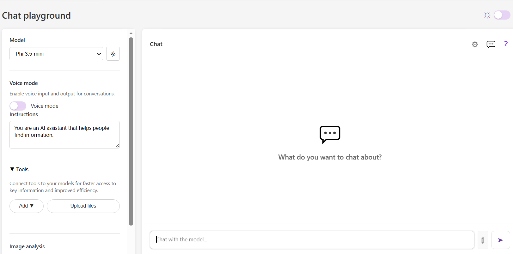
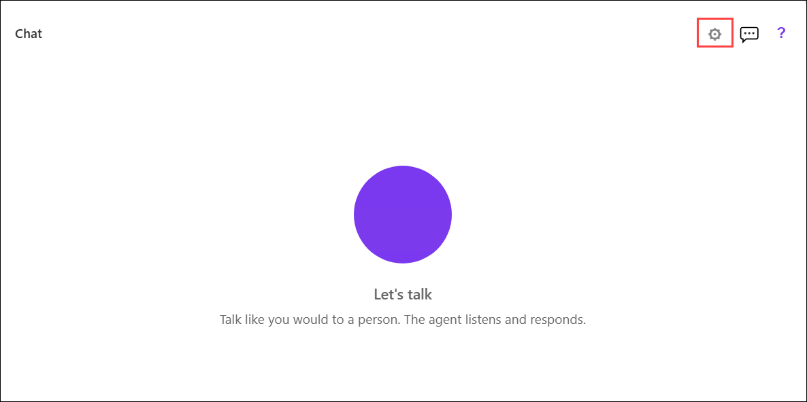
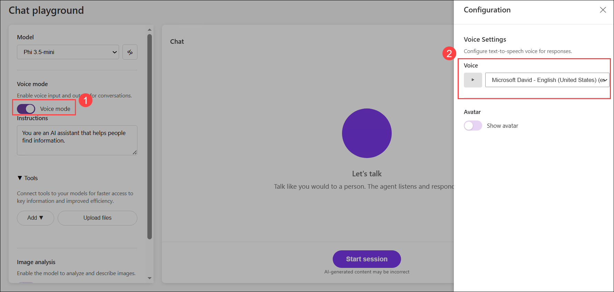
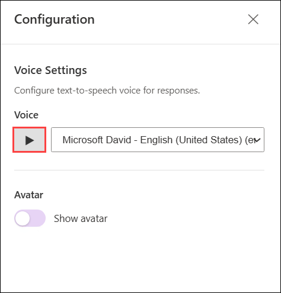
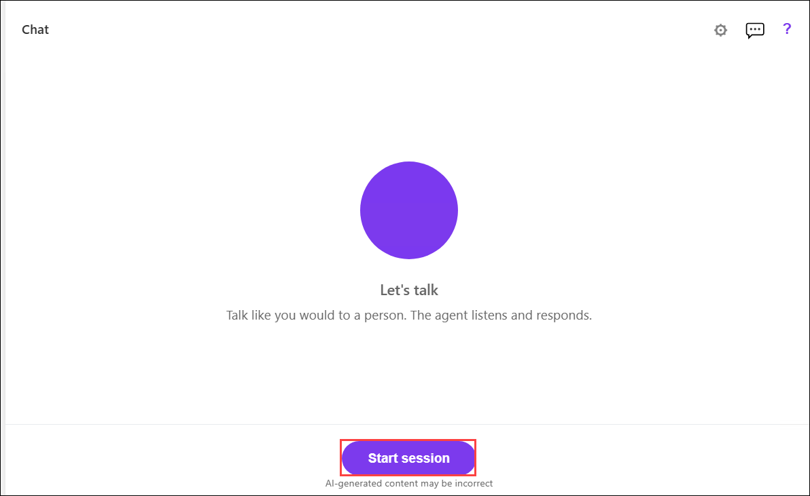

# Lab: Explore AI speech

## Lab Overview

In this lab, you'll interact with a generative AI model using speech. The goal of this lab is to explore speech-to-text (STT) and text-to-speech (TTS) functionality with a generative AI model.

## Lab Objectives

In this lab, you will complete the following tasks:

+ Task 1: Open the Chat Playground app

+ Task 2: Configure Voice mode

+ Task 3: Use speech to interact with the model (Read Only)

### Estimated timing: 60 Minutes

## Task 1: Open the Chat Playground app

In this task, you'll open the Chat Playground application, initialize the generative AI model, and familiarize yourself with the chat interface.

1. On your virtual machine, click on the **Microsoft Edge** icon as shown below:

    

1. In a web browser, open the **[Chat Playground](https://aka.ms/chat-playground)** at `https://aka.ms/chat-playground`.

    The app intiializes by downloading a language model.

    > **Tip:** The first time you download a model, it may take a few minutes. Subsequent downloads will be faster. If your browser or operating system does not support WebGPU models, the fallback CPU-based model will be selected (which provides slower performance and reduced quality of response generations).

1. View the Chat Playground app, which should look like this:

    

    > **Tip:** You can switch between light and dark themes using the ☼ / ☾ toggle at the top right.

## Task 2: Configure Voice mode

In this task, you'll enable Voice mode, select a speech synthesis voice, and configure the application for voice-based interactions.

> **Note:** Voice mode depends on browser support for the Web Speech API and access to voices for speech synthesis, with a fallback to an offline speech-to-text model. The app should work successfully in most modern browsers. If your browser configuration is not compatible, you may experience errors; and ultimately voice mode may not work for you.

1. In the pane on the left, under the selected model, enable **Voice mode (1)**

    > **Note:** If the **Configuration** pane is not displayed automatically on the right, open it using the **Configuration** (**&#9881;**) button above the **Chat** pane.

     

1. In the configuration pane, view the voices in the **Voice (2)** drop-down list.

   

    > **Note:** Text-to-speech solutions use *voices* to control the cadence, pronunciation, timbre, and other aspects of generated speech. The available voices depend on your browser and operating system, and can include *local* voices installed in the operating system as well as *online* voices available for your browser.

1. Select any of the available voices, and use the *Preview selected voice* (**&#9655;**) button to hear a sample of the voice.

    

    Online voices are downloaded on-demand, which may take a few seconds. The app verifies that they are loaded successfully, and displays an error if not.

    > **Tip:** After you've selected a voice, you can also optionally select an avatar to represent the voice agent visually!

1. When you have selected the voice you want to use, close the **Configuration** pane.

## Task 3: Use speech to interact with the model (Read Only)

In this task, you'll explore how speech-to-text and text-to-speech enable voice conversations with a generative AI model by observing the application's speech workflow.

> **Note:** `In the current lab environment, audio input (microphone) is not supported due to platform limitations; therefore, while you can perform the steps in this task, you will not be able to provide prompts using voice.`

1. In the **Chat** pane, use the **Start session** button to start a conversation with the model. If prompted, allow access to the system microphone.

    

1. When the app status is **Listening...**, say something like `What's speech recognition?` and wait for a response.

    > **Tip:** If an error occurs or the app can't detect any speech input using the default Web Speech functionality, it will automatically failover to a local speech recognition model and prompt you to retry.

1. Verify that the app status changes to **Processing...**. The app will process the spoken input, using speech-to-text to convert your speech to text and submit it to the model as a prompt.

    > **Tip:** Processing speech and retrieving a response from the model may take some time in this browser-based sample app - especially when using the CPU-based model. Be patient!

1. When the status changes to **Speaking...**, the app uses text-to-speech to vocalize the response from the model.

    > **Note:** If no voices are available in your browser, the reponse will not be vocalized.

1. After the response has been spoken, the app switches back to the **Listening...** state. Continue the conversation by speaking again (for example, "*What's speech synthesis?*").

    At any point, you can use the **[CC]** button to see a transcript of the conversation so far.

1. To end the conversation, use the **X** button. The session will end and the conversation transcript will be shown, like this:

1. You can use the **Start session** button to begin a new conversation. The conversation history from the previous session will not be retained.

## Summary

In this lab, you explored the use of speech-to-text and text-to-speech with a generative AI model in a simple playground app. The app used in this lab is based on a simplified version of the agent playground in Microsoft Foundry portal; in which Azure Speech in Foundry tools *Voice Live* capabilities can be added to an agent. While the app in this lab is limited to "speak - wait - speak" interactions, the Azure Speech Voice Live capabilities in Microsoft Foundry include multi-turn real-time conversations with support for interruptions and background noise suppression.

### You've successfully completed the hand's-on lab!