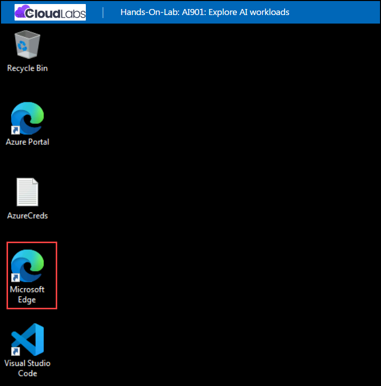
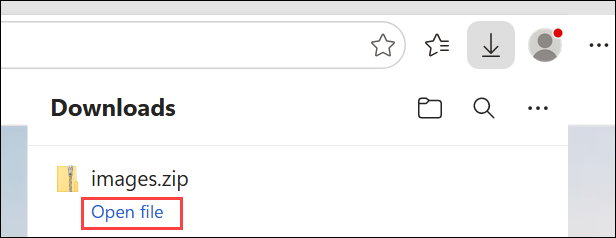
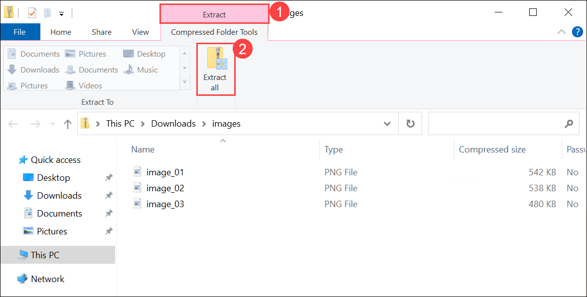
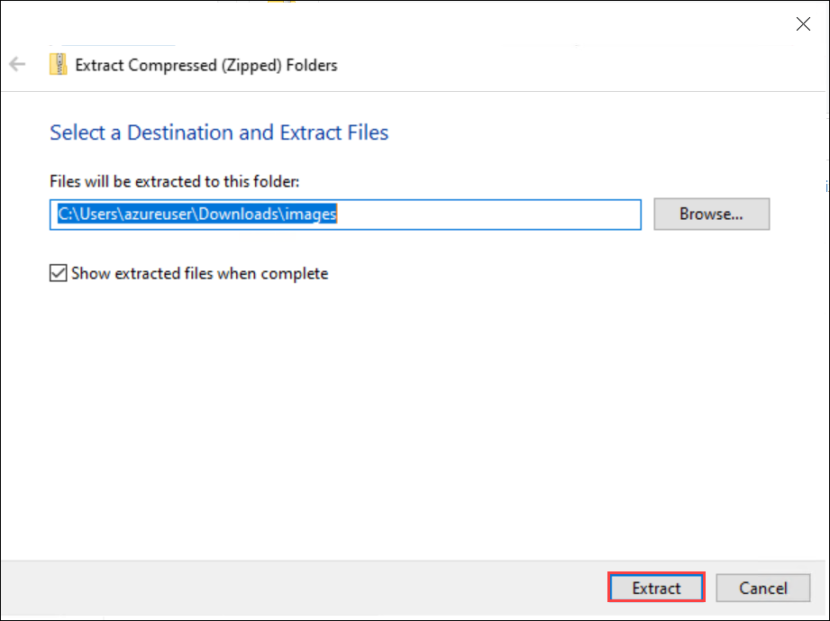
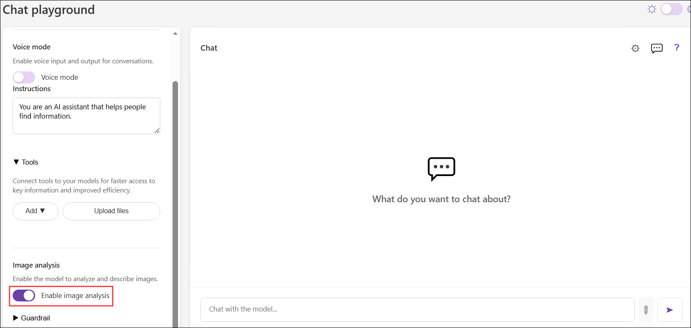
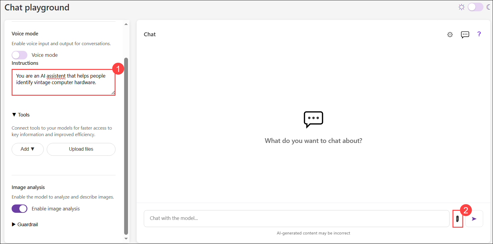
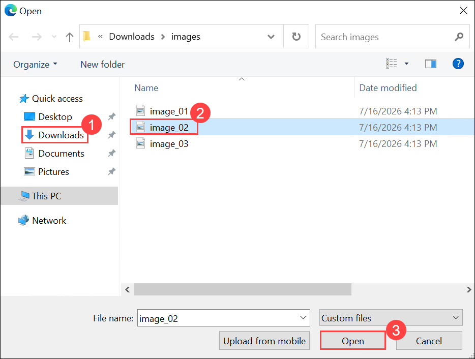
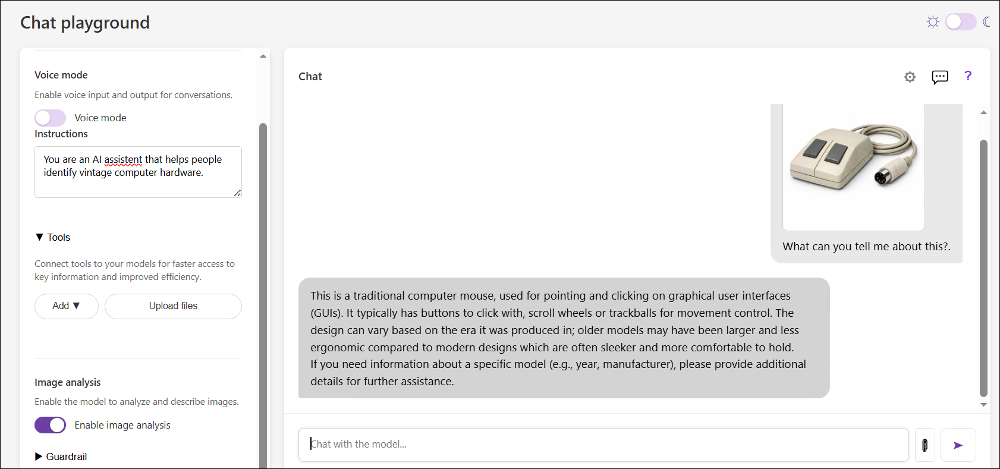

# Lab: Explore computer vision

### Estimated timing: 45 Minutes

## Lab Overview

In this lab, you'll use a chat playground to interact with a generative AI solution that can analyze and interpret images. The goal of this lab is to explore a common pattern for combining text and visual input in a prompt for a generative AI model.

## Lab Objectives

In this lab, you will complete the following task:

+ Task 1: Prepare for image-based chat

## Task 1: Prepare for image-based chat

In this task, you use a generative AI model in a chat playground to respond to prompts that include image data.

1. On your virtual machine, click on the **Microsoft Edge** icon as shown below:

    

1. In a web browser, open the **[Chat Playground](https://aka.ms/chat-playground)** at `https://aka.ms/chat-playground`.

    > **Tip:** The first time you download a model, it may take a few minutes. Subsequent downloads will be faster. If your browser or operating system does not support WebGPU models, the fallback CPU-based model will be selected (which provides slower performance and reduced quality of response generations). If *that* fails, a basic mode with no model and responses retrieved from Wikipedia is used.

1. While waiting for the model to download, open a new browser tab, and download **[images.zip](https://aka.ms/ai-images)** from `https://aka.ms/ai-images` to your local computer.

1. In the browser **Downloads** pane, select **Open file** for the downloaded **images.zip** file.

     

1. In File Explorer, select the **Extract (1)** tab, and then select **Extract all (2)**.

     

1. In the **Extract Compressed (Zipped) Folders** dialog, keep the default extraction location and then select **Extract**.

    

1. Return to the browser tab containing the chat playground and ensure a language model has downloaded. Then, in the configuration pane on the left pane, in the **Vision** section, enable **Image analysis** and wait for the computer vision model to be downloaded and initialized.

   

    In the chat interface, an **Upload image** (**&#x1F4CE;**) button is enabled.

1. In the configuration pane update the **Instructions (1)** to the following system prompt:

    ```
   You are an AI assistent that helps people identify vintage computer hardware.
    ```

1. Click the **Upload image (2)** button, and browse to select one of the images you extracted on your computer.

    

1. In the **Open** dialog, select the **Downloads (1)** folder, select any image **(2)** file, and then select **Open (3)**.

    

    > **Note:** A thumbnail of the image is added to the prompt input area.

1. Enter a prompt like `What can you tell me about this?`. The image is included in the message.

    

    - The MobileNetV3 model is used to determine the likely subject of the image, and the results of that analysis is included in the prompt to the Phi language model. The result should be a reponse that uses the image information to answer the question.

1. Submit prompts that include the other images, such as `What is this?` or `Tell me about this.`

    > **Note:** Responses will vary in quality depending on the selected language model; but the image classificaton model should correctly identify the images.

1. If you want to explore further, you can upload your own images and enter appropriate prompts. The combination of a small language model and a limited computer vision model means that the quality of the responses may be highly variable compared to a true multimodal large language model!

## Summary

In this lab, you explored the use of computer vision with a generative AI model in a chat playground. The app used in this lab is based on a simplified version of the chat playground in the Microsoft Foundry portal. Microsoft Foundry supports a range of multimodal models that can accept combined image and text input, enabling significantly more complex image interpretation than this simple example. Additionally, you can use the Azure Content Understanding tool to analyze images.

### You've successfully completed the hand's-on lab!