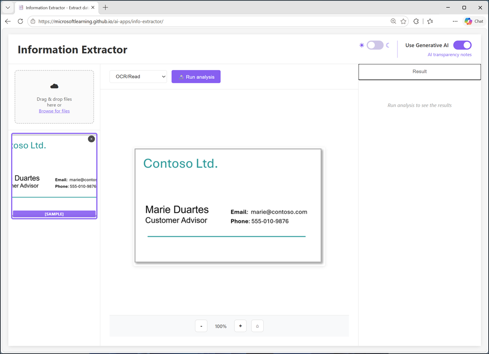
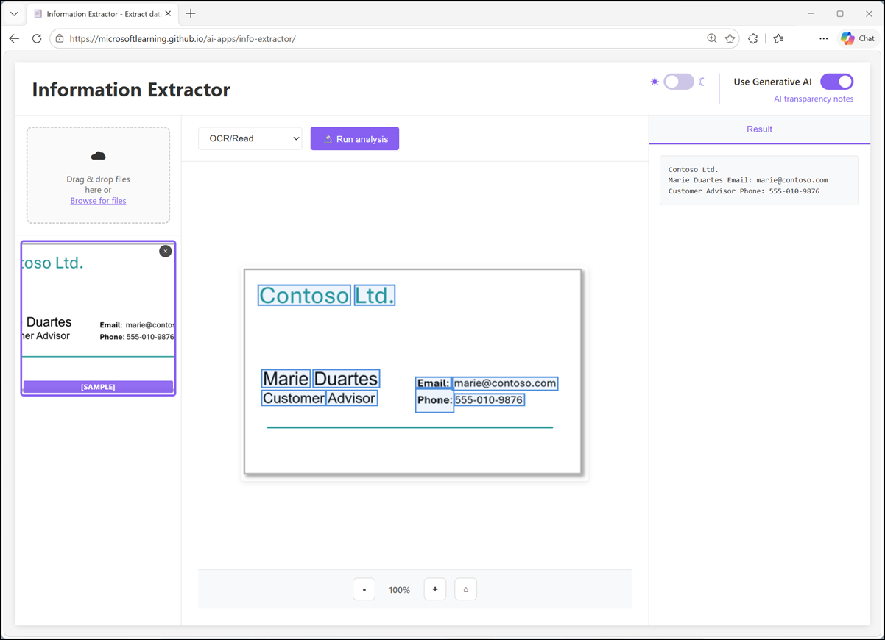
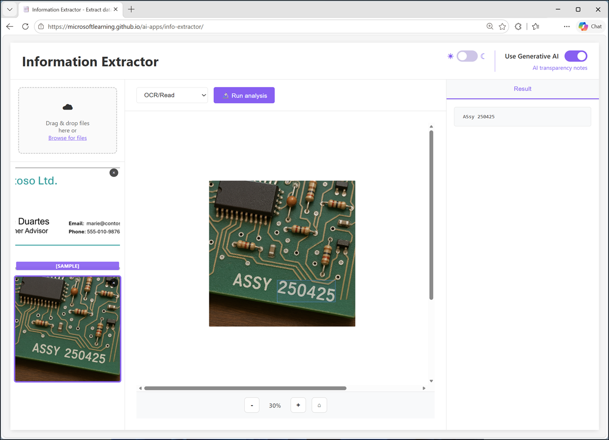
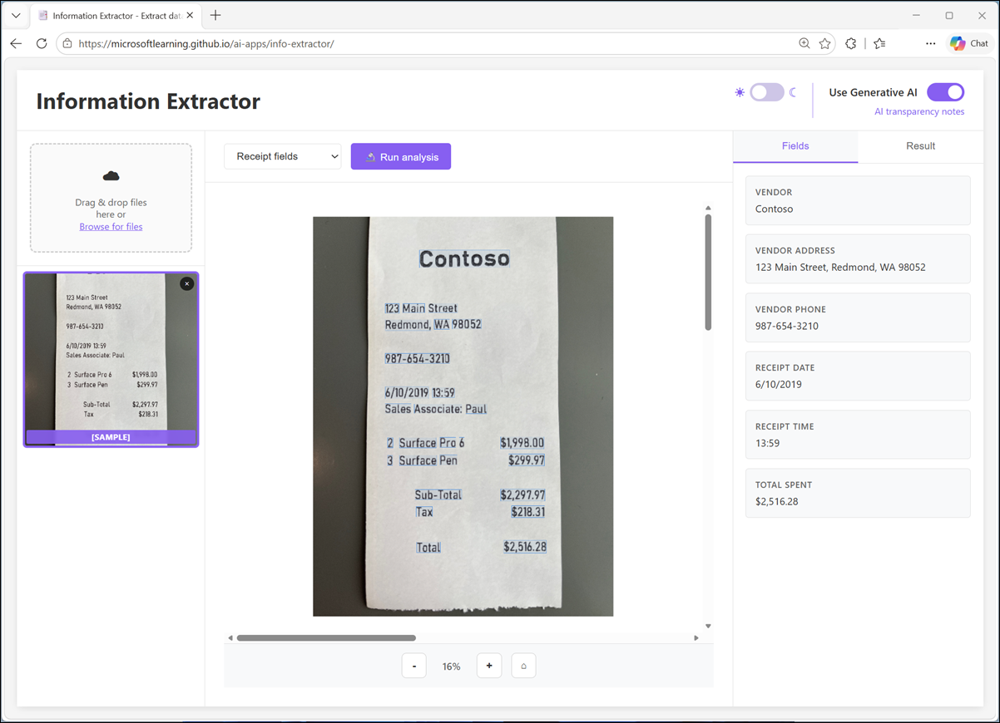

# Lab: Explore information extraction
### Please be aware that no Lab VM is provided for this lab. You will need to complete the lab on your personal computer.

## Lab Overview

In this lab, you'll use optical character recognition (OCR) and generative AI to extract information from receipts. The goal of this lab is to explore for yourself how information extraction from documents involves an OCR process to detect text, and a field extraction stage to map specific text strings to field values.

## Lab Objectives

In this lab, you will complete the following task:

- Task 1: Start the Info Extractor app
- Task 2: Use OCR to read text in an image
- Task 3: Extract fields from receipts

### Estimated timing: 15 Minutes

## Task 1: Start the Info Extractor app

Suppose you need to extract data fields from scanned receipts to help automate an expense claim solution. You can use an AI technique called optical character recognition (OCR) to identify text and its location in images. By combining this text extraction with a generative AI model, you can then apply semantic analysis to associate individual text values with specific data fields - such as names, phone numbers, dates, amounts, and so on.

> **Note**: The models used in this lab will run in your browser, on your local computer. Performance may vary depending on the available memory in your computer and your network bandwidth to download the model. If WebLLM models are not supported in your browser, a fallback mode with reduced functionality will be enabled, allowing you to use OCR to extract text and statistical heuristics to match fields.

1. In a web browser, open the **[Information Extractor](https://aka.ms/info-extractor)** app at `https://aka.ms/info-extractor`.
1. Wait for the model to download and initialize.

    > **Tip**: The first time you open the app, it may take a few minutes for the model to download. Subsequent downloads will be faster.
    >
    > If the model is taking a long time to load, you can cancel and start in basic mode. You can switch between available modes at any time by using the Use Generative AI toggle.

1. While you're waiting for the model to initialize, in a new browser tab, download **[pcbs.zip](https://aka.ms/pcb-images){:target="_blank"}** from `https://aka.ms/pcb-images` and  **[receipts.zip](https://aka.ms/receipts){:target="_blank"}** from `https://aka.ms/receipts` to your local computer. You'll use the the app to extract information from the images in these archives.

1. Return to the browser tab containing the Information Extractor app, which should look similar to this:

    

    >**Tip**: You can switch between *light* and *dark* themes using the &#x263C; / &#x263E; toggle at the top right.

## Task 2: Use OCR to read text in an image

Suppose you want to find information related to a piece of computer hardware or some other item with information printed on it. A first step might be to digitize the text so you can use it to look up details on the Internet or in an AI assistant. You can use an AI technique called optical character recognition (OCR) to "read" text in images.

1. In the Information Extractor app, after the model has initialized, ensure that **OCR/Read** is selected and that the sample business card image is loaded.
1. Run analysis on the sample image. When analysis is complete, view the text that has been extracted in the **Result** pane on the right.

    

1. Extract the downloaded **pcb-images.zip** archive in a local folder to see the files it contains. These files are images of printed circuit boards that contain text.
1. Upload any of the PCB images, and view it in the main content area of the app.
1. Run analysis on the uploaded image and review the results.

    

1. Repeat the process to analyze the other PCB images you downloaded.

    > **Tip**: Try uploading any images that contain legible text. The OCR model used in the app is basic, so the quality of your results may vary!

## Task 3: Extract fields from receipts

Now suppose you need to extract data fields from scanned receipts to help automate an expense claim solution. You can use OCR to identify text and its location in images, and then use a generative AI model to associate individual text values with specific data fields - such as company names, phone numbers, dates, amounts, and so on.

1. In the Information Extractor app, switch from the **OCR/Read** option to **Receipt Fields**.

    The user interface is rest and a sample image of a receipt is loaded. The pane on the right now includes a tab for **Fields** as well as the original **Results** tab.

1. Run analysis on the sample receipt image, and wait for the OCR and field extraction processes to complete.

    > **Tip**: Field extraction may take some time when using the AI model. Be patient!

    When the analysis is complete, the specific values associated with a receipt are identified by the field extraction process and listed in the **Fields** pane. The full OCR text results are in the **Result** tab.

    

1. Extract the downloaded **receipts.zip** archive in a local folder to see the files it contains.
1. Upload any of the receipt images, and view it in the main content area of the app.
1. Run analysis on the uploaded image and review the fields and results.
1. Repeat the process to analyze the other receipt images you downloaded (or a scanned receipt of your own).

## Summary

In this exercise, you explored how AI can be used to extract information from content using a combination of OCR and generative AI.

In Microsoft Foundry, the Content Understanding tool is a multimodal information extraction solution that you can use to analyze documents, images, audio files, and videos.

