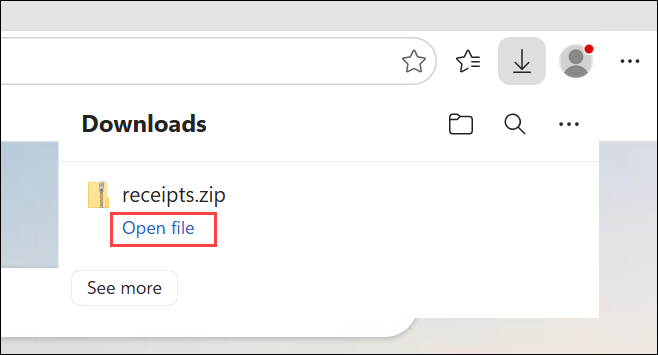
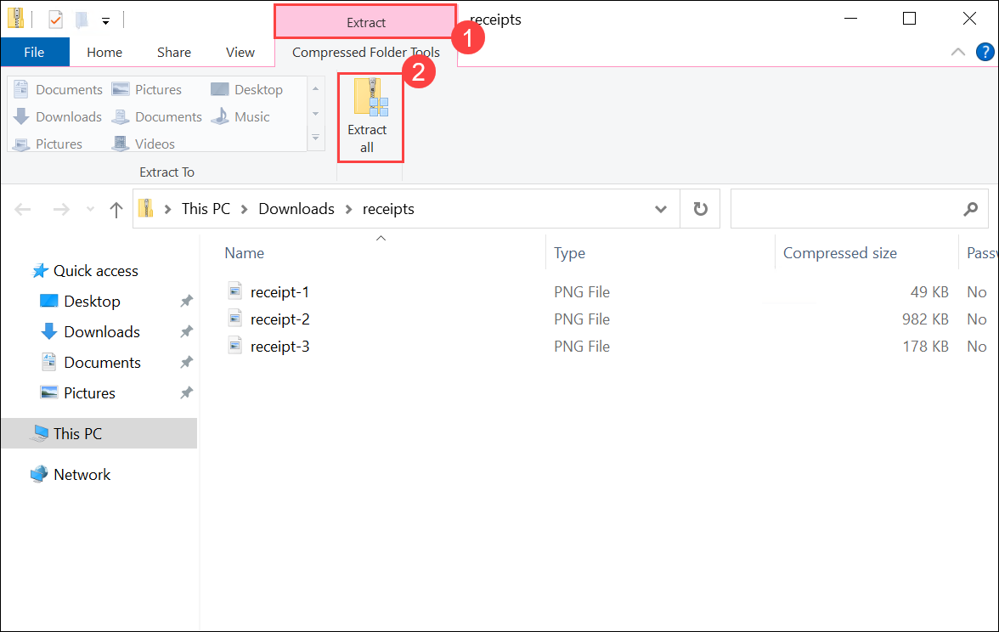
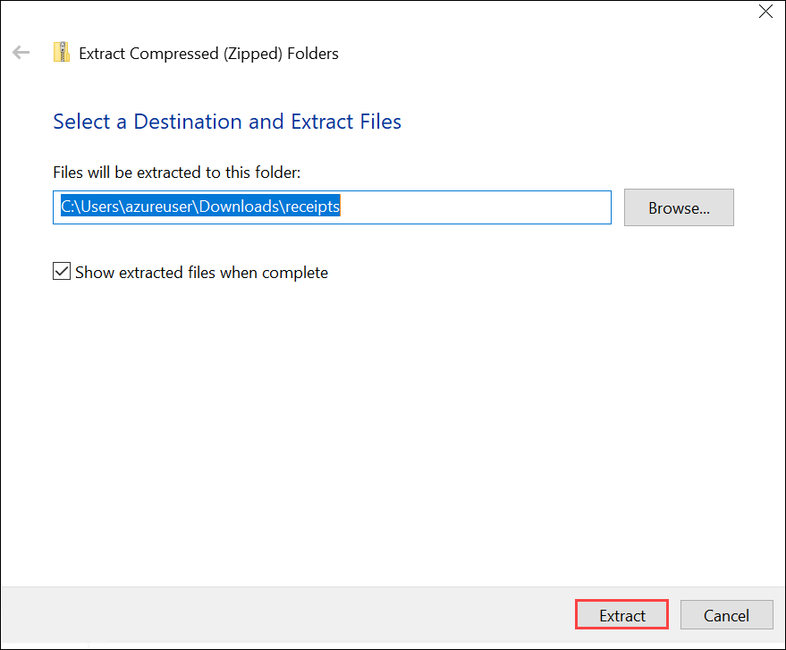
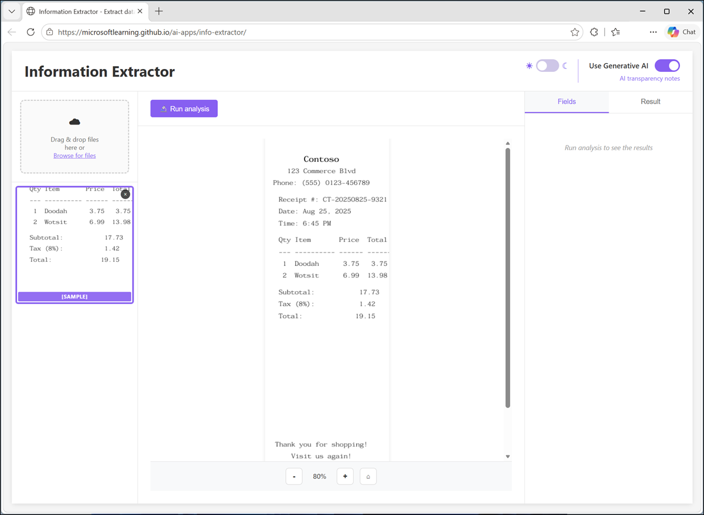
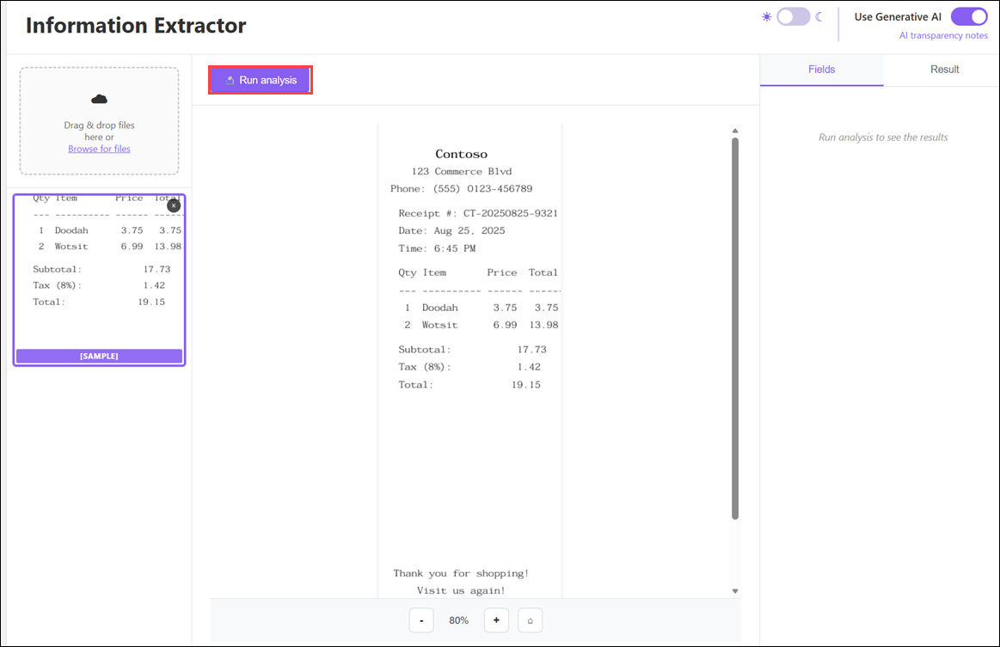
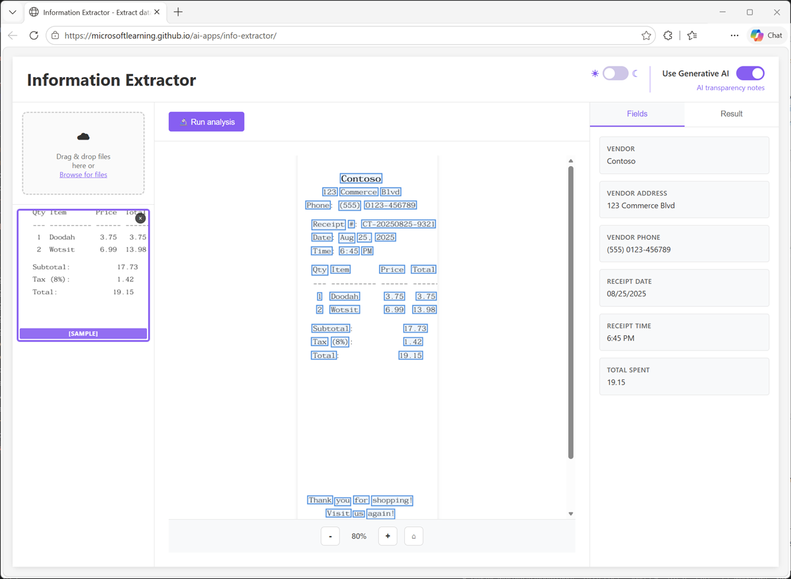

# Lab: Explore information extraction

### Estimated timing: 45 Minutes

## Lab Overview

In this lab, you'll use optical character recognition (OCR) and generative AI to extract information from receipts. The goal of this lab is to explore for yourself how information extraction from documents involves an OCR process to detect text, and a field extraction stage to map specific text strings to field values.

## Lab Objectives

In this lab, you will complete the following task:

+ Task 1: Extract information from receipts

## Task 1: Extract information from receipts

Suppose you need to extract data fields from scanned receipts to help automate an expense claim solution. You can use an AI technique called optical character recognition (OCR) to identify text and its location in images. By combining this text extraction with a generative AI model, you can then apply semantic analysis to associate individual text values with specific data fields - such as names, phone numbers, dates, amounts, and so on.

1. On your virtual machine, click on the **Microsoft Edge** icon as shown below:

    

1. In a web browser, open the **[Information Extractor](https://aka.ms/info-extractor)** app at `https://aka.ms/info-extractor`.

1. Wait for the model to download and initialize.

    > **Tip**: The first time you open the app, it may take a few minutes for the model to download. Subsequent downloads will be faster.

1. While you're waiting for the model to initialize, in a new browser tab, download **[receipts.zip](https://aka.ms/receipts)** from `https://aka.ms/receipts` to your local computer.

1. In the browser **Downloads** pane, select **Open file** for the downloaded **receipts.zip** file.

    

1. In File Explorer, select the **Extract (1)** tab, and then select **Extract all (2)**.

    

1. In the **Extract Compressed (Zipped) Folders** dialog, keep the default extraction location and then select **Extract**.

    

1. Return to the browser tab containing the Information Extractor app, and verify that the model has loaded.

1. View the sample receipt that is pre-loaded.

    

1. Run analysis on the sample image, and wait for the OCR and field extraction processes to complete.

    

1. When the analysis is complete, the text regions in the scanned receipt identified by the OCR process are highlighted on the image, and specific values required for expense claim processing are identified by the field extraction process and listed in the **Fields** pane. The full OCR text results are in the **Result** tab.

    

1. Upload any of the receipt images, and view it in the main content area of the app.

1. Run analysis on the uploaded image and review the fields and results.

1. Repeat the process to analyze the other receipt images you downloaded (or a scanned receipt of your own).

## Summary

In this lab, you explored how AI can be used to extract information from content using a combination of OCR and generative AI. In Microsoft Foundry, the Content Understanding tool is a multimodal information extraction solution that you can use to analyze documents, images, audio files, and videos.

### You've successfully completed the hand's-on lab!