## Hands-On-Lab: Building an Anomaly Detection Notebook in Azure Machine Learning

In this hands-on lab, you will build and evaluate a machine learning workflow in Azure Machine Learning Studio Notebooks that detects anomalies in manufacturing sensor data using a technique called Isolation Forest.

You will begin by creating a Compute Instance and a notebook, then register and load a dataset of machine sensor readings. Next, you'll clean the data, train an Isolation Forest model to identify unusual sensor behavior, and evaluate the model's predictions against known anomaly labels. Finally, you'll export the model's predictions to Azure Blob Storage as a new Data Asset, ensuring the results are saved for reporting, auditing, and future analysis.

## Lab Objectives

In this lab, you will be able to complete the following tasks:

- Task 1: Create a Compute Instance
- Task 2: Create a Notebook
- Task 3: Register the Dataset
- Task 4: Load the Manufacturing Dataset
- Task 5: Clean the Dataset
- Task 6: Training the Isolation Forest Model
- Task 7: Ealuate the Model
- Task 8: Export the Results

## Architecture diagram

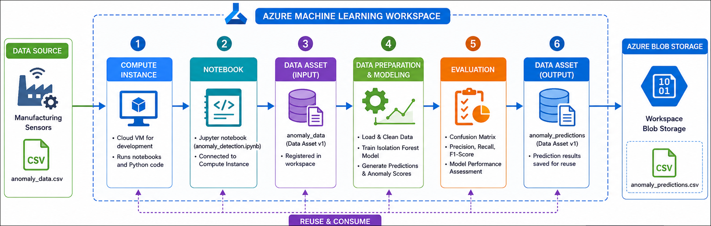

### Task 1: Create a Compute Instance

In this task, you'll sign in to Azure Machine Learning Studio, open your existing workspace, and create a Compute Instance - the cloud computer that will run your notebook, execute your Python code, and train your model.

1. Open a new tab in the browser, right-click on the following link [Azure Machine Learning Studio](https://ml.azure.com/), then **Copy link** and paste it in a new browser tab to log in to **Azure Machine Learning Studio**.

1. If prompted, provide the credentials below:
   - **Email/Username:** <inject key="AzureAdUserEmail"></inject>

   - **Password:** <inject key="AzureAdUserPassword"></inject>

1. Select **Workspaces (1)** from the left navigation pane, then on the **Workspaces** page, select the **anamolydetection-<inject key="Deployment ID" enableCopy="false"></inject> (2)** that you want to open.

   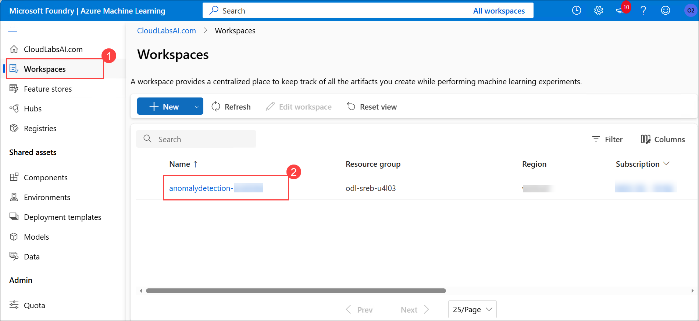

1. From the left navigation pane, select **Compute** under the **Manage** section.

   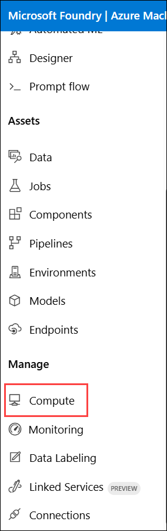

1. Select the **Compute instances** tab (1) to access the page for managing development compute resources, then select **+ New (2)** to create a new compute instance that you can use to run notebooks, scripts, and other machine learning workloads.

   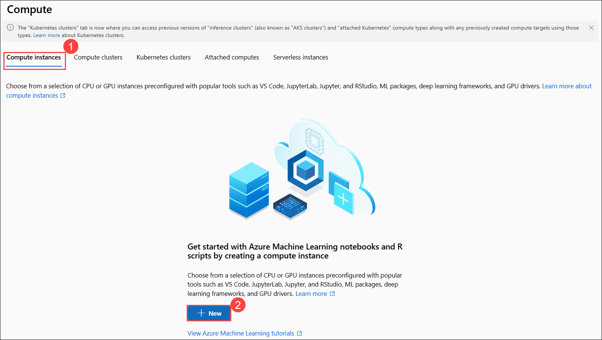

1. Enter a unique name as **compute<inject key="Deployment ID" enableCopy="false"></inject> (1)** for the compute instance, choose **Standard_DS11_v2** virtual machine size **(2)**, leave everything else as default and then select **Review + Create (3)**

   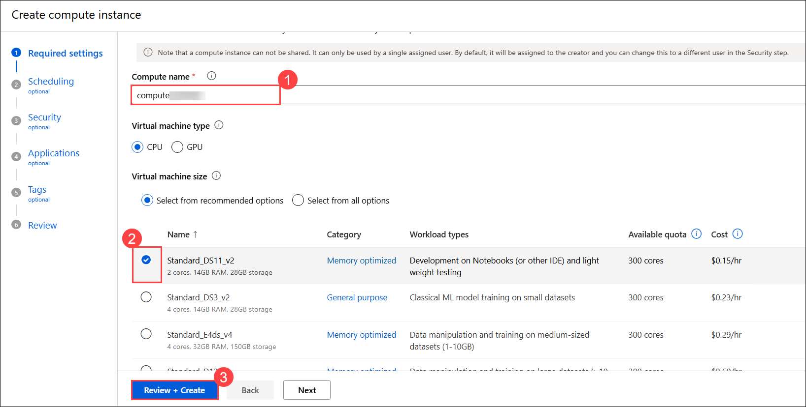

1. Review the configuration of the Compute instance and then click on **Create**.

   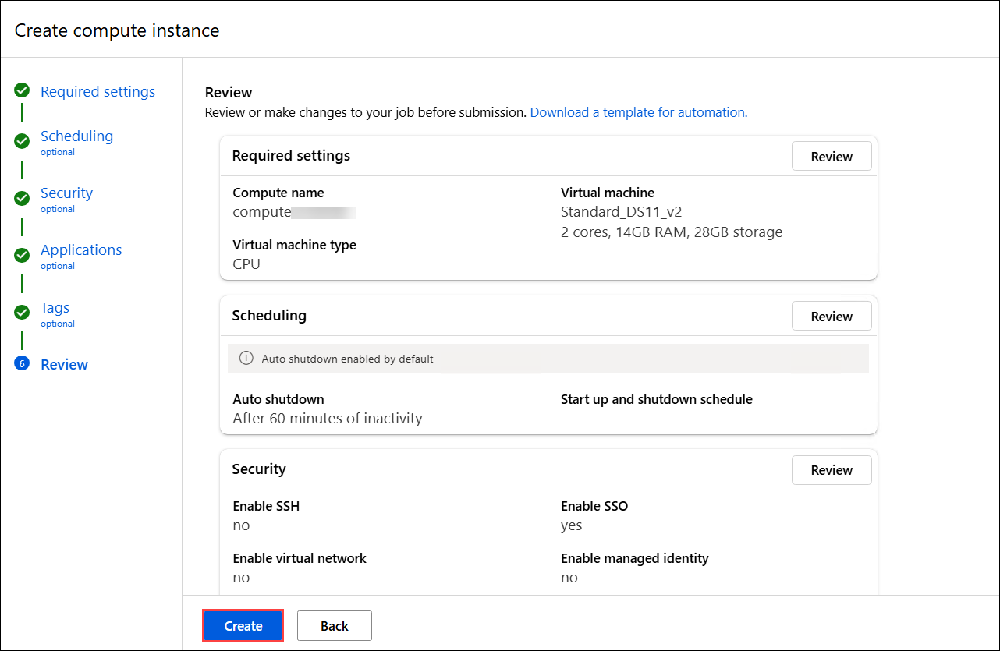

1. Wait for the compute instance to be provisioned. When the **State** changes from **Creating** to **Running**, the compute instance is ready to use for running notebooks, scripts, and other machine learning workloads.

   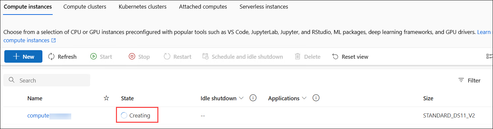

   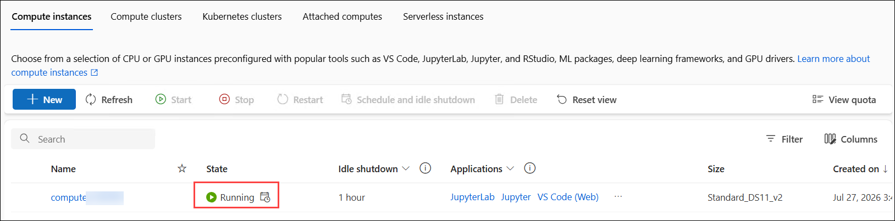

   > **Note:** The compute instance typically takes **3-5 minutes** to be provisioned and become operational.

> **Congratulations** on completing the task! Now, it's time to validate it. Here are the steps:
>
> - Hit the Validate button for the corresponding task. If you receive a success message, you can proceed to the next task.
> - If not, carefully read the error message and retry the step, following the instructions in the lab guide.
> - If you need any assistance, please contact us at cloudlabs-support@spektrasystems.com. We are available 24/7 to help.

<validation step="4f66146e-17d0-450c-b290-c77cbe2af90a" />

### Task 2: Create a Notebook

In this task, you'll create a new notebook file named `anomaly_detection.ipynb` and connect it to your running Compute Instance and the **Python 3.10 - SDK v2** kernel, so it's ready to run the Python code used throughout the rest of this lab.

1. Select **Notebooks (1)** from the left navigation pane, select **+ Files (2)**, and then choose **Create new folder (3)** to create a new folder for storing your notebook and related files.

   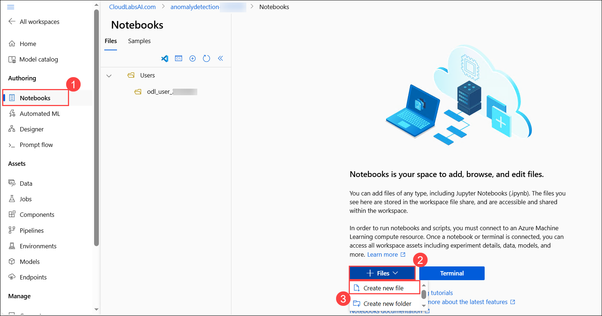

   > **Note:** If the **What's New in Notebooks** dialog appears, select **Close** to dismiss it and continue with the lab.

   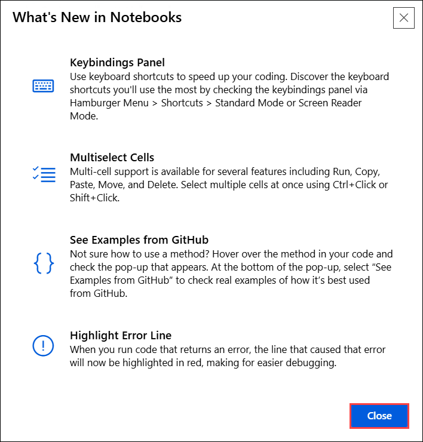

1. Enter **`anomaly_detection.ipynb`** as the **File name (1)**, keep the default **Notebook (\*.ipynb)** file type selected, and then select **Create (2)** to create the notebook.

   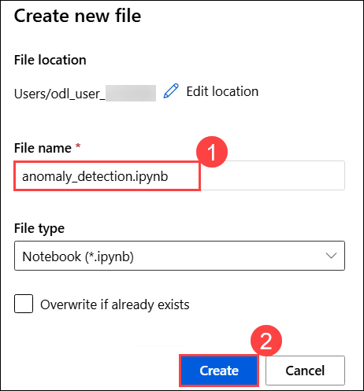

1. Open the **anomaly_detection.ipynb** notebook, verify that the compute instance is in the **Running** state, and ensure the notebook is connected to the **Python 3.10 - SDK v2** kernel before proceeding.

   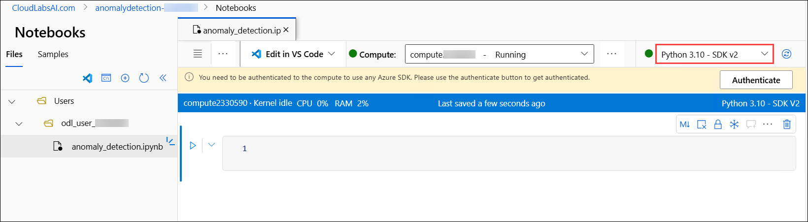

### Task 3: Register the Dataset

In this task, you'll upload the `anomaly_data.csv` file and register it as a Data Asset in your Azure Machine Learning workspace, giving it version control and a reusable reference that your notebook - and any future notebook - can retrieve without needing the original local file.

1. Select **Data (1)** from the left navigation pane, ensure the **Data assets (2)** tab is selected, and then select **+ Create (3)** to create a new data asset for your machine learning workspace.

   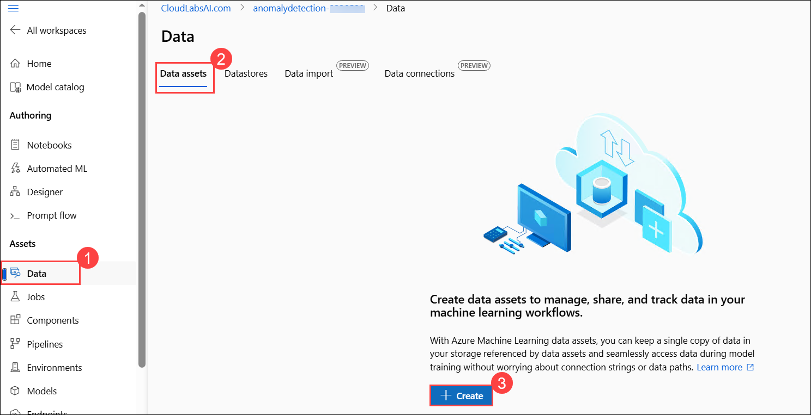

1. Enter **anomaly_data** as the **Name (1)**, ensure the **Type (2)** is set to **File**, and then select **Next (3)** to configure the data source for the data asset.

   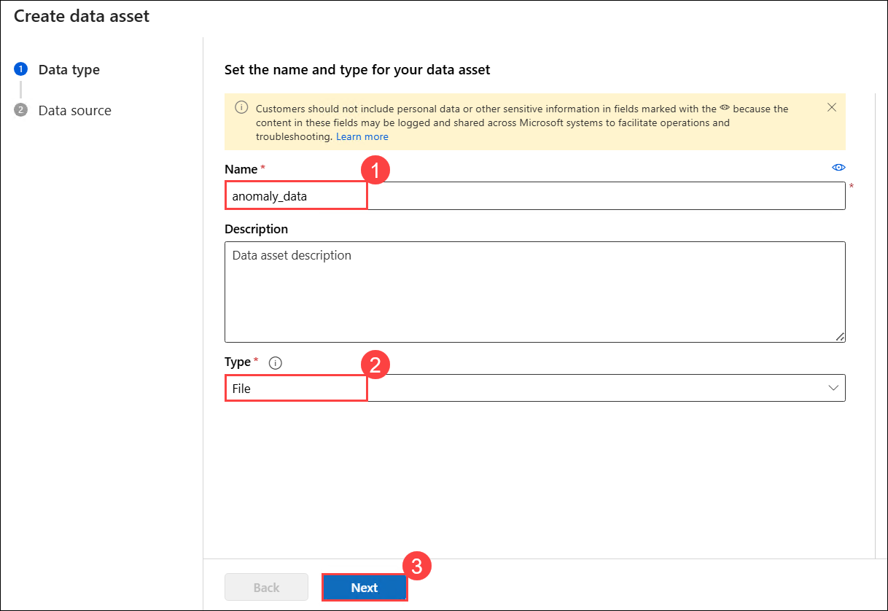

1. Select **From local files (1)** as the data source, and then select **Next (2)** to upload a file from your local computer.

   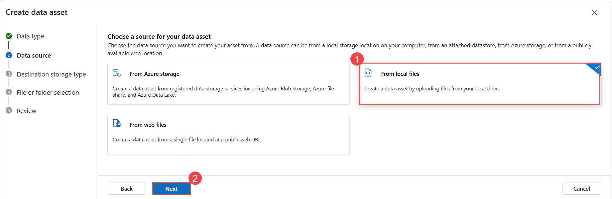

1. Ensure **Azure Blob Storage (1)** is selected as the **Datastore type**, select the **workspaceblobstore (2)** datastore, and then select **Next (3)** to continue to the file selection step.

   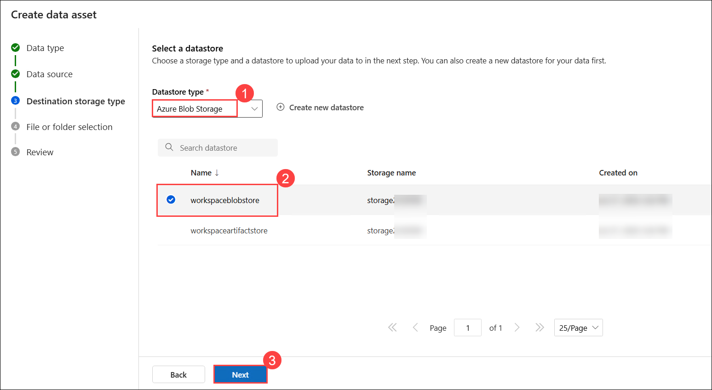

1. Select **Upload files or folder (1)**, choose **Upload files (2)**, and then browse to and select the local file that you want to upload as the data asset.

   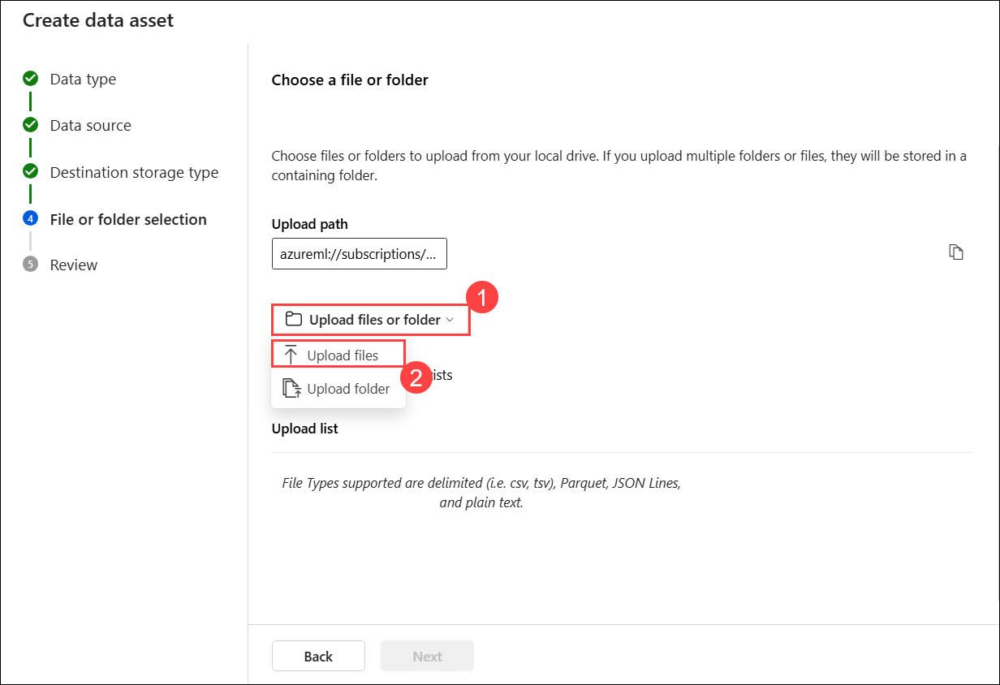

1. **File or Folder Selection**:
   - In the file browser, navigate to `C:\Labs\Allfiles\unit4-lesson3` and then select the file:**`anomaly_data.csv` (1)**
   - Wait for the file to appear under Upload list
   - Click **Next (2)**

     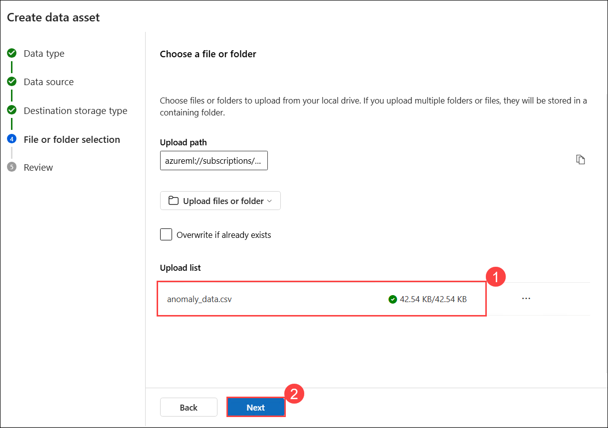

1. Review the data asset configuration to ensure the settings are correct, and then select **Create** to upload the file and create the data asset.

   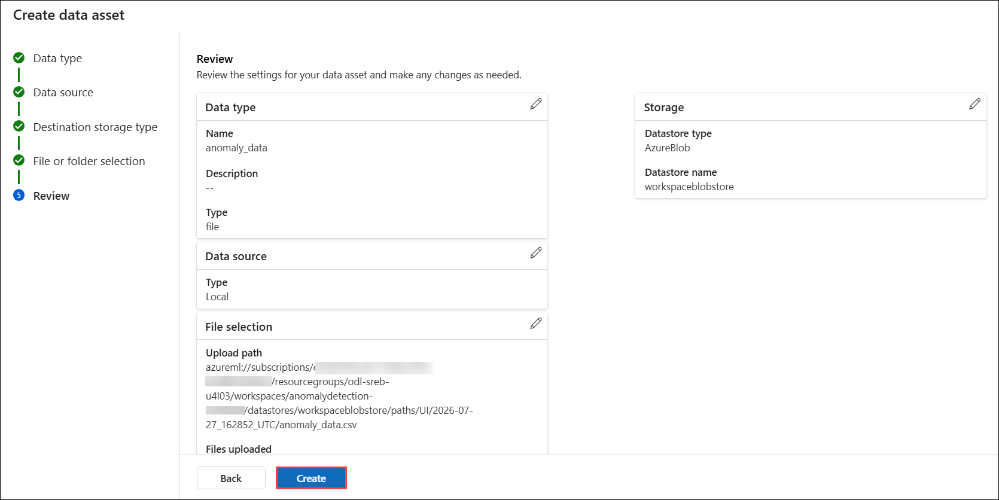

> **Congratulations** on completing the task! Now, it's time to validate it. Here are the steps:
>
> - Hit the Validate button for the corresponding task. If you receive a success message, you can proceed to the next task.
> - If not, carefully read the error message and retry the step, following the instructions in the lab guide.
> - If you need any assistance, please contact us at cloudlabs-support@spektrasystems.com. We are available 24/7 to help.

<validation step="3d02dc16-c8d2-473a-98ba-56cd0c659cb2" />

### Task 4: Load the Manufacturing Dataset

In this task, you'll authenticate your notebook session, install a required package, and write Python code that retrieves the registered Data Asset and loads it into a pandas DataFrame, so it's ready to be cleaned and analyzed.

1. Select **Notebooks (1)** from the left navigation pane, open the **anomaly_detection.ipynb (2)** notebook, and proceed to add the code required for the anomaly detection workflow.

   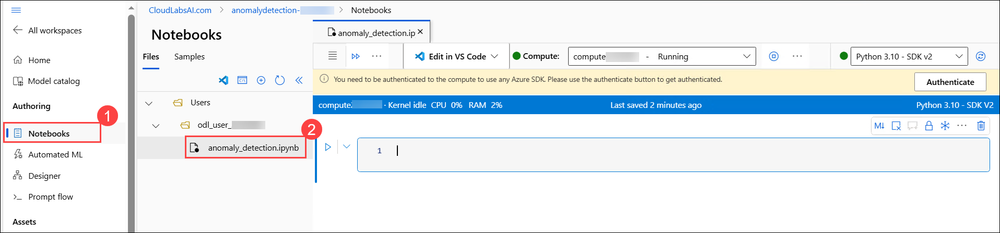

1. Select **Authenticate** to authenticate your notebook session with the Azure Machine Learning compute instance and enable access to Azure resources used in the lab.

   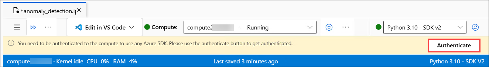

1. Paste the following command into a notebook cell **(1)**, and then select the **Run** button **(2)** to execute the cell.

   ```
   %pip install "setuptools<81" --force-reinstall
   ```

   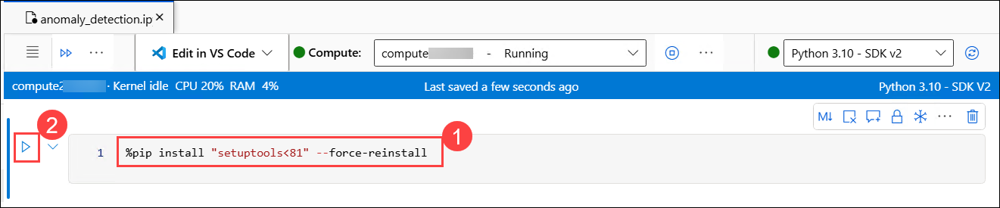

   > **Note:** This command reinstalls **setuptools** version **earlier than 81**, which is required to ensure compatibility with the lab environment.

1. After the above command finishes running, select the **More actions (...) (1)** menu, and then select **Restart kernel (2)** to apply the package changes before continuing.

   .png>)

1. On the **Restart kernel?** dialog, select **Restart**.

   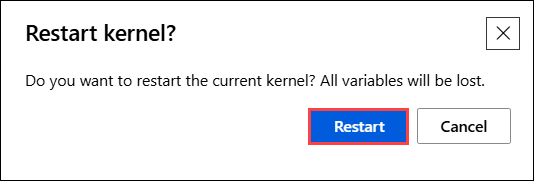

1. Select **+ Code** to add a new code cell below the current cell.

   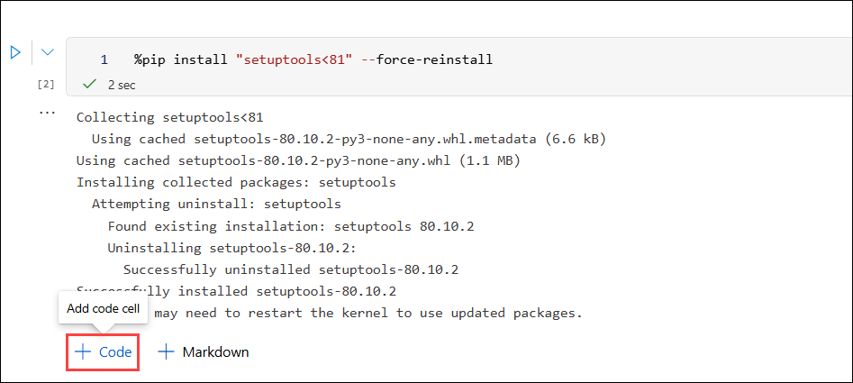

1. Paste the following code into the notebook cell **(1)**, and then select the **Run** button **(2)** to execute the cell. This code connects the notebook to your Azure Machine Learning workspace, retrieves the registered **anomaly_data** Data Asset, loads the dataset into a pandas DataFrame, and displays the first five rows so you can verify that the data has been loaded successfully.

   ```python
   import pandas as pd
   from azure.ai.ml import MLClient
   from azure.identity import DefaultAzureCredential

   # Connect to this workspace
   ml_client = MLClient.from_config(
       credential=DefaultAzureCredential()
   )

   # Retrieve the registered Data Asset
   data_asset = ml_client.data.get(
       name="anomaly_data",
       version="1"
   )

   # Load the CSV file into a pandas DataFrame
   df = pd.read_csv(data_asset.path)

   # Display the first five rows
   df.head()
   ```

   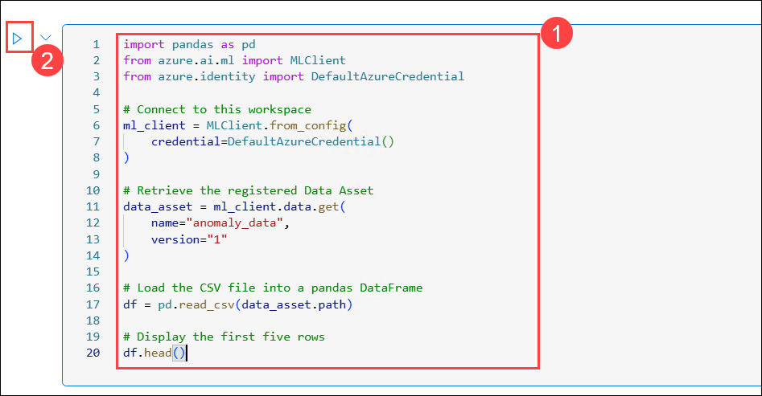

   The output should display the first five rows of the anomaly_data dataset, confirming that the Data Asset was loaded successfully into the notebook.

1. After executing the notebook cell, you should see a table similar to the following:

   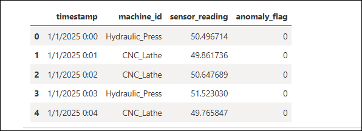

   If the table appears, the dataset has been loaded successfully.

### Task 5: Clean the Dataset

In this task, you'll check the dataset for missing values and create a cleaned copy of the data, preparing it for training the anomaly detection model.

1. Select **+ Code** to add a new code cell below the current cell.

1. Paste the following code into the notebook cell, and then select the **Run** button to execute the cell. This code checks the dataset for missing values, removes any rows containing missing data, creates a clean copy of the dataset, and displays the number of rows before and after the cleaning process.

   ```python
   print("Missing values before cleaning:")
   print(df.isna().sum())

   dataset = df.dropna().copy()

   print(f"Rows before: {len(df)}")
   print(f"Rows after: {len(dataset)}")
   ```

   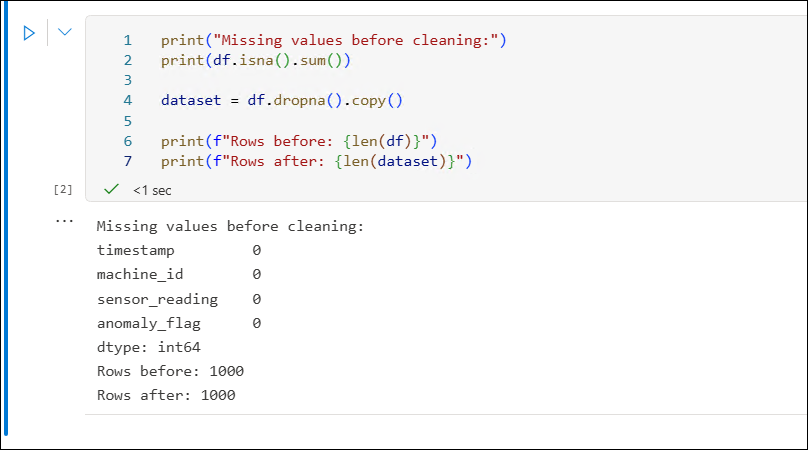

   Since there are no missing values, the row count should remain unchanged.

### Task 6: Training the Isolation Forest Model

In this task, you'll train an Isolation Forest model using scikit-learn to detect anomalies in the sensor readings, and generate an anomaly score for every observation in the dataset.

1. Select **+ Code** to add a new code cell below the current cell.

1. Paste the following code into the notebook cell, and then select the **Run** button to execute the cell. This code trains an **Isolation Forest** model to detect unusual sensor readings, generates anomaly predictions and anomaly scores for each observation, and displays the ten sensor readings that are most likely to be anomalies.

   ```python
   from sklearn.ensemble import IsolationForest

   feature_columns = ["sensor_reading"]
   X = dataset[feature_columns]

   model = IsolationForest(
       n_estimators=100,
       contamination=0.01,
       random_state=42
   )
   model.fit(X)

   predictions = model.predict(X)
   dataset["Predicted_Label"] = predictions
   dataset["Predicted_Label"] = dataset["Predicted_Label"].replace({
       1: 0,
       -1: 1
   })

   dataset["Anomaly_Score"] = -model.decision_function(X)

   dataset.sort_values(
       "Anomaly_Score",
       ascending=False
   ).head(10)
   ```

   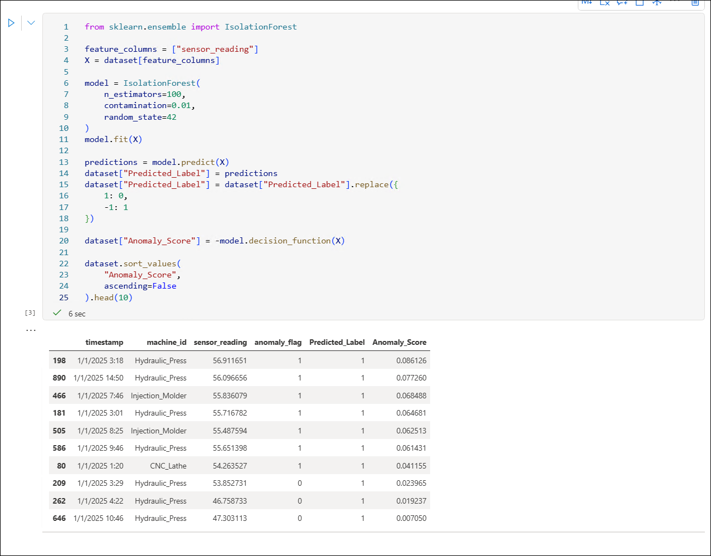

   The output should include two new columns, **Predicted_Label** and **Anomaly_Score**, along with the ten sensor readings that the model identifies as the most anomalous.

### Task 7: Ealuate the Model

In this task, you'll compare the model's predictions against the known anomaly labels using a confusion matrix and classification report, so you can judge how accurate the model actually is before trusting its results.

1. Select **+ Code** to add a new code cell below the current cell.

1. Paste the following code into the notebook cell, and then select the **Run** button to execute the cell. This code compares the model's predictions with the actual anomaly labels, generates a confusion matrix and classification report, and displays key evaluation metrics such as true positives, false positives, true negatives, and false negatives.

   ```python
   from sklearn.metrics import confusion_matrix, classification_report

   cm = confusion_matrix(
       dataset["anomaly_flag"],
       dataset["Predicted_Label"]
   )
   tn, fp, fn, tp = cm.ravel()

   print("Confusion Matrix")
   print(cm)
   print(f"\nTrue Positives: {tp}")
   print(f"True Negatives: {tn}")
   print(f"False Positives: {fp}")
   print(f"False Negatives: {fn}")

   print("\nClassification Report")
   print(classification_report(
       dataset["anomaly_flag"],
       dataset["Predicted_Label"]
   ))
   ```

   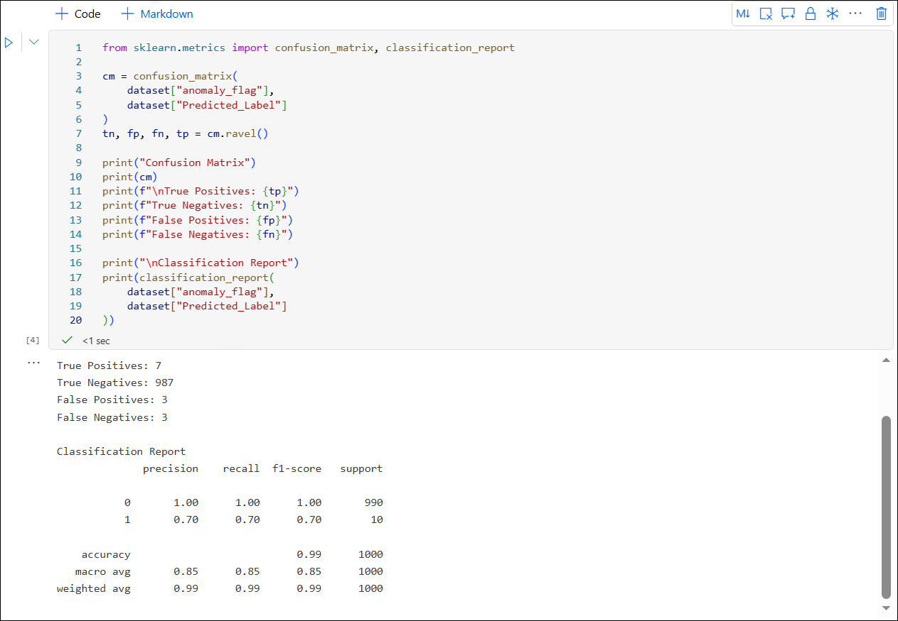

   The output should display the **confusion matrix** and a **classification report** summarizing the model's performance, including precision, recall, F1-score, accuracy, and the counts of true positives, true negatives, false positives, and false negatives.

### Task 8: Export the Results

In this task, you'll save the prediction results to a CSV file and register them as a new Data Asset in Azure Blob Storage, so the results can be reused in future notebooks, dashboards, or reporting workflows.

1. Select **+ Code** to add a new code cell below the current cell.

1. Paste the following code into the notebook cell, and then select the **Run** button to execute the cell. This code saves the prediction results as a CSV file, uploads the file to your Azure Machine Learning workspace, and creates a versioned **Data Asset** that can be reused in future notebooks and machine learning workflows.

   ```python
   from azure.ai.ml.entities import Data
   from azure.ai.ml.constants import AssetTypes

   dataset.to_csv(
       "anomaly_predictions.csv",
       index=False
   )

   results_asset = Data(
       path="./anomaly_predictions.csv",
       type=AssetTypes.URI_FILE,
       name="anomaly_predictions",
       version="1",
       description="Isolation Forest prediction results"
   )

   ml_client.data.create_or_update(results_asset)
   print("Prediction results successfully uploaded.")
   ```

   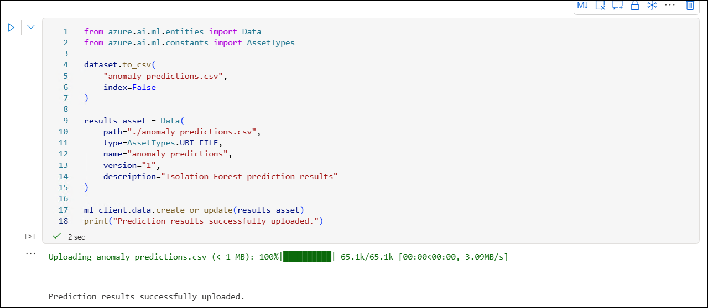

   The output should display the message **"Prediction results successfully uploaded."**, indicating that the CSV file has been uploaded and registered as a new **Data Asset** in the Azure Machine Learning workspace.

## Review

In this lab, you have completed the following tasks:

- Created a Compute Instance
- Created a Notebook
- Registered Our Dataset
- Loaded the Manufacturing Dataset
- Cleaned Our Data
- Trained an Isolation Forest Model
- Evaluated the Model
- Saved Our Results to Azure Blob Storage

### You have successfully completed the lab
