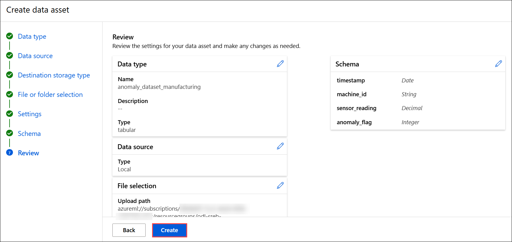
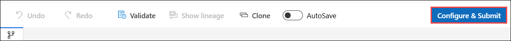
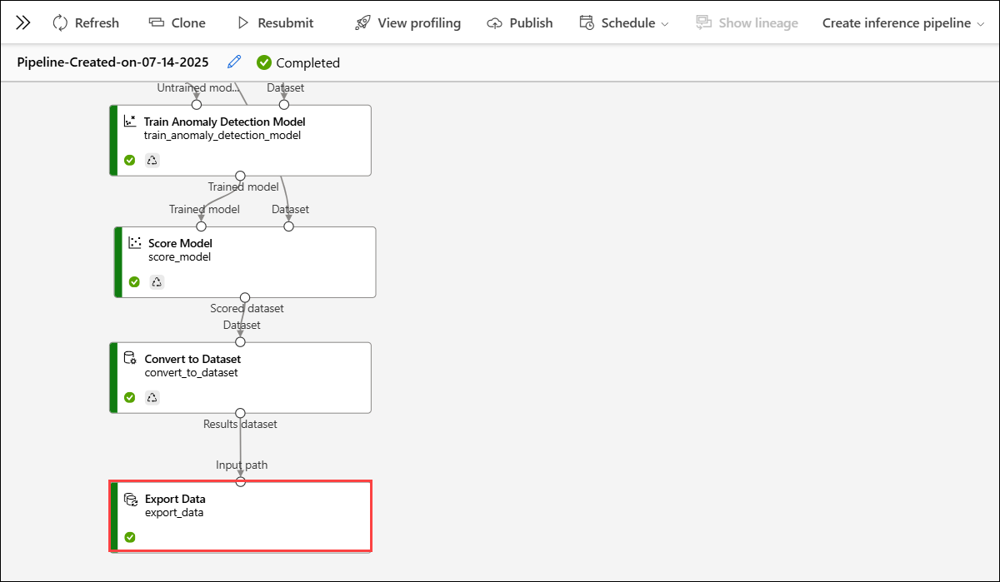

## Deploying PCA-Based Pipelines

Now that we know what data we’re working with, let’s dive into how we’re going to use it!  
Using a technique called **Principal Component Analysis (PCA)**, we’ll use Azure Machine Learning tools to learn the pattern of normal behavior and then detect when something deviates from it.

---

### Task 1: Create Azure ML Workspace

1. **Log in** to [Azure Machine Learning Studio](https://ml.azure.com/) when prompted provide below credentials.

    - **Email/Username:** <inject key="AzureAdUserEmail"></inject>

    - **Password:** <inject key="AzureAdUserPassword"></inject>
   
1. On the **Create a new workspace to get started with Azure ML** fill in the following fields:

   - **Name**: `PCA_Anomaly_Model`  
   - **Friendly Name**: *(Optional)*  
      Azure will auto-fill this based on the name.
   - **Hub (Optional)**: Leave this as “None” unless instructed otherwise.
   - **Advanced Settings**:
     - **Subscription**: Select the appropriate Azure subscription from the dropdown. 
     - **Resource Group**: Choose an existing one 
     - **Region**: Select **East US 2** for better performance.
     - After filling out all the required fields, click the **“Create”** button.

         

    >**Note**: If you **did not** see the page like Figure 1, simply click **“Create Workspace”** on your dashboard and fill out the fields as described in Step 2.

1. Now navigate to your newly created workspace. On the **left-hand menu**, click **“Workspaces”**. Locate the workspace you just created `PCA Anomaly Model`.

      
   
1. Click on its name to open it. This will take you inside the workspace where you can build and run machine learning experiments.

     

1. Once you are inside your workspace PCA Anomaly Model, look at the left hand side menu to find the “Designer” tab under the Authoring section. Click on 
this tab.

     

   >**Note**:  This will open the Azure Machine Learning Designer interface where you can  begin creating your machine learning pipeline by dragging and dropping 
components.

1. Once the **Designer** page is loaded, make sure that you’re on the Classic prebuilt tab under the “New pipeline” section. From here, click on the box with a plus sign 
that says, **Create a new pipeline using classic prebuilt components**.

     

### Task 2: Upload Our Dataset

Now it’s time to add the dataset to the Azure ML pipeline!

1. On the **left panel**, under the **Data (1)** tab, click the **➕ (plus icon) (2)** to upload a dataset.  

     

1. On **Create a new workspace to get started with Azure ML** page enter the following data.

   - Name the dataset: **`anomaly_dataset_manufacturing`**  
   - Select type: **Tabular**  
   - Click **Next**  

     

1. On the **Choose a source for your data asset** page, choose **From local files** the click on **Next**. 

     

1. On the **Select a datastore** page select the following option:  
   - Under **Datastore type**, select **Azure Blob Storage**  
   - Choose the datastore named: **`workspaceblobstore`**  
   - Click **Next**  

     

1. On the **Choose a file or folder** page, select **Upload files or folder (1)** from the dropdown, then select **Upload files (2)**.

     

1. **File or Folder Selection**  
   - In the file browser, select the file: `anomaly_data.csv`  
   - Wait for the file to appear under “Upload list”  
   - Click **Next**  

     

1. On the **Settings** page, review the fields and ensure they match the expected format then click **Next**  

     

1. On the **Schema** page, ensure the schema fields are correctly recognized then click **Next**  

     

1. On the **Review** page, click **Create** to finalize the dataset upload

     

1. Under the **Data** tab, locate the uploaded dataset named **`anomaly_dataset_manufacturing`**.  

     

1. Click on the dataset card then select **Use data** to **drop it onto the pipeline canvas** on the right.

      

1. Verify the data placed in the canvas, and click 'Save' to avoid losing progress.

      

### Task 3: Preprocessing Our Data

Now it’s time to add the **Clean Missing Data** component. Follow the steps below to complete this part!

1. Switch to the **Component** tab and search for **"Clean Missing Data"** by Microsoft.  
    
    

1. Click on the **Clean Missing Data** data component, then drag it from the left panel and drop it below the **Dataset card** in the pipeline canvas on the right.

    
   
1. Now connect the Dataset to the Cleaning Component, hover over the small **circle at the bottom** of the dataset block labeled **Data output**. Click and **drag a line** to the **left circle** of the Clean Missing Data component labeled **Dataset**. **Save** your progress by clicking **Save** at the top right of the canvas.

     

1. Now you will Configure the Clean Missing Data component. Double-click the **Clean Missing Data** block on the canvas. Then click the blue **Edit column** link next to **Columns to be cleaned**. This will open a pop-up window.  

     

1. Select only **sensor_reading** - Do **not** include columns like `timestamp`, `machine_id`, or `anomaly_flag`. Click **Save** in the pop-up,

     

1. Click **Save** again on the main screen.  

     

### Task 4: Adding Detection Models

Now that you have cleaned the dataset, it's time to add the **PCA-Based Anomaly Detection model** into your pipeline.

1. On the **Component** tab, search for **PCA-Based Anomaly Detection**. Then **Drag** the PCA-Based Anomaly Detection component into the canvas.

    
   
   >**Note**: This is a built-in model that detects outliers in time-series data using **Principal Component Analysis**.

1. Next, you will train the model using your cleaned dataset by adding the **Train Anomaly Detection Model** component.

1. In the Component tab, search for **Train Anomaly Detection Model**. Drag the component into your canvas, placing it below the **PCA-Based Anomaly Detection** block.  

    

1. Connect:
   - The **Untrained model output** from the **PCA-Based Anomaly Detection** to the **Model input** of Train Anomaly Detection Model.
   - The **Cleaned data output** from the **Clean Missing Data** to the **Dataset input** of Train Anomaly Detection Model.  

     

1. Next, you will use the **Score Model** to apply the trained model and generate predictions.

1. In the Component tab, search for **"Score Model"** by Microsoft.

1. Drag the **Score Model** component into the canvas, placing it **below** the **Train Anomaly Detection Model**.  

     

1. Connect:
   - The **Trained model output** from **Train Anomaly Detection Model** to the **Trained model input** of **Score Model**.
   - The **Cleaned data output** from **Clean Missing Data** to the **Dataset input** of **Score Model**.

   > This ensures that your newly trained model is scoring the same dataset it learned from.

1. Click **Save** at the top of the screen to preserve your progress.

### Task 5: Convert and View Results

1. We can’t visualize the output directly using the Score Model component, so we’ll need to convert the scored results into a visual-friendly format. To do so, we’ll use a component 
called “Convert to Dataset”.

1. In the left-side pane under the Component tab, search for the “Convert to Dataset” Component. Then **Drag** the Convert to Dataset component onto the canvas and place it under the 
Score Model component.

   >**Note**: This tool takes the output from the model and converts it to a format that can be visualized in the Designer.

1. Connect the Scored dataset output from the Score Model to the Dataset input of 
the Convert to Dataset component.

1. Once connected, click Save at the top to preserve your updated pipeline.

1. Now that the pipeline is fully built with all the components connected—from data intake to anomaly scoring—we're ready to run it to view our results!

1. First, let’s make sure all components are connected as shown.
    - Confirm that:
      i. The dataset flows through Clean Missing Data.
      ii. The cleaned data connects to both:
          - Train Anomaly Detection Model
          - Score Model
      iii. PCA-Based Anomaly Detection is connected to the Train component.
      iv. Score Model connects to Convert to Dataset.

1. Save your pipeline, if not auto-saved already.

1. Click the **Configure & Submit** button in the top-right corner.

    

### Task 6: Configure Pipeline Job Basics 

We now need to configure a bit more detail before running your pipeline in Azure ML 
Designer.

1. On the **Basics** page, perform the steps as mentioned below:

   - In the Experiment name select **Create new**
   - In **New experiment name** filed provide **`Test_Anomaly_Manufacturing`**
   - Click the blue **Next** button at the bottom-right corner of the screen

      

1. On the **Inputs & outputs** page, click on **Next** to skip.

1. On the Runtime Settings page, from the dropdown of the **Select Compute Type** section, click on Compute Cluster. Since no cluster is currently available, we’ll need to create one. Click on **Create Azure ML Compute Cluster**.

1. On the **Select virtual machine** page, specify the following then click on **Next** :
  
    - Location: Confirm that the selected region is the same as your workspace.
    
    - Virtual Machine Tier: Leave as default. 
    
    - Virtual Machine Type: Keep this as **CPU** (sufficient for our anomaly detection task).

    - Virtual Machine Size: Choose **Standard_DS11_v2**.
  
        

1. On the **Configure Settings** page, provide **Compute name** then click on **Create**

    

1. Back on the **Runtime Settings** page, select the newly created Azure ML compute cluster from the dropdown in the **Select Azure ML compute cluster** field, then click on **Review + Submit**.

     

1. On **Review + Submit** page, click on **Submit**. 

    

1. Once submitted, a success notification appears at the top of the page. Click on 'View details' to monitor the pipeline. It may take some time for the pipeline to complete.

      
     
1. Right-click on the **Convert to Dataset** component, hover over **Preview data** to click on **Results dataset**.

   

   

1. Understanding the Output Each row represents a **timestamped data record** from the pipeline. Here's what the columns mean:

    | Column Name         | Description                                                                 |
    |---------------------|-----------------------------------------------------------------------------|
    | `timestamp`         | When the data was collected; essential for time-series analysis.            |
    | `machine_id`        | Identifier for the machine (e.g., `CNC_Lathe`, `Injection_Molder`).         |
    | `sensor_reading`    | Numeric value collected from the machine's sensor.                          |
    | `anomaly_flag`      | Original label: 1 if anomaly, 0 if normal.                                  |
    | `Scored Labels`     | Model's prediction: 1 for anomaly, 0 for normal.                            |
    | `Scored Probabilities` | Shows the model's confidence level in its prediction. Closer to 1 means higher certainty of an anomaly. |

1. What Is a Pipeline, Really?
    
    - A pipeline in Azure ML Designer is a step-by-step process that moves data through different stages—starting from input, moving through cleaning and analysis, and ending with a final output. Each stage performs a specific operation to transform or analyze the data.
    
    - At the beginning, you upload your raw dataset. Then, you may clean the data to handle missing or incorrect values. After cleaning, the data is sent to a machine learning model, 
which processes it to find patterns or make predictions. The model then produces new output data—such as predicted labels or anomaly scores.
    
    - However, after the model finishes running, it’s important to think about where the results go. If they are not stored or saved properly, it becomes difficult to access or share them later.
    
    - Let’s walk through the actual pipeline we built for anomaly detection and understand what happens to the data at each step.

#### Input Dataset

1. This is the starting point of the pipeline. You uploaded a CSV file or dataset containing sensor readings from a machine. This could track things like temperature, pressure, and 
vibration levels.

   **Example of a Results Dataset:**
   
    | **timestamp** | **machine_id** |  **temperature** | **pressure** | **vibration** | **anomaly_flag**  |
    |---------------|----------------|----------------- |--------------|---------------|-------------------|
    | 12:00 PM      |  M001          |   75             |      30      |     0.04      |      0            | 
    | 12:01 PM      |  M001          |   76             |      30.1    |     0.06      |      0            |
    | 12:02 PM      |  M001          |   120            |      80      |     1.5       |      1            |

    >**Note**: The last column (anomaly_flag) tells us whether that row is normal (0) or an anomaly (1). This column is used for testing the model’s accuracy.

#### Clean Missing Data

1. Data collected from machines may sometimes be incomplete—for example, a sensor might fail to report a value. The Clean Missing Data step helps prepare the data by:
    
    -  Replacing missing values with a default or average value
    -  Removing rows or columns with too many gaps

1. This ensures your model isn’t confused or misled by blank entries

   **Before Cleaning Dataset Example**

    | **temperature** |  pressure   |  vibration |
    |-----------|-------------|------------|
    | 75        |  30         |   0.04     |  
    |           |  30.1       |   0.06     |  
    | 120       |   80        |   1.5      |  

    **After Cleaning Dataset Example:**

    |temperature|  pressure   |  vibration |
    |-----------|-------------|------------|
    | 75        |  30         |   0.04     |  
    | 75        |  30.1       |   0.06     |  
    | 120       |   80        |   1.5      |  

#### Model (PCA)

- This is where the machine learning magic happens. Your cleaned data is sent into a model that learns to detect unusual behavior (anomalies).

- Specifically, we used Principal Component Analysis (PCA for short). The model looks at patterns in normal machine behavior and flags anything that deviates from it.

#### Output: Scored Dataset

- Once the model runs, it adds two new columns to the dataset that contain its predictions. One column, “Scored Labels” is the model’s prediction for the anomaly flag. The second 
column, “Scored Probabilities” is the confidence level of the prediction.

  **Example Scored Dataset Output:**

    | **timestamp** | **machine_id** |  **temperature** | **pressure** | **vibration** | **anomaly_flag**  | **Scored Labels**|  **Scored Probabilities**|  
    |---------------|--------------- |------------------|--------------|---------------|-------------------|------------------|-------------------------|
    | 12:00 PM      |  M001          |   75             |   30         |     0.04      |      0            |    0             |        0.98             |
    | 12:01 PM      |  M001          |   76             |   30.1       |     0.06      |      0            |    0             |        0.97             |
    | 12:02 PM      |  M001          |   120            |   80         |     1.5       |      1            |    1             |        0.65             | 
    
### Task 7: Saving our Data to Azure Blob

- Where Is the Data Stored?
   
   - After your pipeline processes the data and makes predictions, those results are not automatically saved in a permanent location. If you don’t store them externally, they may 
     only exist temporarily inside the Azure ML pipeline. That means you can’t reuse them in other projects, download them later, or share them with your team.

   - To solve this, you can connect your pipeline to Azure Blob Storage, which acts as a permanent cloud storage location.

- Azure Blob Storage is like a big cloud-based folder. You can think of it as an online hard drive where you can store:
     - Datasets (CSV files, Excel files)
     - Images, logs, or sensor readings
     - Output from your machine learning models

- We will now export your final scored dataset (which includes anomaly predictions) to an external storage location such as Azure Blob Storage. This ensures the results are saved 
even after the pipeline finishes.

1. Azure Blob Storage is like a big cloud-based folder. You can think of it as an online hard drive where you can store:

     -  Datasets (CSV files, Excel files)
     -  Images, logs, or sensor readings
     -  Output from your machine learning models

1. We will now export your final scored dataset (which includes anomaly predictions) to an external storage location such as Azure Blob Storage. This ensures the results are saved 
even after the pipeline finishes.

1. First, go to the Component tab and search for the **Export Data** component. Then, drag and drop the component into your canvas below the rest of 
your pipeline, as seen in below image.

     

1. Draw a line from the output of **Convert to Dataset** and connect it to the Input path of the **Export Data** component.

     

1. Now, we need to configure Export Data to save our model’s output.

1. Once you've added and connected the Export Data module in your pipeline, click on it to open the configuration panel on the right side

1. Set the fields in the panel as follows:
     a. Datastore Type: Azure Blob Storage
         - This tells Azure that you want to save the output file in a cloud-based blob container.
     b. Datastore: workspaceblobstore
         - This is the default blob storage associated with your workspace. It acts like a cloud folder that stores files outside of the pipeline’s memory.
     c. Output Path: predictions
         - This path acts like a folder name inside your blob storage. The system will save your file inside this path.
     d. File Format: csv
         - This will save the output as a CSV file.
     e. Save the configuration.

    
        
6. Click on **Configure & Submit** and the pipeline will run.

    

1. On the Basics page, Under **Experiment name** choose **Select existing (1)** the click on **Review + Submit (2)**
   
     

1. Once submitted, a success notification appears at the top of the page. Click on View details to monitor the pipeline. It may take some time for the pipeline to complete.

    
   
1. Wait for a while, as it might take some time for the pipeline to complete. Then review the **Export Data** step to ensure it ran successfully.

    

1. Log on to Azure Portal with your credentials. 
 
1. From here, click on **Storage Accounts** under the “Azure Services” section.

1. Now, we need to find the correct storage account from the list of accounts you currently see. It will be named “testanomalymod” followed by a sequence of random numbers. For example, “testanomalymod7380583022”. Once you find it, click on that account.

1. Once you open the blob storage, click on the predictions file that was generated by the pipeline. Now you can see the pipeline output.

    
   
#### Exit Activity: Saving Your Model’s Output to External Storage

**Scenario:**

- You work for a smart manufacturing company. Every hour, your Azure ML pipeline runs and checks sensor data from 100+ machines to detect anomalies. You used Azure ML Designer and a PCA-Based Anomaly Detection model.

- Now your team wants to save the predictions to Azure Blob Storage so they can:
     
     - View them later
     - Share them with managers
     - Generate monthly reports
     - Keep an archive for compliance

**Scenario Setup:**

- You work in a smart factory where your Azure ML pipeline runs every hour to check sensor readings for anomalies.
- The system has been flagging unusual behavior in Machine_12, but the logs are not saved consistently.
- This week, a manager asked you for a report of anomalies from the past 30 days — but the data wasn’t stored.
- Now your team wants you to:
    
    - Decide what output from the pipeline should be saved
    - Decide where and how often to store it
    - Justify your choices to your supervisor

- Prompts to think about since you have to answer these at the end: 
    
    1. What type of data would you save from the anomaly detection pipeline?
    
    2. Why is it important to save the output externally, instead of keeping it inside the pipeline?
    
    3. How would you use Azure Blob Storage in your solution?

- Final Deliverable (Public Audience Simulation):

   - Prepare a short status report or slide (3–4 bullet points) that explains your model’s findings to your factory’s operations manager. Include:

       - What the model predicted
       - How confident it was
       - What should be done next (e.g., notify maintenance)

### PBL Thinking Extension – Comparing PCA to Other Anomaly Detection Models

- Reflect & Extend: Could Another Model Work Better?
   
   - In this lesson, you used PCA-Based Anomaly Detection to find unusual sensor readings across multiple machines. PCA works by learning the “normal behavior” of the entire dataset and flagging points that deviate from that pattern.

   - But what if different machines behave differently?
   
   - Or what if a sensor value isn’t extreme, but its pattern over time is suspicious?

   - One alternative approach is using a model like Isolation Forest — a tree-based method that works well when anomalies are rare and different in value, not just direction. It       isolates each data point and sees how “deep” the tree has to go to separate it from others. 
Anomalies tend to get isolated quickly.
   
   - Even though Azure ML Designer doesn’t support Isolation Forest directly, here's how you 
might compare the two in theory:

      | **Model**                       | **How It Works**                                                                    |  **When It's Useful**                               | 
      |---------------------------------|-------------------------------------------------------------------------------------|-----------------------------------------------------|
      | PCA-Based Anomaly Detection     |  Finds unusual patterns based on direction and variance from “normal” behavior      | Works well when normal behavior is consistent and                                                                                                                                          smooth; effective for correlated features          |
      | Isolation Forest                | Separates each point using decision trees; anomalies are isolated in fewer splits   | Works well when anomalies are fewand clearly different in                                                                                                                                 value (not just pattern)                            |

       

