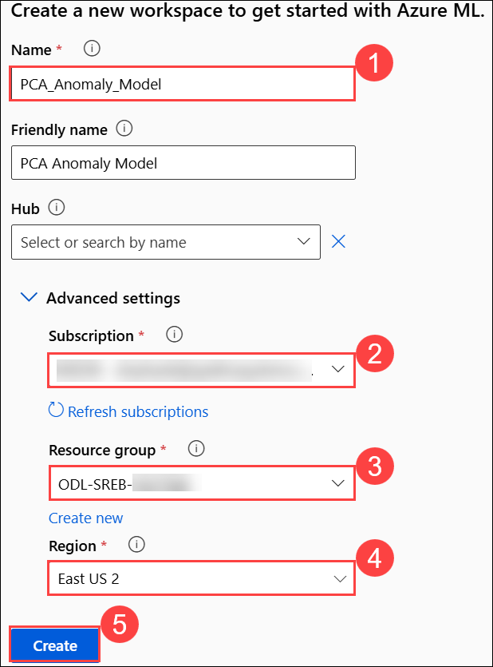

## Deploying PCA-Based Pipelines

Now that we know what data we’re working with, let’s dive into how we’re going to use it!  
Using a technique called **Principal Component Analysis (PCA)**, we’ll use Azure Machine Learning tools to learn the pattern of normal behavior and then detect when something deviates from it.

---

### Part 0: Create Azure ML Workspace

1. **Log in** to [Azure Machine Learning Studio](https://ml.azure.com/) when prompted provide below credentials.

    - **Email/Username:** <inject key="AzureAdUserEmail"></inject>

    - **Password:** <inject key="AzureAdUserPassword"></inject>
   
1. On the **Create a new workspace to get started with Azure ML** fill in the following fields:

   - **Name**: `PCA_Anomaly_Model`  
   - **Friendly Name**: *(Optional)*  
      Azure will auto-fill this based on the name.
   - **Hub (Optional)**: Leave this as “None” unless instructed otherwise.
   - **Advanced Settings**:
     - **Subscription**: Select the appropriate Azure subscription from the dropdown. 
     - **Resource Group**: Choose an existing one 
     - **Region**: Select **East US 2** for better performance.
     - After filling out all the required fields, click the **“Create”** button.

         

    >**Note**: If you **did not** see the page like Figure 1, simply click **“Create Workspace”** on your dashboard and fill out the fields as described in Step 2.

3. Now navigate to your newly created workspace. On the **left-hand menu**, click **“Workspaces”**. Locate the workspace you just created `PCA Anomaly Model`.

      
   
4. Click on its name to open it. This will take you inside the workspace where you can build and run machine learning experiments.

     

5. Once you are inside your workspace PCA Anomaly Model, look at the left hand side menu to find the “Designer” tab under the Authoring section. Click on 
this tab.

     

   >**Note**:  This will open the Azure Machine Learning Designer interface where you can  begin creating your machine learning pipeline by dragging and dropping 
components.

6. Once the **Designer** page is loaded, make sure that you’re on the Classic prebuilt tab under the “New pipeline” section. From here, click on the box with a plus sign 
that says, **Create a new pipeline using classic prebuilt components**.

     

## Part 1: Upload Our Dataset

Now it’s time to add the dataset to the Azure ML pipeline!

---

### Step-by-Step Instructions

1. On the **left panel**, under the **Data** tab, click the **➕ (plus icon)** to upload a dataset.  

     

2. **Data Type**  
   - Name the dataset: `anomaly_dataset_manufacturing`  
   - Select type: **Tabular**  
   - Click **Next**  

     

3. **Data Source**  
   - Choose **From local files**  

     

4. **Destination Storage Type**  
   - Under **Datastore type**, select **Azure Blob Storage**  
   - Choose the datastore named: `workspaceblobstore`  
   - Click **Next**  

     

5. **File or Folder Selection**  
   - Click **Upload files or folder**  
   - In the file browser, select the file: `anomaly_data.csv`  
   - Wait for the file to appear under “Upload list”  
   - Click **Next**  

     

6. **Settings**  
   - Review the fields and ensure they match the expected format  
   - Click **Next**  

     

7. **Schema**  
   - Ensure the schema fields are correctly recognized  
   - Click **Next**  

     

8. **Review**  
   - Click **Create** to finalize the dataset upload

---

### Add Dataset to the Pipeline Canvas

9. Under the **Data** tab, locate the uploaded dataset named `anomaly_dataset_manufacturing`.  

     

10. Click on the dataset card.  
    - Drag it from the left panel and **drop it onto the pipeline canvas** on the right  
    - **Save your work** to avoid losing progress  

     

## Part 2: Preprocessing Our Data

Now it’s time to add the **Clean Missing Data** component. Follow the steps below to complete this part!

---

### Steps to Clean Missing Data

1. Switch to the **Component** tab and search for **"Clean Missing Data"** by Microsoft.  
    
    

2. **Connect the Dataset to the Cleaning Component**:  
   - Hover over the small **circle at the bottom** of the dataset block labeled **Data output**.
   - Click and **drag a line** to the **left circle** of the Clean Missing Data component labeled **Dataset**.  

     

3. **Save** your progress by clicking **Save** at the top right of the canvas.

4. **Configure the Clean Missing Data component**:  
   - Double-click the **Clean Missing Data** block on the canvas.

5. Click the blue **Edit column** link next to **"Columns to be cleaned"**.  
   - This will open a pop-up window.  

     

6. **Select only numerical columns** that might have missing entries.  
   - Do **not** include columns like `timestamp`, `machine_id`, or `anomaly_flag`.  

     

7. Click **Save** in the pop-up, then click **Save** again on the main screen.  

     

---

## Part 3: Adding Detection Models

Now that you have cleaned the dataset, it's time to add the **PCA-Based Anomaly Detection model** into your pipeline.

---

### Steps to Add PCA-Based Anomaly Detection

1. On the **Component** tab, search for **PCA-Based Anomaly Detection** (or just "PCA") by Microsoft.  
   - This is a built-in model that detects outliers in time-series data using **Principal Component Analysis**.  

     

2. **Drag** the PCA-Based Anomaly Detection component into the canvas.

---

### Train the PCA Model

Next, train the model using your cleaned dataset by adding the **Train Anomaly Detection Model** component.

1. In the Component tab, search for **Train Anomaly Detection Model** by Microsoft.

2. Drag the component into your canvas, placing it below the **PCA-Based Anomaly Detection** block.  

     

3. Connect:
   - The **Untrained model output** from the **PCA-Based Anomaly Detection** to the **Model input** of Train Anomaly Detection Model.
   - The **Cleaned data output** from the **Clean Missing Data** to the **Dataset input** of Train Anomaly Detection Model.  

     
---

### Score the Dataset

Next, you’ll use the **Score Model** to apply the trained model and generate predictions.

1. In the Component tab, search for **"Score Model"** by Microsoft.

2. Drag the **Score Model** component into the canvas, placing it **below** the **Train Anomaly Detection Model**.  

     

3. Connect:
   - The **Trained model output** from **Train Anomaly Detection Model** to the **Trained model input** of **Score Model**.
   - The **Cleaned data output** from **Clean Missing Data** to the **Dataset input** of **Score Model**.

   > This ensures that your newly trained model is scoring the same dataset it learned from.

4. Click **Save** at the top of the screen to preserve your progress.
