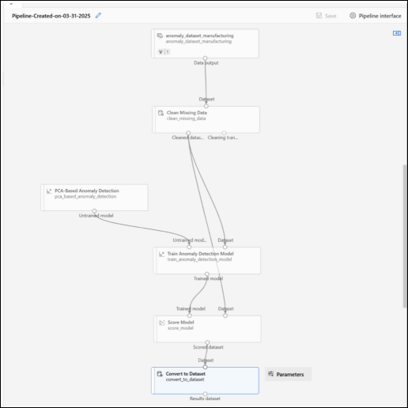
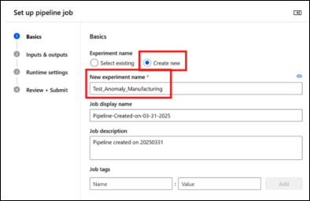
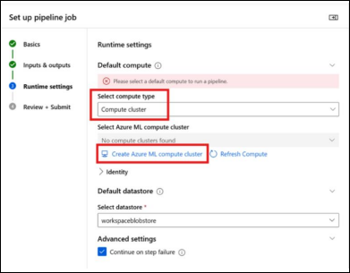
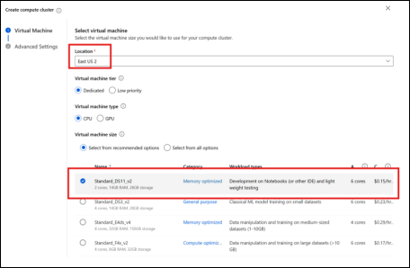
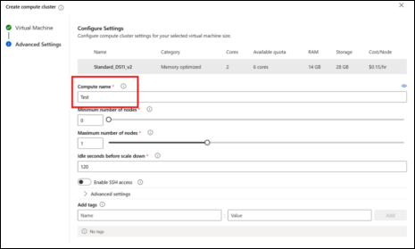
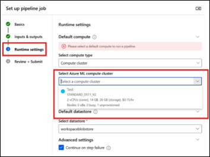
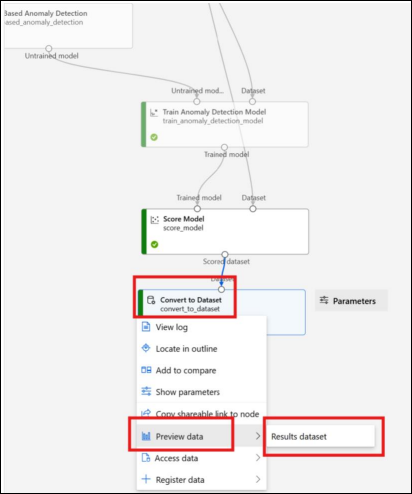

## Part 4: Convert and View Results

We can’t visualize the output directly using the **Score Model** component, so we’ll use the **Convert to Dataset** component to make the results viewable.

---

### Steps to Convert the Scored Output

1. In the **Component** tab (left panel), search for **"Convert to Dataset"** by Microsoft.  
   - This component converts the output from the model into a format that can be visualized in the Designer.  

     

2. Drag the **Convert to Dataset** component onto the canvas and place it **below the Score Model**.

3. Connect the **Scored dataset output** from the **Score Model** to the **Dataset input** of the **Convert to Dataset** component.

4. Click **Save** at the top to preserve your updated pipeline.

---

### Verify Pipeline Connections

Before running the pipeline, confirm the correct flow of components:

1. Check that the following connections are made:
   - ✅ Dataset → Clean Missing Data  
   - ✅ Cleaned Data → Train Anomaly Detection Model  
   - ✅ Cleaned Data → Score Model  
   - ✅ PCA-Based Anomaly Detection → Train Anomaly Detection Model  
   - ✅ Score Model → Convert to Dataset

2. Save your pipeline if it isn’t auto-saved.

3. Click the **Configure & Submit** button in the **top-right corner**.

---

## Part 5: Configure Pipeline Job Basics

Before running the pipeline, we’ll configure some basic details.

---

### 1. Configure Basics

     

- Under **“Experiment name”**, select **Create new**.
- Name it: `Test_Anomaly_Manufacturing`
- The **Job Display Name** is auto-generated based on today’s date.
- Skip the **Optional Fields**.
- Click **Next**.

---

### 2. Inputs & Outputs

- You can **skip** this section.
- Click **Next**.

---

### 3. Runtime Settings

 

a. Under **Select Compute Type**, choose **Compute Cluster**.

b. Since no cluster is available:
   - Click **Create Azure ML Compute Cluster**
   - A new pane will open.

#### Configure the Compute Cluster

 

- **Location**: Ensure it matches your workspace (e.g., **East US 2**)
- **VM Tier**: Leave as **default** (do not select Dedicated or Low priority)
- **VM Type**: Set to **CPU**
- **VM Size**: Choose **Standard_DS11_v2**

 

- Under **Advanced Settings**, give your compute a name (e.g., `anomalycluster`)
- Leave other settings at default
- Click **Create**

 

c. After the compute is created, select it and click **Next**

d. On the final screen, click **Submit**

---

### View the Output Dataset

Once the pipeline has successfully run:

1. **Right-click** on the **Convert to Dataset** component  
2. Hover over **Preview data**, then click on **Results dataset**

 

---

### Understanding the Output

Each row represents a **timestamped data record** from the pipeline. Here's what the columns mean:

| Column Name         | Description                                                                 |
|---------------------|-----------------------------------------------------------------------------|
| `timestamp`         | When the data was collected; essential for time-series analysis.            |
| `machine_id`        | Identifier for the machine (e.g., `CNC_Lathe`, `Injection_Molder`).         |
| `sensor_reading`    | Numeric value collected from the machine's sensor.                          |
| `anomaly_flag`      | Original label: 1 if anomaly, 0 if normal.                                  |
| `Scored Labels`     | Model's prediction: 1 for anomaly, 0 for normal.                            |
| `Scored Probabilities` | Shows the model's confidence level in its prediction. Closer to 1 means 
higher certainty of an anomaly.
  |
