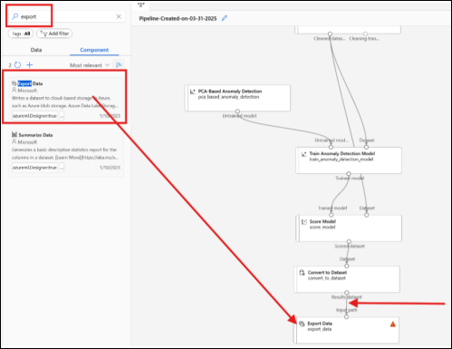

# Exit Activity: Solving a Manufacturing Problem Using Azure

## Scenario

You work in a factory where machines are supposed to run smoothly 24/7. One day, your manager notices that **some machines are acting strangely** at random times, but no one knows why.

Your job is to use **Azure Machine Learning** to **detect unusual machine behaviors** using the anomaly detection pipeline you built in class.

---

## Activity: Answer in `SREB_U4_L3_Handout`

1. **What kind of data would you collect from the machines?**
2. **Which Azure tool would you use to build a pipeline?**  
   *(Hint: You used it today)*
3. **How would you clean the data if it has missing values?**  
   *(What step would you use?)*
4. **Which model or technique could you use to detect anomalies?**  
   *(You used PCA or a custom model today)*

---

## What Is a Pipeline, Really?

A **pipeline in Azure ML Designer** is a **step-by-step process** that moves data through several stages:

1. **Input Dataset**  
   - You upload a CSV file with sensor readings  
   - Example:

   | timestamp | machine_id | temperature | pressure | vibration | anomaly_flag |
   |-----------|------------|-------------|----------|-----------|---------------|
   | 12:00 PM  | M001       | 75          | 30       | 0.04      | 0             |
   | 12:01 PM  | M001       | 76          | 30.1     | 0.06      | 0             |
   | 12:02 PM  | M001       | 120         | 80       | 1.5       | 1             |

2. **Clean Missing Data**
   - Handles incomplete sensor readings
   - Example:

   **Before Cleaning**

   | temperature | pressure | vibration |
   |-------------|----------|-----------|
   | 75          | 30       | 0.04      |
   |             | 30.1     | 0.06      |
   | 120         | 80       | 1.5       |

   **After Cleaning**

   | temperature | pressure | vibration |
   |-------------|----------|-----------|
   | 75          | 30       | 0.04      |
   | 75          | 30.1     | 0.06      |
   | 120         | 80       | 1.5       |

3. **Model (PCA-Based Anomaly Detection)**
   - Detects abnormal behavior
   - Looks for patterns in the normal machine operation and flags deviations

4. **Scored Output**
   - Adds predictions to the dataset

   | Scored Labels | Scored Probabilities |
   |---------------|----------------------|
   | 0             | 0.98                 |
   | 0             | 0.97                 |
   | 1             | 0.65                 |

---

## Saving Your Model’s Output to External Storage

### Why?

Without saving, model results **disappear** after the pipeline ends. Use **Azure Blob Storage** to save:

- Predictions
- Logs
- Outputs for reporting and compliance

---

### How to Export to Azure Blob Storage

1. **Add the "Export Data" component** to your pipeline below **Convert to Dataset**  

     

2. **Connect Convert to Dataset → Export Data**

3. **Configure Export Data:**

   - **Datastore Type**: Azure Blob Storage
   - **Datastore**: `workspaceblobstore`
   - **Output Path**: `test`
   - **File Format**: `csv`

4. **Save and Submit Pipeline**

---

### Accessing the Output in Azure Portal

1. Go to **Azure Portal**
2. Click **Storage Accounts**
3. Find your storage account (e.g., `testanomalymod7380583022`)
4. Open **Containers → Blob Storage**
5. Find and download the predictions file

---

## Final Reflection: Saving Model Output

### Scenario

Your factory runs anomaly detection every hour, but results weren’t saved properly. Now your manager wants anomaly records from the past **30 days**.

Your task:

- Decide **what to save**
- Decide **where and how often**
- Justify your decision

---

## Handout Questions (Complete in `SREB_U4_L3_Handout`)

1. **What type of data would you save from your anomaly detection pipeline?**
2. **Why is it important to save the output outside the pipeline?**  
   (Give at least two reasons)
3. **What Azure component did you use to connect your pipeline to external storage?**
4. **Where in the pipeline did you connect the Export Data module?**  
   *(Before which module or after which result?)*
5. **If your factory wanted to review problems from 3 months ago, would the data still be available? Why or why not?*
6. **In your own words, explain what Azure Blob Storage is and why it's helpful.**

---

## Final Deliverable: Status Report Slide (Public Audience)

**Prepare 3–4 bullet points for your operations manager:**

- ✅ What the model predicted
- 📊 How confident it was
- 🔧 What should be done next (e.g., notify maintenance)

---

## Thinking Extension – Comparing PCA with Isolation Forest

| Model                     | How It Works                                                        | When It's Useful                                      |
|--------------------------|----------------------------------------------------------------------|-------------------------------------------------------|
| PCA-Based Anomaly Detection | Finds unusual patterns based on variance from “normal”             | Best when features are correlated and behavior is smooth |
| Isolation Forest         | Separates data points with decision trees, isolates anomalies early | Best when anomalies are rare and clearly different    |

---

## Personal Reflection

- ❓ What step in the pipeline was most confusing or difficult?
- 🔁 What part would you want to review again before a certification or job?
- 🧠 Optional: What’s one question you still have about Azure ML or anomaly detection?

---

## Pipeline Output Summary (Sample Table)

| Timestamp | Machine ID | Sensor Reading | Anomaly Flag (Actual) | Scored Label (Predicted) | Scored Probability |
|-----------|------------|----------------|------------------------|---------------------------|--------------------|
|           |            |                |                        |                           |                    |
|           |            |                |                        |                           |                    |

---

### Follow-Up Prompt

- ✅ Did the model correctly identify anomalies?
- ⚠️ Any false positives or false negatives?
- 💡 What would you do to improve the model?

---

