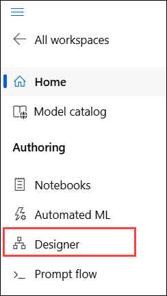
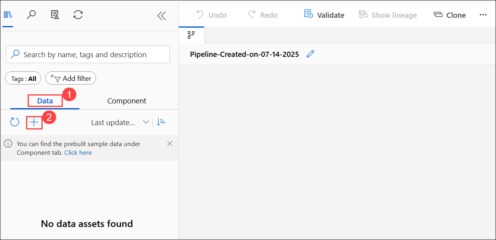
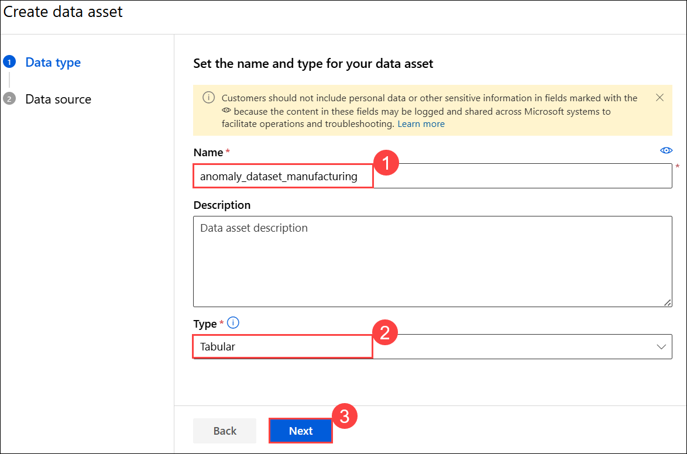
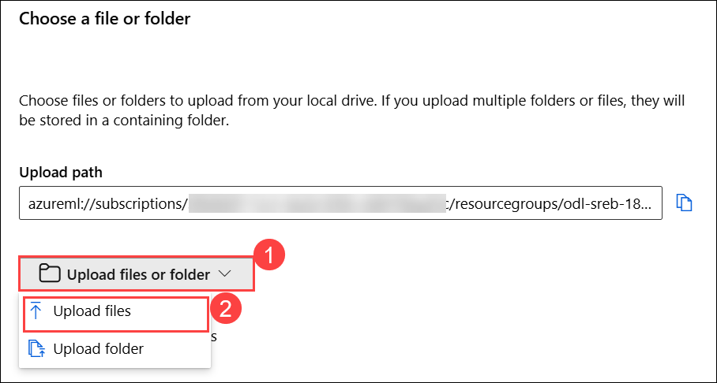
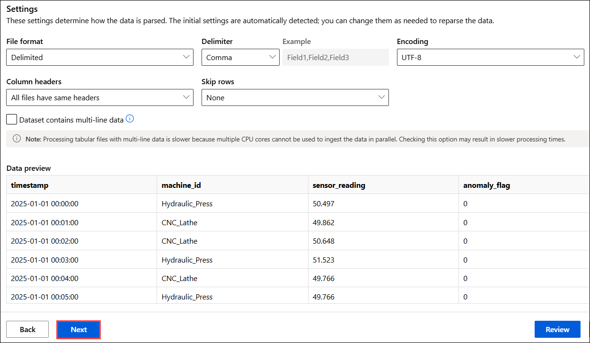
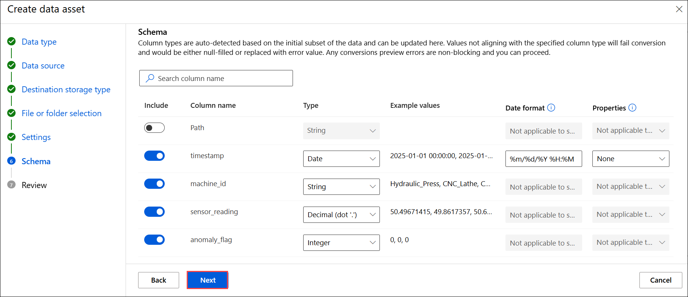
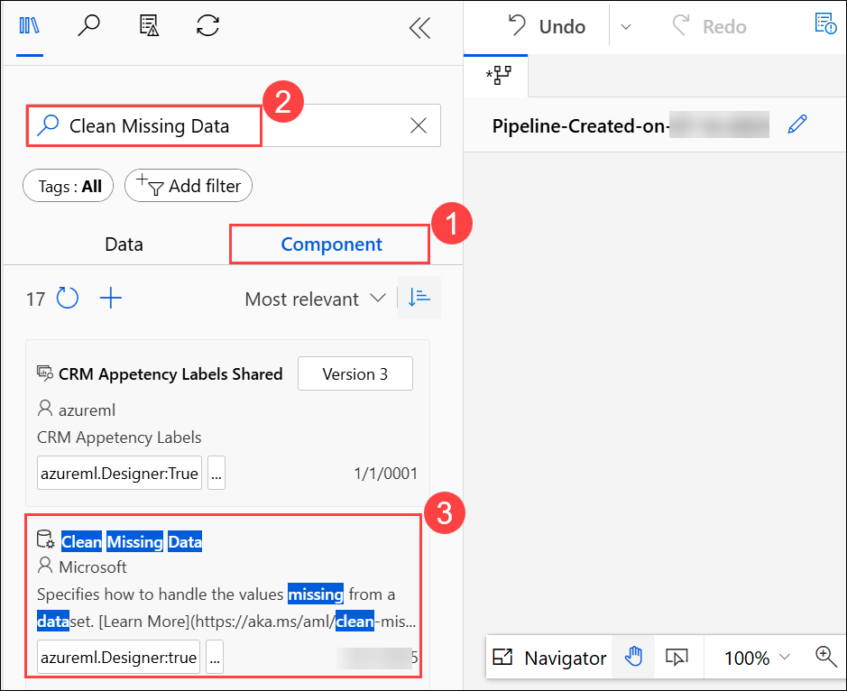
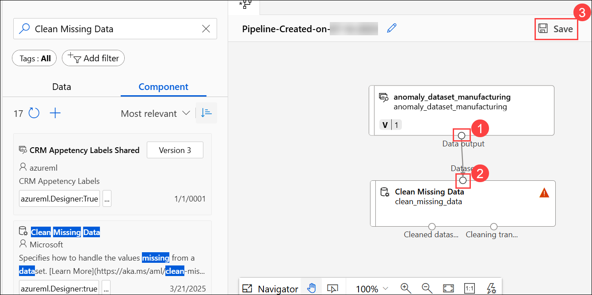
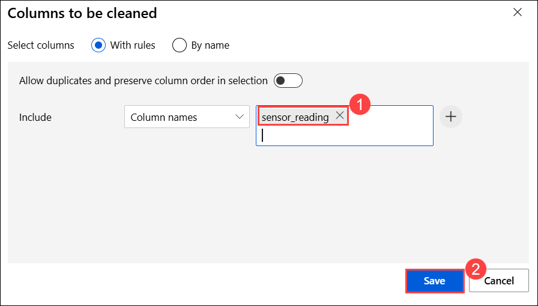
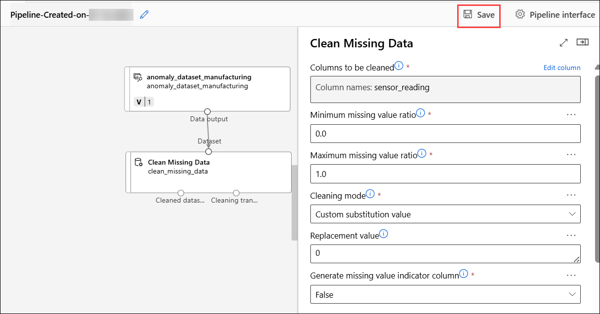

## Hands-On-Lab: Using Machine Learning to Detect Anomalies in Manufacturing

In this lab, you will build and deploy a machine‑learning pipeline in Azure Machine Learning Designer that detects anomalies in factory‑floor sensor data using Principal Component Analysis (PCA), connects to external data storage for scalable ingest, and triggers simulated robotic responses when potential machine failures are identified.

### Task 1: Create Azure ML Workspace

In this task you will set up an Azure Machine Learning workspace where all your machine learning assets and experiments will be organized and run. You will learn how to create a workspace in the Azure ML Studio, select the appropriate region and resource group, and navigate to the Designer interface to start building your pipeline.

1. **Log in** to [Azure Machine Learning Studio](https://ml.azure.com/) when prompted provide below credentials.

    - **Email/Username:** <inject key="AzureAdUserEmail"></inject>

    - **Password:** <inject key="AzureAdUserPassword"></inject>
   
1. On the **Create a new workspace to get started with Azure ML** fill in the following fields:

    - **Name**: Enter `PCA_Anomaly_Model`  **(1)**
    - **Friendly Name**: *(Optional)*  
      Azure will auto-fill this based on the name.
    - **Hub (Optional)**: Leave this as **None** unless instructed otherwise **(2)**
    - **Advanced Settings**:
    - **Subscription**: Select the appropriate Azure subscription from the dropdown **(3)**
    - **Resource Group**: Choose an existing one **(4)**
    - **Region**: Select **East US 2 (5)** for better performance.
    - After filling out all the required fields, click the **Create (6)** button.

       

       >**Note**: If you **did not** see the page like Figure 1, simply click **“Create Workspace”** on your dashboard and fill out the fields as described in Step 2.

1. Now navigate to your newly created workspace. On the **left-hand menu**, click **Workspaces (1)**. Select the workspace you just created `PCA Anomaly Model` **(2)**.

      
   
1. This will take you inside the workspace where you can build and run machine learning experiments.

     

1. Once you are inside your workspace PCA Anomaly Model, look at the left hand side menu and select the **Designer** tab under the **Authoring** section. 

     

     >**Note**:  This will open the Azure Machine Learning Designer interface where you can  begin creating your machine learning pipeline by dragging and dropping components.

1. Once the **Designer** page is loaded, make sure that you’re on the **Classic prebuilt (1)** tab under the “New pipeline” section. From here, click on the box with a plus sign that says, **Create a new pipeline using classic prebuilt components** **(2)**.

     

### Task 2: Upload Our Dataset

In this task you will upload the manufacturing sensor data to your Azure ML workspace. You will create a tabular dataset from a local CSV file, configure the data source, and add it to your pipeline canvas for further processing.

1. On the **left panel**, under the **Data (1)** tab, click the **➕ (plus icon) (2)** to upload a dataset.  

     

1. On **Create a new workspace to get started with Azure ML** page enter the following data.

    - Name: Enter **`anomaly_dataset_manufacturing` (1)**  
    - Select type: **Tabular (2)**  
    - Click **Next (3)**  

           

1. On the **Choose a source for your data asset** page, choose **From local files (1)** the click on **Next (2)**. 

     

1. On the **Select a datastore** page select the following option:  
    
    - Under **Datastore type**, select **Azure Blob Storage (1)**  
    - Choose the datastore named: **`workspaceblobstore` (2)**  
    - Click **Next (3)**  

       

1. On the **Choose a file or folder** page, select **Upload files or folder (1)** from the dropdown, then select **Upload files (2)**.

      

1. **File or Folder Selection**  

    - In the file browser, select the file: `anomaly_data.csv` **(1)** 
    - Wait for the file to appear under “Upload list”  
    - Click **Next (2)**  

       

1. On the **Settings** page, review the fields and ensure they match the expected format then click **Next**  

     

1. On the **Schema** page, ensure the schema fields are correctly recognized then click **Next**  

     

1. On the **Review** page, click **Create** to finalize the dataset upload

     

1. Under the **Data** tab, locate the uploaded dataset named **`anomaly_dataset_manufacturing`**.  

              

1. Click on the dataset card. **Drag it from the left panel** and **drop it onto the empty space in the pipeline canvas on the right (1)** and then **Save (2)**.

              

### Task 3: Preprocessing our Data

Now it’s time to add the clean missing data component.

1. Switch to the **Component (1)** tab and search for **"Clean Missing Data" (2)** by Microsoft. Click on the **Clean Missing Data (3)** data component,  
    
     

1. Then drag it from the left panel and drop it below the **Dataset card** in the pipeline canvas on the right.

     

1. Now connect the Dataset to the Cleaning Component, hover over the small **circle at the bottom** of the dataset block labeled **Data output (1)**. Click and **drag a line** to the **left circle** of the Clean Missing Data component labeled **Dataset (2)**. Save your progress by clicking **Save (3)** at the top right of the canvas.

         

1. Now you will Configure the Clean Missing Data component. Double-click the **Clean Missing Data (1)** block on the canvas. Then click the blue **Edit column (2)** link next to **Columns to be cleaned**. This will open a pop-up window.  

     

1. Select only **sensor_reading (1)** - Do **not** include columns like `timestamp`, `machine_id`, or `anomaly_flag`. Click **Save (2)** in the pop-up,

     

1. Click **Save** again on the main screen.  

         

### Task 4: Split Data

Now it’s time to add the Split Data component.

1. Switch to the **Component (1)** tab, search for **Split Data (2)** by Microsoft and then drag it from the left panel and drop it below **Clean Missing Data** in the pipeline canvas on the right **(3)**.

         

1. Connect the **Cleaning Component** to the **Split Data** Component by hovering over the small circle at the bottom of the **Clean Missing Data**. Then, **click and drag a line to the circle of the Split Data component**

      

