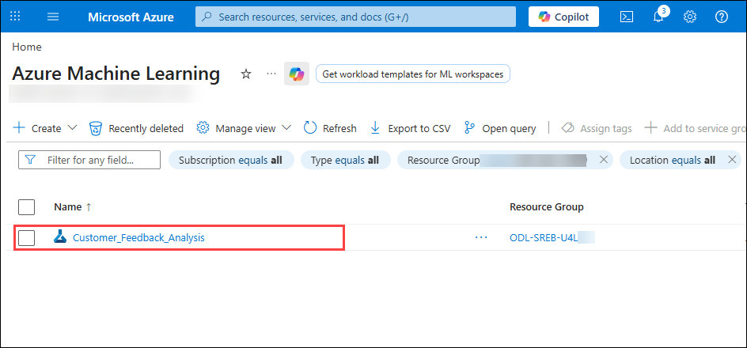
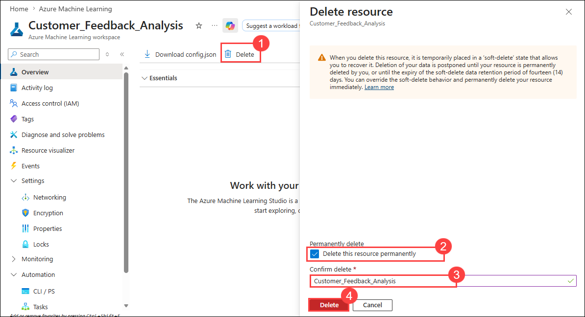

# Hands-On-Lab: Analyzing Manufacturing Feedback with Text Data

In this hands-on lab, you will work with real customer feedback data to identify product issues and predict customer satisfaction. You will use Azure ML Designer to preprocess text, extract features using N-Grams, and build a machine learning model using logistic regression. The lab guides you through splitting data, scoring, evaluating, and running the pipeline. By the end, you will be able to analyze textual data and view preview results to gain insights.

## Lab Objectives

In this lab, you will be able to complete the following tasks:

- Task 1: Setting up the Project
- Task 2: Uploading the Dataset
- Task 3: Preprocess the Text
- Task 4: Extract N-Gram Features
- Task 5: Split the Data
- Task 6: Add Logistic Regression and Trace the Model
- Task 7: Score the Model
- Task 8: Evaluate the Model
- Task 9: Run the Pipeline 
- Task 10: View Preview Results

## Architecture diagram

 

### Task 1: Setting up the Project

In this task you will set up an Azure Machine Learning workspace where all your machine learning assets and experiments will be organized and run. You will learn how to create a workspace in the Azure ML Studio, select the appropriate region and resource group, and navigate to the Designer interface to start building your pipeline.

1. Open a new tab in the browser, right-click on the following link [Azure Machine Learning Studio](https://ml.azure.com/), then **Copy link** and paste it in a new browser tab to log in to **Azure Machine Learning Studio**.

1. If prompted, provide the credentials below:

   - **Email/Username:** <inject key="AzureAdUserEmail"></inject>

   - **Password:** <inject key="AzureAdUserPassword"></inject>

1. On the **Create a new workspace to get started with Azure ML** fill in the following fields:

   - Name: Enter **Customer_Feedback_Analysis (1)**

   - Friendly Name: Leave default 

   - Hub (Optional): You can leave this as **None (2)**

   - **Advanced Settings**:

     - Subscription: Leave the default Azure subscription **(3)**
     - Resource Group: Select **anomaly-rg (4)**
     - Region: Select **<inject key="Region" enableCopy="false" /> (5)**
   - After filling out all fields, click the **Create (6)** button.

       

       >**Note**: If you **did not** see the page like Figure 1, simply click **“Create Workspace”** on your dashboard and fill out the fields as described in Step 2.

1. Wait for the workspace to create, it may take around 2-3 minutes.

1. On the left-hand menu, find and click **Workspaces (1)** and then select the workspace named **Customer Feedback Analysis (2)** the one which you have just created. 

    

    >**Note**: This will take you inside the workspace where you can build and run machine learning experiments.

1. From the left-hand side menu to find the **Designer (1)** tab under the **Authoring** section. 

   - Make sure that you’re on the **Classic prebuilt**tab under the “New pipeline” section. From here, click on the box with a **plus sign (2)** that says, `Create a new pipeline using classic prebuilt components`.

     

> **Congratulations** on completing the task! Now, it's time to validate it. Here are the steps:
>
> - Hit the Validate button for the corresponding task. If you receive a success message, you can proceed to the next task.
> - If not, carefully read the error message and retry the step, following the instructions in the lab guide.
> - If you need any assistance, please contact us at cloudlabs-support@spektrasystems.com. We are available 24/7 to help.

<validation step="e79afd41-e38b-4ec9-8f83-6759b76dce56" />

---     

### Task 2: Uploading the Dataset

In this task you will upload the Manufacturing Custome Feedback data to your Azure ML workspace. You will create a tabular dataset from a local CSV file, configure the data source, and add it to your pipeline canvas for further processing.

1. On the left panel, under the **Data (1)** tab, click the **+ (plus icon) (2)** to upload a dataset.

    

1. On the **Data type**, provide the following details:

   - Name: Enter **Customer_Feedback_dataset (1)**
   - Make sure the type is **Tabular (2)**
   - Click **Next (3)**  

        

1. On the **Choose a source for your data asset** page, choose **From local files (1)** the click on **Next (2)**. 

    

1. On the **Select a datastore** page select the following option:  
    
   - Under **Datastore type**, select **Azure Blob Storage (1)**  
   - Choose the datastore named: **`workspaceblobstore` (2)**  
   - Click **Next (3)**  

      

1. On the **Choose a file or folder** page, select **Upload files or folder (1)** from the dropdown, then select **Upload files (2)**.

     

1. **File or Folder Selection**  

   - In the file browser, navigate to  `C:\Labs\Allfiles\unit4-lesson6` and then select the file: `Manufacturing_Customer_Feedback.csv` **(1)** 
   - Wait for the file to appear under “Upload list”  
   - Click **Next (2)**  

       

1. On the **Settings** page, review the fields and ensure they match the expected format then click **Next**  

    

1. On the **Schema** page, ensure the schema fields are correctly recognized then click **Next**  

    

1. On the **Review** page, click **Create** to finalize the dataset upload

    

1. Under the **Data** tab, locate the uploaded dataset named **`Customer_Feedback_dataset` (1)**. Click on the dataset card. **Drag it from the left panel** and drop it onto the empty space in the pipeline canvas on the right **(2)** 

             

1. Then **Save**.

   

> **Congratulations** on completing the task! Now, it's time to validate it. Here are the steps:
>
> - Hit the Validate button for the corresponding task. If you receive a success message, you can proceed to the next task.
> - If not, carefully read the error message and retry the step, following the instructions in the lab guide.
> - If you need any assistance, please contact us at cloudlabs-support@spektrasystems.com. We are available 24/7 to help.

<validation step="2c8a2957-ad44-4b70-9f63-f2eee2194ada" />

---                

### Task 3: Preprocess the Text

In this task, you will use the Preprocess Text component to clean and prepare customer feedback data for machine learning. You'll specify the target text column and apply standard text preprocessing steps to ensure consistent input for modeling.

1. In the **Component (1)** tab (left panel), search for the **Preprocess Text (2)** module by Microsoft. Drag the **Preprocess Text** module into your pipeline workspace **(3)**.

    

1. Connect the dataset to the module by clicking on the **small circle** at the bottom of **Customer_Feedback_dataset**. Then, drag a connection line to the **top-left circle** of the **Preprocess Text** module named **Dataset**

    

   Now we need to tell Azure ML which column (in your dataset) contains the customer feedback that needs to be cleaned for machine learning.

1. Double click on the **Preprocess Text** module **(1)** and scroll down to the field labeled **Text column to clean**. Click **Edit Column (2)**.

    

1. From here, select the column named **Feedback (1)** and then click **Save (2)**.

    
    
1. Select **Save**.

    

### Task 4: Extract N-Gram Features

In this task, you will convert the cleaned text data into numerical features using the Extract N-Gram Features from Text module. You’ll configure it to generate bigrams (2-word combinations) with term frequency weighting, preparing the data for training machine learning models.

1. Navigate to the **Component (1)** tab, search for **Extract N-Gram Features from Text (2)**. Drag the Extract N-Gram Features from Text module onto the canvas **(3)**.

     

1. Drag a line from the bottom circle of the **Preprocess Text** module to the **top-left input** of the **N-Gram Features** module (labeled "Dataset").

     

1. Next step is to configure the extract N-Gram Features from Text module.
    
1. Double-click the **Extract N-Gram Features from Text** module **(1)**. Click **“Edit column” (2)** next to the **Text column** field.

    

1. From the list of available columns, enter **Feedback (1)**. Click **Save (2)**.

    

1. On the **Extract N-Gram Features from Text**, set the following fields and then **Save (9)**:

    - `Vocabulary Mode`: Leave it as **Create (1)**. 
    - `N-Grams Size`: Change the value to `2` **(2)**. 
    - `Weighting Function`: Change from Binary Weight to **TF (Term Frequency) (3)**. 
    - `Minimum Word Length`: Change from 3 to `1` **(4)**. 
    - `Maximum Word Length`: Leave it as `25` (default is fine) **(5)**.
    - `Minimum N-Gram Document Absolute Frequency`: Leave it as `5` (default) **(6)**.

    - `Maximum N-Gram Document Ratio`: Leave it as `1` (default, meaning ngrams can appear in all documents) **(7)**.

    - `Normalize N-Gram Feature Vectors`: Leave this as **False (8)**.

      

### Task 5: Split the Data

In this task, you will use the Split Data module to divide your dataset into training and testing sets. This prepares your data so that 70% is used to train the model and 30% is reserved to evaluate its performance.

1. In the **Component (1)** tab on the left, search for the **Split Data (2)** module. Drag it onto the canvas **(3)**.

    

1. From the left **Result dataset** of the **Extract N-Gram Features from Text** module, drag a line to the **Dataset** of the **Split Data module**.

    

1. Double click the **Split Data module** to open the Parameters panel on the right.

    - Splitting mode: **Split Rows (1)**
    - Fraction of rows in the first output: **0.7 (2)**
        - This means 70% of the data will be used for training
        - The remaining 30% will be used for testing
    - Randomized split: **True (3)**
    - Random seed: Enter `42` **(4)** 
    - Stratified split: **False (5)**
    - Click **Save (6)** at the top of the screen.

          

### Task 6: Add Logistic Regression and Trace the Model

In this task, you will add and configure a Two-Class Logistic Regression model to train on your dataset. You will link it with the training data and set the target column to predict customer satisfaction scores.

1. In the **Component (1)** tab on the left, search for **Two-Class Logistic Regression (2)**. Drag it onto your pipeline canvas **(3)**.

    

1. In the **Component (1)** tab on the left, search for **Train Model (2)**. drag it below the logistic regression module **(3)**.     

    

1. Connect the Modules:

    - Connect the **output of the Two-Class Logistic Regression** module to the **left input of the Train Model** module (labeled “Untrained model”) **(1)**.
    - From the **Split Data** module, connect the **left output port** (training set, 70%) to the **right input of the Train Model** module (labeled “Dataset”) **(2)**.
 
      

1. Double Click the **Train Model** box to open its Parameters panel **(1)**. Click **“Edit column”** under **Label column (2)**.

    

1. Type **Satisfaction_Score (1)** — this is the column your model will learn to predict and then **Save (2)**.

    

1. Click **Save** in the top toolbar.    

    
      
### Task 7: Score the Model

In this task, you will use the Score Model module to test your trained logistic regression model on new (unseen) customer reviews. This will generate predictions that can later be evaluated for accuracy.

1. In the **Component (1)** tab, search for **Score Model (2)**. Drag it onto the canvas **(3)**.

    

1. Connect the Modules:
    - Connect the **output of the Train Model** module to the **left input of the Score Model** module (labeled “Trained model”) **(1)**.
    - From the **Split Data** module, connect the **right output port** (30% testing data) to the **right input of the Score Model** module (labeled “Dataset”) **(2)**.  

    - Click **Save (3)** at the top of the screen

      

### Task 8: Evaluate the Model

In this task, you will add the Evaluate Model component to analyze how well your trained model performs using key metrics like accuracy, precision, recall, and the confusion matrix.

This component gives you the key metrics to assess the model’s performance, including:
- Accuracy: How often the model is correct
- Precision: How often predicted positives are actually positive
- Recall: How many actual positives the model captured
- F1 Score: A balance between precision and recall
- Confusion Matrix: A table that breaks down true/false positives and negatives
- ROC Curve: Shows how well the model separates the two classes

Once this is complete, you'll be able to run the pipeline and preview your model's evaluation results.

1. In the **Component (1)** tab, search for **Evaluate Model (2)**. Drag it onto the canvas **(3)**.

    

1. From the **bottom circle of the Score Model** module, connect it to the **left input of the Evaluate Model** module **(1)** and then **Save (2)**.

    

### Task 9: Run the Pipeline  

In this task, you will run the complete machine learning pipeline you built. This includes configuring the experiment, selecting the compute resource, and submitting the pipeline for execution in Azure Machine Learning Studio.

1. Click on **Configure & Submit**.

    

1. On the **Basic** tab,

    -  **Experiment name**: Select **Create new (1)**

    - **New experiment name**: Enter **Test_Customer_Feedback (2)**

    - Click **Next (3)**

      

1. Click **Next** on **Inputs & Outputs**.

    

1. Now we’re on the **Runtime settings** step of the pipeline submission process. This is where you choose the **computer (called a compute cluster)** that Azure will use to run your pipeline.

    - Select Compute Type: From the dropdown, select **Compute cluster (1)**.

    - Click on **Create Azure ML compute cluster (2)**

        

1. You are now in the **Virtual Machine** tab for setting up a compute cluster. This step helps Azure decide which kind of machine to use for running your pipeline.

    - **Location**: Confirm that the selected region is the same as your workspace (**<inject key="Region" enableCopy="false" />**) **(1)**
    - **Virtual Machine Tier**: Leave as default. (do not select "Dedicated" or "Low priority" unless specified otherwise for cost-saving purposes) **(2)**
    - **Virtual Machine Type**: Keep this as **CPU (3)** 
    - **Virtual Machine Size**: Choose **Standard_DS11_v2 (4)**
    - Click **Next (5)**  

        

1. **Advanced Settings**: Give a Compute Name as **Test (1)** and leave everything default. Then click **Create (2)**.

     

1. Select the Compute Created **Test (1)** and click **Next (2)**.   

     

     >**Note**: The creation of the compute cluster takes approximately 3–5 minutes. You’ll be able to select the cluster only after it’s fully created. Please wait until the process is complete, and keep refreshing the cluster.

1. Once on the **final** page, click **Submit**.     

     

1. Once submitted, a success notification appears at the top of the page. Click on **'View details'** to monitor the pipeline. It may take some time for the pipeline to complete.

        

1. Please wait for the pipeline to complete, which may take approximately `10–15 `minutes. Once it's finished successfully, the status will show as **Completed**.

       

### Task 10: View Preview Results

In this task, you will preview and interpret the evaluation results of your trained model. You’ll analyze key metrics and charts such as the ROC curve, confusion matrix, and precision-recall to assess model performance.

1. Right-click on the **Evaluate Model (1)** box. Select **Preview data (2)** > **Evaluation results (3)**.

     

1. After training a model, it’s important to evaluate how well it performs. The evaluation results include charts and metrics that show how accurately the model made predictions on test data.

    - **ROC Curve**:  The **ROC** (Receiver Operating Characteristic) curve helps us see how well the model separates positive and negative cases. 

        

        - The horizontal axis shows the false positive rate (wrongly predicting "yes"). 
        - The vertical axis shows the true positive rate (correctly predicting "yes"). 
        - A perfect model would have a curve that reaches the top-left corner — which this model does. That means the model never confused a negative example for a positive one

    - **Precision-Recall Curve**:  

        

    - This chart explains how well the model identifies positive cases.
        - Precision is how many of the model’s positive predictions were correct.
        - Recall is how many of the actual positive cases the model found.
        - A curve that reaches the top-right corner means the model found all positives without making any mistake 

    - **Lift Curve**: The lift curve shows whether the model ranks the most important predictions (true positives) higher than others.

        - A steep curve means the model successfully puts the most important cases at the top. In this case, the curve rises sharply, showing that the model ranks positive examples very effectively.    

            

    - **Threshold Slider**: The threshold is the cutoff point the model uses to decide between predicting "Delayed" or "On Time." In this case, a value of 0.5 means that any shipment with a predicted probability of delay equal to or greater than 0.5 is classified as "Delayed." The model is performing strongly even at this threshold, showing it makes confident and consistent predictions.

         

    - **Confusion Matrix**

      This matrix shows how the model's predictions compared to actual outcomes:

       

        - `127 True Negatives`: The model correctly predicted shipments that were on time.
        - `171 True Positives`: The model correctly predicted shipments that were delayed.
        - `2 False Positives`: The model incorrectly predicted some on-time shipments as delayed.
        - `0 False Negatives`: The model did not miss any delayed shipments.     

    - This confusion matrix shows extremely high performance with only two errors, and no missed delays.

       

        - `Accuracy`: 0.993 — The model made correct predictions for 99.3% of the test data.
        - `Precision`: 1.0 — Every prediction of “Delayed” was correct.
        - `Recall`: 0.984 — The model successfully identified 98.4% of all actual delays.
        - `F1 Score`: 0.992 — This score balances both precision and recall, confirming  overall quality.
        - `AUC`: 1.0 — The model perfectly separates “Delayed” from “On Time” shipments.
        - These are the highest possible scores and indicate perfect performance

    - **Summary Metrics**     

             

    - **Score Bin Table**
        - This table breaks down the model’s performance across different confidence levels. Each row represents a score bin, which groups predictions by how confident the model was in making them. It helps identify how well the model performs at various confidence thresholds.
        - `Score bin`: Shows the model’s confidence range for predictions. For example, (0.900, 1.000] includes predictions where the model was between 90% and 100% confident.
        - `Positive examples`: The number of actual delayed shipments (label 1) that fall in this confidence range.
        - `Negative examples`: The number of on-time shipments (label 0) predicted in this confidence range.
        - `Fraction above threshold`: Shows what portion of the predictions in this bin are above the classification threshold (default is 0.5). This reflects how many examples are confidently predicted.
        - `Accuracy`: Proportion of correct predictions in that bin. A value closer to 1 means more accurate predictions in that confidence range.
        - `F1` Score: A combination of precision and recall that balances correctness with completeness. Closer to 1 means better overall performance    
        - `Precision`: Out of all predictions made in that bin for delayed shipments, how many were actually delayed? A perfect precision of 1.0 means there were no
false alarms.
        - `Recall`: Out of all actual delayed shipments, how many did the model catch in that score bin?
        - `Negative precision / Negative recall`: These metrics measure how well the model predicts the on-time (negative) class. High values mean the model rarely mislabels on-time shipments.
        - `Cumulative AUC`: Tracks the model’s overall ability to rank predictions as we move through the score bins. This value increases as bins with high separation power are included.    
          
### Resource Cleanup

> **NOTE:** Perform this task only if you are completed with the lab and no longer require Machine Learning Workspace.

1. Navigate back to Azure portal. In the Search bar, search for **Azure Machine Learning (1)** and select **Azure Machine Learning (2)** from the list.

    

1. Select the workspace **Customer_Feedback_Analysis**.

    

1. Click on **Delete (1)**, there will a Delete Resource window opened at the right, select the **checkbox (2)** next to Delete this resource permanently. Provide the workspace name **Customer_Feedback_Analysis (3)** to confirm deletion and click on **Delete (4)**.

    

## Review

In this lab, you have completed the following tasks:

- Setting up the Project
- Uploaded the Dataset
- Preprocessed the Text
- Extractracted N-Gram Features
- Split the Data
- Added Logistic Regression and Trace the Model
- Score the Model
- Evaluated the Model
- Run the Pipeline 
- Viewed Preview Results

## You have successfully completed the lab
