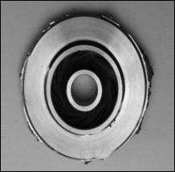
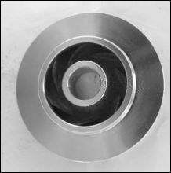
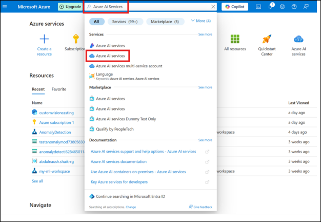
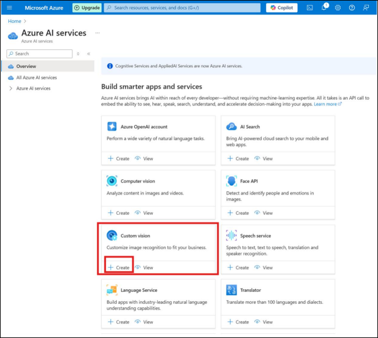
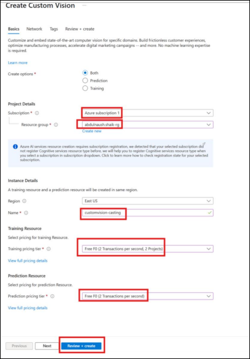
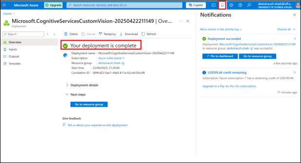
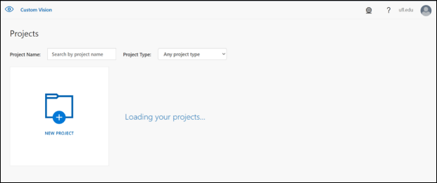
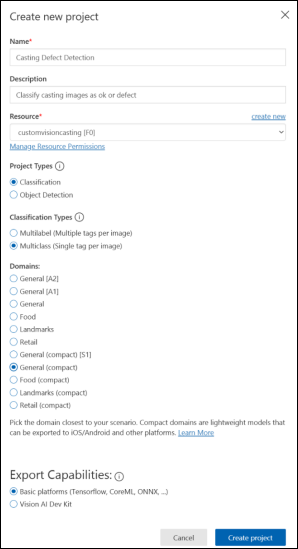
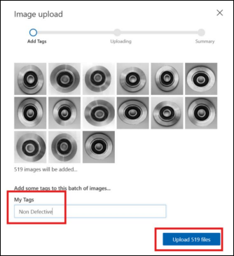
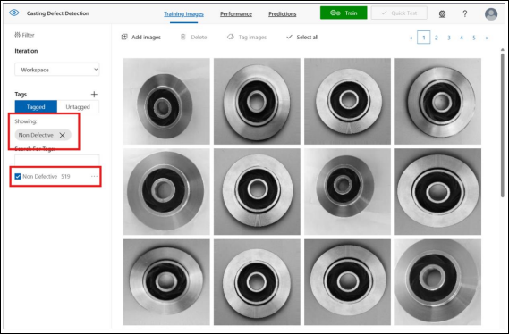

# Lesson 8: Spot the Flaw - Detecting Defective Products with Image Classification

## Lesson Description

In this lesson, students will explore how artificial intelligence can assist with quality control in manufacturing by identifying defective parts. They will examine real product images, train a machine learning model using Azure Custom Vision, and evaluate its performance. Through guided discussion, students will also consider when to trust a model’s prediction and how combining data sources can improve reliability and safety in automated systems.

## Main Learning Goal

Students will explore how computer vision is used in manufacturing to identify defective parts. Using a real dataset of metal casting images, students will train and evaluate a machine learning model that distinguishes between defective and non-defective products.

## Essential Question

**How can AI models trained on product images help factories improve quality control and reduce waste?**

## Standards

* **4.4**: Evaluate the use of a large data set to explore a real-world scenario.

## Objectives

* Understand how computer vision supports manufacturing quality control.
* Load and explore an image dataset in Azure ML or Python.
* Train a binary classification model to detect defective products.
* Evaluate the model’s accuracy and suggest improvements.
* Explain how this model helps manufacturers reduce errors and improve product reliability.

## Would You Ship This Part?

Imagine you're working at a factory that builds car parts. Two parts come down the line. One is decent, the other one has a flaw.

   

   

Your job: decide if each part should be shipped to a customer.

### Discussion:

* Would you approve both parts for shipping?
* What are the consequences of a defective part going unnoticed?
* Could you make 500 such decisions per hour?
* Could a computer model do it better or more consistently?

AI in high-stakes industries helps reduce risk of:

* Engine failure due to cracks
* Turbine damage from misalignment
* Medical device failure

Today, students will build a visual classifier to support human decision-making in factories.

---

## Build a Defect Classifier Using Azure ML

### Understanding the Dataset

* **Non-Defective**: Passed inspection
* **Defective**: Contains cracks, dents, chips, etc.

Machine learning offers consistency across shifts, plants, and geographies. Azure Custom Vision enables easy training with labeled images.

---

## Part 0: Setting up the Project

### Step 1: Setting up the Workspace

1. Login to Azure Portal: [https://portal.azure.com](https://portal.azure.com)

2. Search for **Azure AI Services**

    

3. Click **Create** under **Custom Vision**

    

#### Fill out the Custom Vision creation form:

* **Both**: For training and prediction
* **Subscription**: Your assigned subscription
* **Resource group**: Select or create (e.g., casting-rg)
* **Region**: East US (or nearest)
* **Name**: `customvision-casting`
* **Training tier**: Free F0
* **Prediction tier**: Free F0
* Click **Review + Create** then **Create**

    

### Step 2: Wait for Deployment

Wait for deployment to complete (1-2 mins).

    

### Step 3: Create a New Project

1. Go to: [https://customvision.ai](https://customvision.ai)
2. Click **NEW PROJECT**

     

3. Fill the form:

   * **Name**: Casting Defect Detection
   * **Description**: Classifying casting images as ok or defective
   * **Resource**: customvision-casting \[F0]
   * **Project Type**: Classification
   * **Classification Type**: Multiclass
   * **Domain**: General (Compact)
   * **Export Capabilities**: Basic platforms
4. Click **Create Project**

    

## Part 1: Upload and Tag Images

### Step 1: Add Non-Defective Images

* Click **Add Images**
* Upload all from `ok_front`
* Tag as **Non Defective**

    

### Step 2: Add Defective Images

* Click **Add Images**
* Upload all from `def_front`
* Tag as **Defect**

## Part 2: Train the Model

1. Click **Train** (green button)
2. Choose **Quick Training**
3. Wait for training to complete and observe performance metrics

    

### Model Metrics:

* **Precision**: Correct predictions out of total predicted
* **Recall**: Correct predictions out of total actuals
* **AP**: Average precision
* **False Negatives**: Defect classified as Non-Defective

## Part 3: Test the Model

### Test with Defective Image

1. Click **Quick Test**
2. Upload an image from `def_front` (test folder)
3. Observe prediction results

### Test with Non-Defective Image

1. Repeat above but use image from `ok_front`

---

## Exporting the Model

1. Click **Export**
2. Review platforms (Tensorflow, CoreML, ONNX, etc.)

*Optional:* Deploy in a mobile or factory-floor app.

## Trusting the Machine

Model uses statistical patterns in pixels (not true "vision"):

### Class Discussion:

1. Is 85% confidence enough to reject a part?
2. Could other data (temperature, machine settings) help?
3. How could combining data sources make decisions better?

## Model Refinement

Choose any of the following to improve your model:

* Add more images (especially from new angles)
* Correct any incorrect labels
* Retrain and compare metrics

### Reflection:

* Did your model's accuracy improve?
* Why do you think that happened (or didn’t)?

