# Hands-On-Lab: Classification Two Ways - Supervised vs Unsupervised Categorization

In this hands-on lab, you will build and experiment with machine learning models for both classification and clustering tasks. You will apply supervised learning techniques to train models that can predict outcomes based on labeled data, and use unsupervised learning methods to group data based on underlying patterns without predefined labels. By comparing the performance and results of these different algorithms, you will gain insights into how each approach can be used to categorize and understand data in unique ways.

## Lab Objectives

In this lab, you will be able to complete the following tasks:

- Task 1: Set Up the Azure ML Workspace
- Task 2: Create a Preprocessing Pipeline
- Task 3: Add the Dataset to Your Pipeline Canvas
- Task 4: Cloning our Preprocessing Pipeline
- Task 5: Classification in Azure (Supervised)
- Task 6: Run the Supervised Pipeline
- Task 7: Clustering in Azure (Unsupervised)
- Task 8: Evaluate the Models

## Architecture diagram

### Task 1: Set Up the Azure ML Workspace

1. Open a new tab in the browser, right-click on the following link [Azure Machine Learning Studio](https://ml.azure.com/), then **Copy link** and paste it in a new browser tab to log in to **Azure Machine Learning Studio**.

1. If prompted, provide the credentials below:

   - **Email/Username:** <inject key="AzureAdUserEmail"></inject>

   - **Password:** <inject key="AzureAdUserPassword"></inject>
   
1. On the **Create a new workspace to get started with Azure ML** fill in the following fields:

    - **Name:** Enter **Class_Workspace_<inject key="DeploymentID" enableCopy="false"/>**  **(1)**
    - **Friendly Name:** Leave default
    - **Hub (Optional):** Leave this as **None** unless instructed otherwise **(2)**
    - **Advanced Settings:**
    - **Subscription:** Select the appropriate Azure subscription from the dropdown **(3)**
    - **Resource Group:** Select **ODL-SREB-U5L07** **(4)**
    - **Region:** Select **<inject key="Region" enableCopy="false" /> (5)** for better performance.
    - After filling out all the required fields, click the **Create (6)** button.

      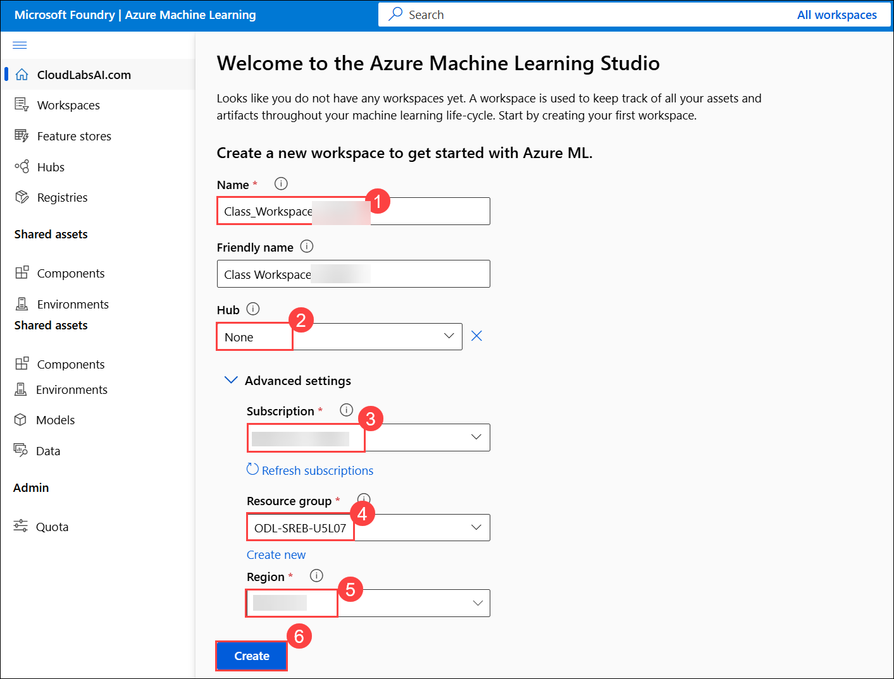 

       >**Note:** If you **did not** see the page like Figure 1, simply click **“Create Workspace”** on your dashboard and fill out the fields as described in Step 2.

1. Wait for the workspace to create, it may take around 2-3 minutes.

1. Now navigate to your newly created workspace. On the **left-hand menu**, click **Workspaces (1)**. Select the workspace you just created **Class_Workspace_<inject key="DeploymentID" enableCopy="false"/>** **(2)**.

     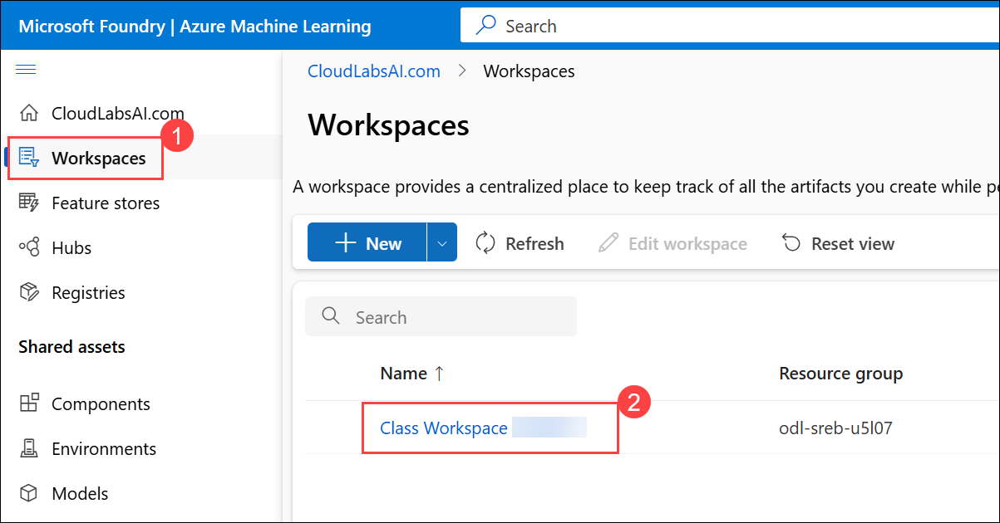 

1. This will take you inside the workspace where you can build and run machine learning experiments.
  
1. In the side menu of your workspace, select **Designer (1)**. Click **Create a new pipeline using classic prebuilt components (2)**.     

     

> **Congratulations** on completing the task! Now, it's time to validate it. Here are the steps:
>
> - Hit the Validate button for the corresponding task. If you receive a success message, you can proceed to the next task.
> - If not, carefully read the error message and retry the step, following the instructions in the lab guide.
> - If you need any assistance, please contact us at cloudlabs-support@spektrasystems.com. We are available 24/7 to help.

<validation step="e8c67e43-1e2e-4cfa-849b-c2a20cc39f49" />

---   

### Task 2: Create a Preprocessing Pipeline     

1. Switch to the **Component** tab in the left panel **(1)** and search for **Clean Missing Data (2).** Drag that component onto the canvas **(3)**.   

   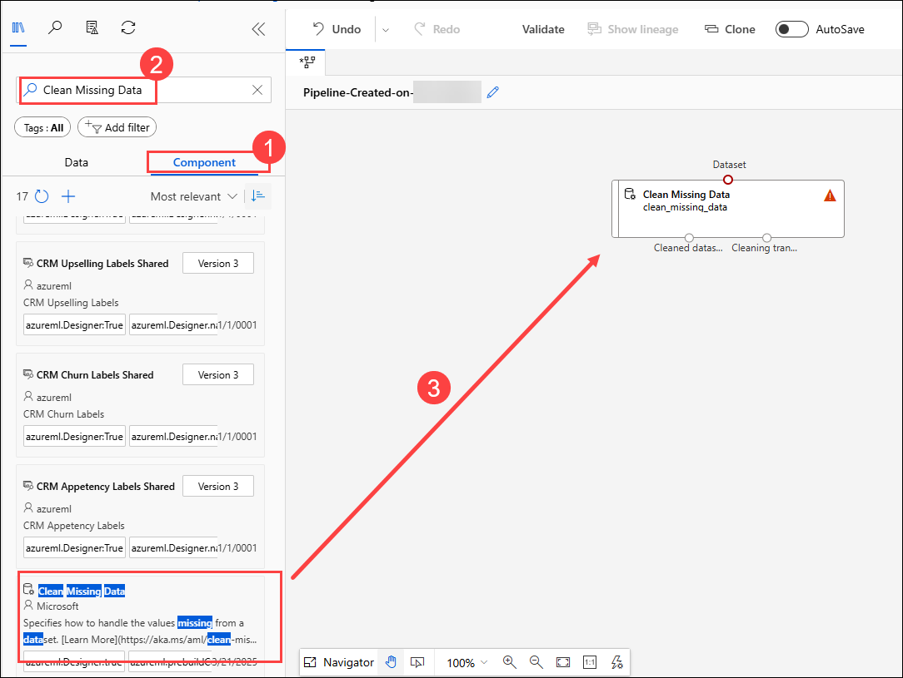

1. Double click on **Clean Missing Data (1)** and then select **Edit Column (2)** under `Columns to be cleaned`.

   

1. Select **All Columns (1)** and then **Save (2)**.

   

1. Select **Save**.

1. Switch to the **Component** tab in the left panel **(1)** and search for **Remove Duplicate Rows (2).** Drag that component onto the canvas **(3)**.

    - Connect **left output** of **Clean Missing Data** to **Dataset** of **Remove Duplicate Rows** **(4)**

      

1. Double click on **Remove Duplicate Rows (1)** and then select **Edit Columns (2)**.

     

1. Select **All Columns (1)** and then **Save (2)**.

     

1. Select **Save**.

     

1. Switch to the **Component** tab in the left panel **(1)** and search for **Split Data (2).** Drag that component onto the canvas **(3)**.

    - Connect **Output** of **Remove Duplicate Rows** to **Dataset** input of  **Split Data** **(4)**

      

1. Select the **Edit** icon to rename the Pipeline. 

     

1. Name the pipeline as **Preprocessing_Pipeline (1)** and then **Save (2)**.   

     

### Task 3: Add the Dataset to Your Pipeline Canvas     

1. Navigate to **Data (1)** from the left navigation and then select **+ Create (2)**.

   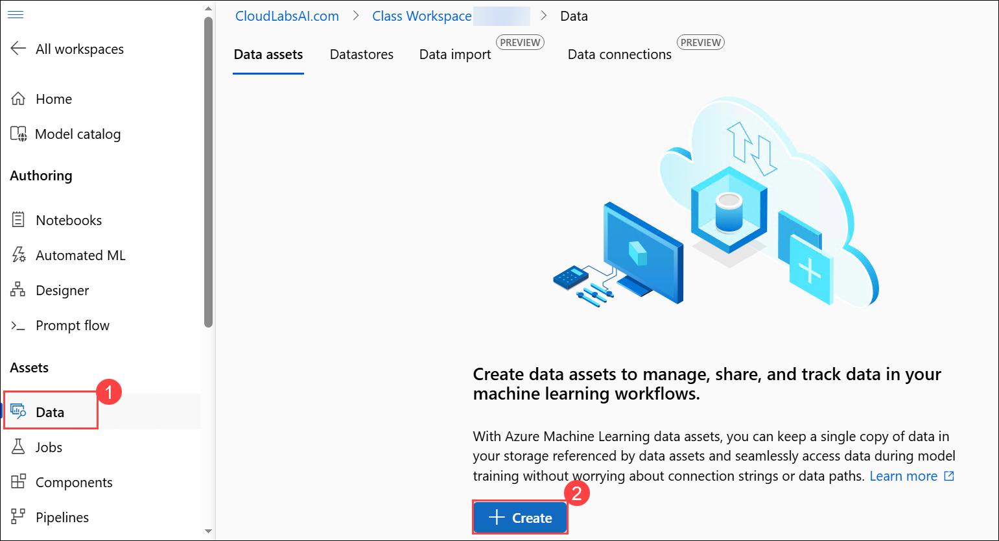

1. On **Create data asset** page enter the following data.

    - Name: Enter **`Clemson-Tigers-School-History` (1)**  
    - Description: **Contains Clemson University’s Tigers football team season stats. (2)**
    - Select type: **Tabular (3)**  
    - Click **Next (4)**  

           

1. On the **Choose a source for your data asset** page, choose **From local files (1)** the click on **Next (2)**. 

     

1. On the **Select a datastore** page select the following option:  
    
    - Under **Datastore type**, select **Azure Blob Storage (1)**  
    - Choose the datastore named: **`workspaceblobstore` (2)**  
    - Click **Next (3)**  

       

1. On the **Choose a file or folder** page, select **Upload files or folder (1)** from the dropdown, then select **Upload files (2)**.

      

1. **File or Folder Selection**  

    - In the file browser, navigate to  `C:\Labs\Allfiles\unit5-lesson7` and then select the file: `Clemson Tigers School History.csv` **(1)** 
    - Wait for the file to appear under “Upload list”  
    - Click **Next (2)**  

       

1. On the **Settings** page, review the fields and ensure they match the expected format then click **Next**  

     

1. On the **Schema** page, ensure the schema fields are correctly recognized then click **Next**  

     

1. On the **Review** page, click **Create** to finalize the dataset upload

    

> **Congratulations** on completing the task! Now, it's time to validate it. Here are the steps:
>
> - Hit the Validate button for the corresponding task. If you receive a success message, you can proceed to the next task.
> - If not, carefully read the error message and retry the step, following the instructions in the lab guide.
> - If you need any assistance, please contact us at cloudlabs-support@spektrasystems.com. We are available 24/7 to help.

<validation step="2cf274aa-3ba9-470b-8225-3a5bbc90ddba" />

---       

### Task 4: Cloning our Preprocessing Pipeline

1. Navigate to **Pipeline (1)** from the left navigation pane and then Select **Pipeline drafts (2)** tab and then click on **Preprocessing_Pipeline (3)**.

   

1. Click the **Clone** button at the top. This will create a copy of the pipeline and open it in a new tab.

   

1. Select the **Pencil** icon to rename the Pipeline.    

   

1. Rename your cloned pipeline to **Clemson – Supervised Pipeline (1)** and then **Save (2)**.    

   

### Task 5: Classification in Azure (Supervised)

We will be using logistic regression, a common supervised learning model, to predict whether Clemson will win or lose a bowl game based on the season’s performance data.

1. Navigate to the **Data** tab on the left, drag your **Clemson dataset** onto the pipeline canvas **(1)** and connect it to the existing **preprocessing pipeline (2)** and then **Save (3)**.

    

1. Double click on the **Clean Missing Data (1)** component. Select **Edit Column** under “Columns to be cleaned” to include the **Bowl** column, either “With rules” or “By name”.     
    
     

1. Select **Column names (1)** and then choose **Bowl (2)** and then **Save (2)**.

    

1. Set **Cleaning mode** to **Remove entire row (1)** to filter out seasons that do 
not include a bowl game and then **Save (2)**.

    

     >**Note:** This ensures our model only trains on seasons with a **win/loss** outcome in a bowl.

1. The **Split Data** component already handles splitting our data into training and test sets, so now we need to train our model.     

1. Switch to the **Component** tab in the left panel **(1)** and search for **Train Model (2).** Drag that component onto the canvas **(3)** below the `Split Data` component.

    - **LEFT (training data) output** from the **“Split Data”** component into 
the **Right** **“Dataset”** input of the **“Train Model”** component **(4)**

      

1. We will be using **logistic regression** for our model, because it classifies outcomes into one of two groups, in our case, win or loss.     

1. Switch to the **Component** tab in the left panel **(1)** and search for **“Two-Class Logistic Regression (2).** Drag that component onto the canvas **(3)** beside the `Split Data` component. 

    

1. Connect it to the left **“Untrained model”** input on the **“Train Model”** component **(1)**.   

     - Connect the **left output of Split Data** component to **Right input of Train Model** **(2)**

       

1. Double click the **“Train Model”** component **(1)**. Under Label column, select **Edit Column (2)**. 

    

1. Under Label column, type **“Win/Loss” (1)** then hit **Enter** and then **Save (2)**.     

     

1. Select **Save**.

     

1. Switch to the **Component** tab in the left panel **(1)** and search for **“Score Model (2).** Drag that component onto the canvas **(3)** below the `Train Model` component. 

     

1. Connect:

     - Connect the **output** of the **“Train Model”** to the **left input of “Score Model.” (1)**

     - Connect the **RIGHT (test data) output from “Split Data”** into the **right input of “Score Model.” (2)**

     - Then **Save (3)**

        

        >**Note:** This will compare the 
model’s predictions against the actual win/loss outcomes.     

1. Switch to the **Component** tab in the left panel **(1)** and search for **Evaluate Model (2).** Drag that component onto the canvas **(3)** below the `Score Model` component. 

     - Connect the **output from “Score Model”** to the **left input for “Evaluate Model.” (4)**

     - Then **Save (5)**

        

        >**Note:** This step will generate metrics like **accuracy, precision, recall, F1 score,** and **AUC**. 
  

### Task 6: Run the Supervised Pipeline
      
1. Make sure your pipeline is saved, then click **Configure & Submit** at the top of the screen. 

    

1. You will now walk through a few configuration steps, then click **Next (3):**
  
   - Experiment name: **Create new (1)**
   - New experiment name: **Clemson-Supervised-Pipeline(2)**

       

1. Leave Inputs & Outputs as is, there is nothing to configure for this step. Click **Next.**      

         

1. Now we’re on the **Runtime settings** step of the pipeline submission process. This is where you choose the **computer (called a compute cluster)** that Azure will use to run your 
pipeline.

    - Select Compute Type: From the dropdown, select **Compute cluster (1)**.

    - Click on **Create Azure ML compute cluster (2)**

        

1. You are now in the **Virtual Machine** tab for setting up a compute cluster. This step helps Azure decide which kind of machine to use for running your pipeline.

    - **Location:** Confirm that the selected region is the same as your workspace (**<inject key="Region" enableCopy="false" />**) **(1)**
    - **Virtual Machine Tier:** Leave as default. (do not select "Dedicated" or "Low priority" unless specified otherwise for cost-saving purposes) **(2)**
    - **Virtual Machine Type:** Keep this as **CPU (3)** 
    - **Virtual Machine Size:** Choose **Standard_DS3_v2 (4)**
    - Click **Next (5)**  

         

1. **Advanced Settings:** Give a Compute Name as **Test (1)** and leave everything default. Then click **Create (2)**.

      

1. Select the Compute Created **Test (1)** and click **Next (2)**.   

     

     >**Note:** The creation of the compute cluster takes approximately 3–5 minutes. You’ll be able to select the cluster only after it’s fully created. Please wait until the process is complete, and keep refreshing the cluster.

1. Once on the **final** page, click **Submit**.     

       

1. Once submitted, a success notification appears at the top of the page. Click on **'View details'** to monitor the pipeline. It may take some time for the pipeline to complete.

     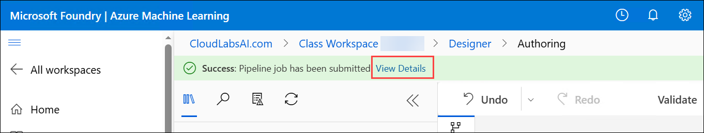 

1. Pipeline may take around `10-15 mins` to complete meanwhile we will move on to setting up our **unsupervised learning pipeline**, which you will build using the previous steps as a guide.      

### Task 7: Clustering in Azure (Unsupervised)

Now you will build an unsupervised machine learning pipeline on your own, following the same general structure as the supervised model we just completed. The goal is to use K-Means Clustering to separate the seasons into three groups that you can later interpret and label as “Elite,” “Average,” and “Poor” based on performance metrics.

Tips that you need to understand in order to successfully build your unsupervised pipeline:

- K-Means clustering only works with numerical and non-null values.
- Search for “clustering” components specifically. Some of the components we 
used before may not be applicable to unsupervised models.
- Unsupervised learning does not use labeled outcomes, so “label column” settings will not be relevant.
- There is a “Validate” button in Azure to check for incomplete or incorrectly 
connected pipeline components.
- If an error occurs during runtime, reviewing the error message can often provide clear direction on what to fix

1. Make another clone of the **Preprocessing Pipeline**.

1. Navigate to **Pipeline (1)** from the left navigation pane and then Select **Pipeline drafts (2)** tab and then click on **Preprocessing_Pipeline (3)**.

    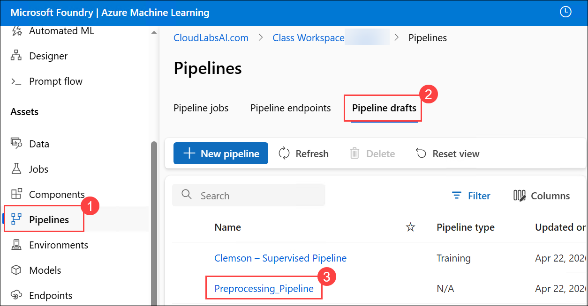

1. Click the **Clone** button at the top. This will create a copy of the pipeline and open it in a new tab.

    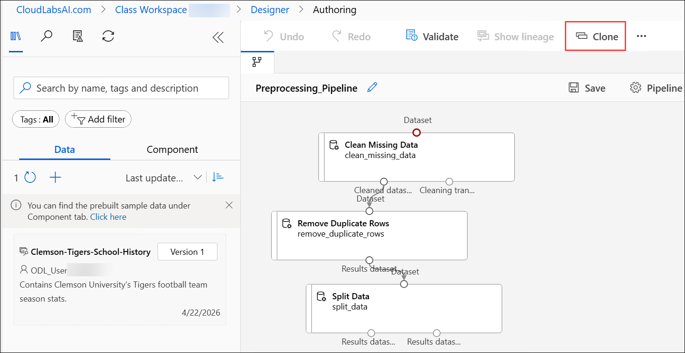

1. Select the **Pencil (1)** icon to rename the Pipeline.    

     - Rename your cloned pipeline to **Clemson – Unsupervised Pipeline (2)** and then **Save (3)**. 

       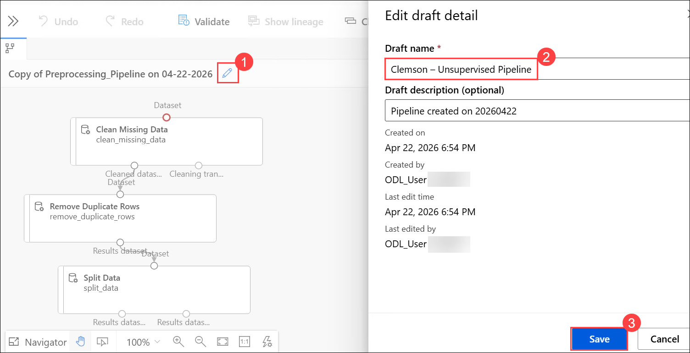

1. Navigate to the **Data (1)** tab on the left, drag your **Clemson dataset** onto the pipeline canvas **(2)** and connect it to the existing **preprocessing pipeline (3)**.

    

1. Double click on the **Clean Missing Data (1)** component. Select **Edit Column** under “Columns to be cleaned”.
    
    

1. Select **Column names (1)** and then type or select all these columns `Overall Wins, Overall Losses, Overall Ties, Overall Win-Loss Percentage, Conference Wins, Conference Losses, Conference Win-Loss Percentage, Simple Rating System, Strength of Schedule, AP Pre Rank, AP Highest Rank, CFP Highest Rank,CFP Final Rank` **(2)** and then **Save (3)**.

    

1. Set the **Cleaning mode** to **Replace with mean (1)** and then **Save (2)**.    

    

1. These are the components that are replaced in the Unsupervised pipeline compared to the Supervised pipeline:

     - Swap out “Two-Classification Regression” with **“K-Means Clustering”** for the model type.
     - Swap out “Train Model” with **“Train Clustering Model”** and connect it to your dataset and clustering model.
     - Swap out “Score Model” with **“Assign Data to Clusters”** and remove **“Evaluate Model.”** This will label each row in the dataset with a cluster ID

1. Switch to the **Component** tab in the left panel and search for **“K-Means Clustering (1).** Drag that component onto the canvas **(2)** beside the `Split Data` component. 

    

1. Switch to the **Component** tab in the left panel and search for **Train Clustering Model (1).** Drag that component into the canvas **(2)**.

    

1. Connect:

     - Connect **output** of **K-Means Clustering** to **left input of Train Clustering Model (1)**

     - Connect **left output of Split Data** to **Right input of Train Clustering Model (2)**

       

1. Switch to the **Component** tab in the left panel and search for **Assign Data to Clusters (1).** Drag that component into the canvas **(2)**.

     - Connect **left output of Train Clustering Model** to **left input of Assign Data to Clusters (3)**

     - Connect **Right output of Split Data** to **Right input of Assign Data to Clusters (4)**

     - Then **Save (5)**

       

1. Double-click **“K-Means Clustering” (1)** and set “Number of centroids” to `3` **(2)** and then **Save (3)**.     

    

     >**Note:** We want to have 3 centroids, so we can group the seasons into “Elite”, “Average”, and “Poor”.

1. Double-click **“Train Clustering Model” (1)**. Select **Edit Column (2)** under `Column Set`.

    

1. Select **Column names (1)** and copy the entire numeric columns provided below that you want the model to use and then hit **Enter**.

     - `Overall Wins, Overall Losses, Overall Ties, Overall Win-Loss Percentage, Conference Wins, Conference Losses, Conference Win-Loss Percentage, Simple Rating System, Strength of Schedule, AP Pre Rank, AP Highest Rank, CFP Highest Rank,CFP Final Rank` **(2)**

     - Then **Save (3)**

       

1. Then **Save (1)** and then click **“Configure + Submit” (2)**.

    

1. You will now walk through a few configuration steps, then click **Next (3):**
  
   - Experiment name: **Create new (1)**
   - New experiment name: **Clemson-Unsupervised-Pipeline(2)**

       

1. Leave **Inputs & Outputs** as it is, there is nothing to configure for this step. Click **Next.**      

        

1. Use the same compute cluster **Test (1)**
as before and then **Next (2)**.   

    

     >**Note:** It may take some time for the test to get selected. Please try refreshing the cluster periodically until it appears.

1. Select **Submit**.

    

1. Once submitted, a success notification appears at the top of the page. Click on **'View details'** to monitor the pipeline. It may take some time for the pipeline to complete.

    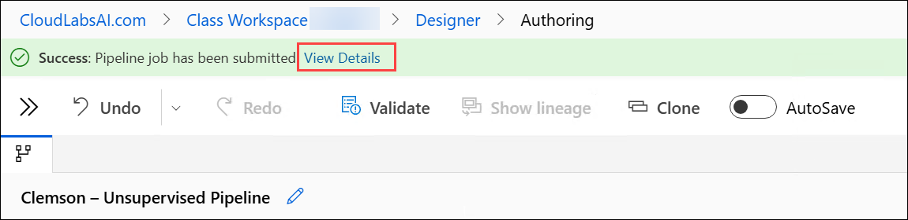

1. Pipeline may take around `10-15 mins` to complete. Until then please check the Evaluate result of Supervised Model.

### Task 8: Evaluate the Models

1. Navigate to **Pipeline (1)** from the left and then select **Clemson-Supervised Pipeline (2)**.

    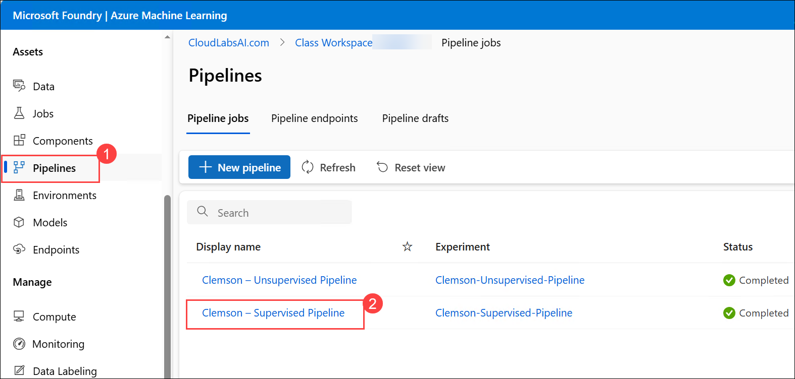

1. Make sure the pipeline is **completed (1)** if not then please wait. Right click on **Evaluate model (2)** then select  **Preview data (3)** and then select **Evaluation results (4)**.   

    

1. View the **Evaluation results**. 

    

     - Azure provides key metrics such as:

          - `Accuracy` – The percentage of predictions the model got right
          - `Precision` – Of all the "win" predictions, how many were actually wins? (True Positives to False Positives ratio)
          - `Recall` – Of all actual wins, how many did the model correctly predict?
          - `F1 Score` – The balance between precision and recall
          - `AUC` (Area Under Curve) – Measures how well the model separates classes (win vs. loss). A value closer to 1 is better.    

     - Interpretation tips:

          - High accuracy alone does not mean it is a good model.
          - If precision is high but recall is low, the model is cautious and only predicts “win” when it is very sure.
          - AUC above `0.8` is typically considered a **strong indicator of performance**.

1. Navigate to **Pipeline (1)** from the left and then select **Clemson-Unupervised Pipeline (2)**.

    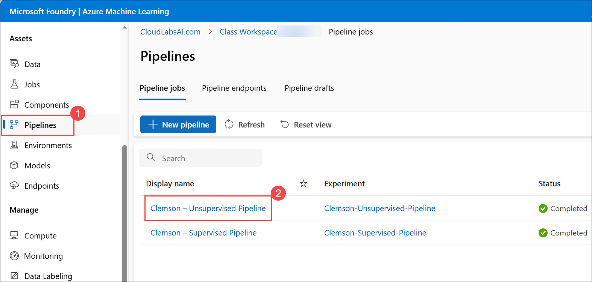

1. This will take around `10-15 mins` to complete as this has started just now. So please wait until the pipeline completed.    

1. Make sure the pipeline is **completed (1)** if not then please wait. Right click on **Assign Data to Cluter (2)** then select  **Preview data (3)** and then select **Result dataset (4)**. 

    

1. When previewing the data, you will see a new column called **“Assignments.”** This column assigns each row a **cluster ID**, like `0, 1,` or `2`. These cluster IDs are arbitrary, which means no cluster is automatically better or worse than another cluster.

    

     >**Interpretation Tips:** Use your analysis of the clustered data to assign meaningful labels to each group. 

     For example:
     - Cluster 0 → "Elite"
     - Cluster 1 → "Average"
     - Cluster 2 → "Poor"

     Keep in mind that K-Means Clustering does not label clusters automatically. It is up to the human analyst to interpret the patterns and decide what each group represents.

## Review

In this lab, you have completed the following tasks:

- Set Up the Azure ML Workspace
- Created a Preprocessing Pipeline
- Added the Dataset to Your Pipeline Canvas
- Clonned our Preprocessing Pipeline
- Classification in Azure (Supervised)
- Run the Supervised Pipeline
- Clustering in Azure (Unsupervised)
- Evaluated the Models

## You have successfully completed the lab

