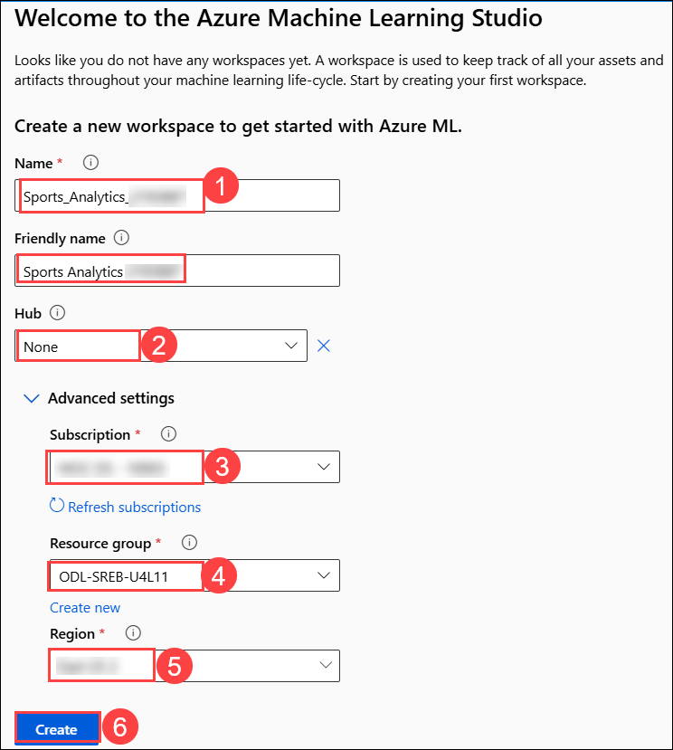
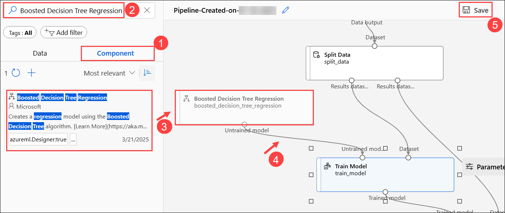

# Hands-On-Lab: Regression in Azure ML Designer

In this hands-on lab, you will take on the role of a junior sports analyst to predict player performance for a South Carolina basketball team. Using Azure ML Designer, you will build and compare Linear Regression and Boosted Decision Tree models based on player statistics. You’ll experiment with feature selection, evaluate model accuracy using RMSE and R², and interpret the results. Based on predicted outcomes, you’ll make data-driven scouting recommendations.

## Lab Objectives

In this lab, you will be able to complete the following tasks:

- Task 1: Set Up the Azure ML Workspace
- Task 2: Add a dataset to your Azure ML pipeline in the Designer
- Task 3: Add the Dataset to Your Pipeline Canvas
- Task 4: Train the Model
- Task 5: Run the Pipeline and Submit the Job
- Task 6: Model Evaluation Results (Azure ML Designer)
- Task 7: Swap in Boosted Decision Tree Regression

## Architecture diagram

### Task 1: Set Up the Azure ML Workspace

In this task you will set up an Azure Machine Learning workspace where all your machine learning assets and experiments will be organized and run. You will learn how to create a workspace in the Azure ML Studio, select the appropriate region and resource group, and navigate to the Designer interface to start building your pipeline.

1. Open a new tab in the browser, right-click on the following link [Azure Machine Learning Studio](https://ml.azure.com/), then **Copy link** and paste it in a new browser tab to log in to **Azure Machine Learning Studio**.

1. If prompted, provide the credentials below:

   - **Email/Username:** <inject key="AzureAdUserEmail"></inject>

   - **Password:** <inject key="AzureAdUserPassword"></inject>
   
1. On the **Create a new workspace to get started with Azure ML** fill in the following fields:

    - **Name**: Enter **Sports_Analytics_<inject key="DeploymentID" enableCopy="false" />  **(1)**
    - **Friendly Name**: Leave default
    - **Hub (Optional)**: Leave this as **None** unless instructed otherwise **(2)**
    - **Advanced Settings**:
    - **Subscription**: Select the appropriate Azure subscription from the dropdown **(3)**
    - **Resource Group**: Select **ODL-SREB-U4L11** **(4)**
    - **Region**: Select **<inject key="Region" enableCopy="false" /> (5)** for better performance.
    - After filling out all the required fields, click the **Create (6)** button.

       

       >**Note**: If you **did not** see the page like Figure 1, simply click **“Create Workspace”** on your dashboard and fill out the fields as described in Step 2.

1. Wait for the workspace to create, it may take around 2-3 minutes.

1. Now navigate to your newly created workspace. On the **left-hand menu**, click **Workspaces (1)**. Select the workspace you just created **Sports_Analytics_<inject key="DeploymentID" enableCopy="false" />** **(2)**.

      

1. This will take you inside the workspace where you can build and run machine learning experiments.

         

> **Congratulations** on completing the task! Now, it's time to validate it. Here are the steps:
> - Hit the Validate button for the corresponding task. If you receive a success message, you can proceed to the next task. 
> - If not, carefully read the error message and retry the step, following the instructions in the lab guide.
> - If you need any assistance, please contact us at cloudlabs-support@spektrasystems.com. We are available 24/7 to help.

<validation step="75aee6ee-f1b5-48b0-a3d3-5da64fc6b8aa" />

### Task 2: Add a dataset to your Azure ML pipeline in the Designer

In this task you will upload the SC Basketball Enhanced data to your Azure ML workspace. You will create a tabular dataset from a local CSV file, configure the data source, and add it to your pipeline canvas for further processing.

1. Once you are inside your workspace **Sports_Analytics_<inject key="DeploymentID" enableCopy="false" />**, look at the left hand side menu to find the **Designer** tab under the Authoring section. Click on 
this tab.

     

   >**Note**:  This will open the Azure Machine Learning Designer interface where you can  begin creating your machine learning pipeline by dragging and dropping 
components.

1. Once the **Designer** page is loaded, make sure that you’re on the **Classic prebuilt** tab under the **New pipeline** section. From here, click on the box with  **➕ (plus icon)** 
that says, **Create a new pipeline using classic prebuilt components**.

     

1. On the **left panel**, under the **Data (1)** tab, click the **➕ (plus icon) (2)** to upload a dataset.  

     

1. On **Create a new workspace to get started with Azure ML** page enter the following data then click on **Next (1)**.

    - Name: Enter **SC_Basketball_Dataset__<inject key="DeploymentID" enableCopy="false" /> (1)**  
    - Select type: **Tabular (2)**  
    - Click **Next (3)**  

           

1. On the **Choose a source for your data asset** page, choose **From local files (1)** the click on **Next (2)**. 

     

1. On the **Select a datastore** page select the following option:  
    
    - Under **Datastore type**, select **Azure Blob Storage (1)**  
    - Choose the datastore named: **`workspaceblobstore` (2)**  
    - Click **Next (3)**  

       

1. On the **Choose a file or folder** page, select **Upload files or folder (1)** from the dropdown, then select **Upload files (2)**.

      

1. **File or Folder Selection**  

    - In the file browser, navigate to `C:\Labs\Allfiles\unit5-lesson11` and select the file: **`SC_Basketball_Enhanced.csv`** **(1)** 
    - Wait for the file to appear under **Upload list**  
    - Click **Next (2)**  

       

1. On the **Settings** page, review the fields and ensure they match the expected format then click **Next**  

     

1. On the **Schema** page, ensure the schema fields are correctly recognized then click **Next**  

     

1. On the **Review** page, click **Create** to finalize the dataset upload

    

> **Congratulations** on completing the task! Now, it's time to validate it. Here are the steps:
> - Hit the Validate button for the corresponding task. If you receive a success message, you can proceed to the next task. 
> - If not, carefully read the error message and retry the step, following the instructions in the lab guide.
> - If you need any assistance, please contact us at cloudlabs-support@spektrasystems.com. We are available 24/7 to help.

<validation step="06a77f45-32e1-47c0-ba75-38ed22c2b7a7" />

### Task 3: Add the Dataset to Your Pipeline Canvas

In this task, you will add your dataset to the pipeline canvas and use the Split Data component to divide your data into training and testing sets. You will configure the split ratio and random seed to ensure consistent and reproducible results.

1. From the left panel, drag your **SC_Basketball_Dataset__<inject key="DeploymentID" enableCopy="false" /> (1)** dataset onto the canvas **(2)**. Click the **Save (3)** button at the top of the canvas to avoid losing progress. 

   

1. Switch to the **Component (1)** tab in the left panel and search for **Split Data (2)** Drag that component **Split Data (3)** onto the canvas.   

    - Connect your dataset to the **Split Data (4)** module 

      

1. Double-click the **Split Data (1)** component to open its settings. Specify the following and then click on **Save (4)**:

    - Fraction of rows in the first output dataset: **0.75**  **(2)**
    - Random seed: **42**  **(3)**

        

### Task 4: Train the Model

In this task, you will set up and connect components to train, score, and evaluate a regression model predicting player points (PTS) using Azure ML Designer.

1. Switch to the **Component** tab in the left panel **(1)** and search for **Linear Regression (2).** Drag that component onto the canvas **(3)**.   

    

1. Switch to the **Component** tab in the left panel **(1)** and search for **Train Model (2).** Drag that component onto the canvas **(3)**.   

    

1. Connect:

    - The **output of Linear Regression** to the **left input of Train Model** (this is the 
untrained model) **(1)**
    - The **left output of Split Data** to the **right input of Train Model** (this is your 70% 
training data) **(2)**  

      

1. Double Click on the **Train Model** module **(1)**, Click **Edit column (2)** under **Label column**.

    

1. Enter **PTS** as the target to predict **(1)** and the **Save (2)**.

    

1. Select **Save**.

    

1. Switch to the **Component** tab in the left panel **(1)** and search for **Score Model (2).** Drag that component onto the canvas **(3)**.   

    

1. Connect:

    - The **output of Train Model** to the **left input of Score Model** **(1)**
    - The **right output of Split Data** (test data) to the **right input of Score Model** **(2)**  
    - Select **Save (3)**

       

1. Switch to the **Component** tab in the left panel **(1)** and search for **Evaluate Model (2).** Drag that component onto the canvas **(3)**.   

    - Connect the **output from Score Model to left input of Evaluate Model (4)**
    - Select **Save (5)**

      

### Task 5: Run the Pipeline and Submit the Job
      
In this task, you will configure, submit, and run your Azure ML pipeline by selecting or creating a compute cluster, then monitor the pipeline’s execution until it completes successfully.      

1. Make sure your pipeline is saved, then click **Configure & Submit** at the top of the screen. 

    

1. You will now walk through a few configuration steps, then click **Next (3)**:
  
   - Experiment name: **Create new (1)**
   - New experiment name: **PTS_Split_70_30 (2)**

       

1. Leave Inputs & Outputs as is, there is nothing to configure for this step. Click **Next.**      

         

1. Now we’re on the **Runtime settings** step of the pipeline submission process. This is where you choose the **computer (called a compute cluster)** that Azure will use to run your 
pipeline.

    - Select Compute Type: From the dropdown, select **Compute cluster (1)**.

    - Click on **Create Azure ML compute cluster (2)**

        

1. You are now in the **Virtual Machine** tab for setting up a compute cluster. This step helps Azure decide which kind of machine to use for running your pipeline.

    - **Location**: Confirm that the selected region is the same as your workspace (**<inject key="Region" enableCopy="false" />**) **(1)**
    - **Virtual Machine Tier**: Leave as default. (do not select "Dedicated" or "Low priority" unless specified otherwise for cost-saving purposes) **(2)**
    - **Virtual Machine Type**: Keep this as **CPU (3)** 
    - **Virtual Machine Size**: Choose **Standard_DS11_v2 (4)**
    - Click **Next (5)**  

         

1. **Advanced Settings**: Give a Compute Name as **Test (1)** and leave everything default. Then click **Create (2)**.

       

1. Select the Compute Created **Test (1)** and click **Next (2)**.   

     

      >**Note**: The creation of the compute cluster takes approximately 3–5 minutes. You’ll be able to select the cluster only after it’s fully created. Please wait until the process is complete, and keep refreshing the cluster.

1. Once on the **final** page, click **Submit**.     

      

1. Once submitted, a success notification appears at the top of the page. Click on **'View details'** to monitor the pipeline. It may take some time for the pipeline to complete.

           

1. Please wait for the pipeline to complete, which may take approximately `10–15 `minutes. Once it's finished successfully, the status will show as **Completed**.

         

### Task 6: Model Evaluation Results (Azure ML Designer)

In this task, you will review and analyze the model’s performance by comparing predicted scores with actual values and examining key evaluation metrics like RMSE and R² to assess accuracy and predictive quality.

1. Right click on the **Score Model** and Select **Preview Data -> Scored Dataset** to compare Scored Labels and actual PTS.

      
       
1. Right click on the **Evaluate Model** and then on **Preview Data -> Evaluation Results**.

    - RMSE (Root Mean Squared Error)
     
    - R² (how well the model explains the data)

       
      
  - **Write down your results.**

     - Was the model accurate? Did it predict well for all players or only some.

### Task 7: Swap in Boosted Decision Tree Regression

In this task, you will replace the Linear Regression model with a Boosted Decision Tree Regression model, rerun the pipeline, and compare the new model’s prediction performance using evaluation metrics to see if it improves accuracy.

1. Navigate back to the Designer tab and select your pipeline.

     
   
1. Switch to the **Component** tab in the left panel and search and drag a **Boosted Decision Tree Regression** module onto the canvas.

1. Delete the **Linear Regression** module and replace it with the **Boosted Decision Tree Regression** module. Then click on **Save**.

    

1. Review the pipeline, then click **Configure & Submit** at the top of the screen.

    

1. On the **Basics** page, choose **Select existing** option then click on **Review + Submit**

    

1. Review the settings and click on **Submit**

      

1. Once submitted, a success notification appears at the top of the page. Click on **'View details'** to monitor the pipeline. It may take some time for the pipeline to complete.

           

1. Please wait for the pipeline to complete, which may take approximately `10–15 `minutes. Once it's finished successfully, the status will show as **Completed**.
   
1. Right click on the Score Model and Select **Preview Data -> Scored Dataset** to compare Scored Labels and actual PTS

     

1. Right click on the **Evaluate Model** and then on **Preview Data -> Evaluation Results**

     

## Review

In this lab, you have completed the following tasks:

- Set Up the Azure ML Workspace
- Added a dataset to your Azure ML pipeline in the Designer
- Added the Dataset to Your Pipeline Canvas
- Trained the Model
- Run the Pipeline and Submit the Job
- Model Evaluation Results (Azure ML Designer)
- Swapped in Boosted Decision Tree Regression

## You have successfully completed the lab
