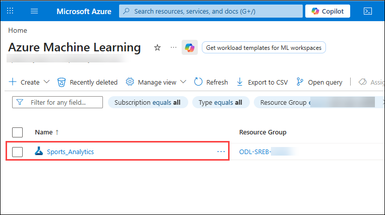
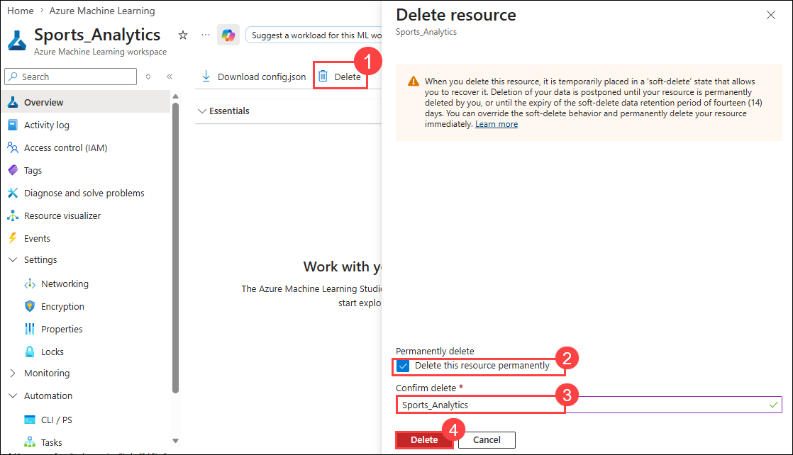

# Hands-On-Lab: Classifying Players Using Decision Trees

In this Hands-on lab, you will act as a basketball scouting analyst and work with real-world South Carolina sports data to classify players as starters or non-starters. You will use Azure ML Designer to build a decision tree classification model and learn how it splits data to make predictions. The lab involves selecting relevant features, configuring a Two-Class Decision Forest model, and interpreting the model’s performance using Azure’s evaluation tools.

## Lab Objectives

In this lab, you will be able to complete the following tasks:

- Task 1: Create Azure ML Workspace
- Task 2: Add a dataset to your Azure ML pipeline in the Designer
- Task 3: Preprocessing Our Data
- Task 4: Configure Pipeline Job Basics

## Architecture diagram

### Task 1: Create Azure ML Workspace

In this task you will set up an Azure Machine Learning workspace where all your machine learning assets and experiments will be organized and run. You will learn how to create a workspace in the Azure ML Studio, select the appropriate region and resource group, and navigate to the Designer interface to start building your pipeline.

1. Open a new tab in the browser, right-click on the following link [Azure Machine Learning Studio](https://ml.azure.com/), then **Copy link** and paste it in a new browser tab to log in to **Azure Machine Learning Studio**.

1. If prompted, provide the credentials below:

   - **Email/Username:** <inject key="AzureAdUserEmail"></inject>

   - **Password:** <inject key="AzureAdUserPassword"></inject>
   
1. On the **Create a new workspace to get started with Azure ML** fill in the following fields:

   - **Name**: `Sports_Analytics`  
   - **Friendly Name**: *(Optional)*  
      Azure will auto-fill this based on the name.
   - **Hub (Optional)**: Leave this as “None” unless instructed otherwise.
   - **Advanced Settings**:
   - **Subscription**: Select the appropriate Azure subscription from the dropdown. 
   - **Resource Group**: **ODL-SREB-<inject key="DeploymentID" enableCopy="false"/>**
   - **Region**: Select **<inject key="Region" enableCopy="false" />** for better performance.
   - After filling out all the required fields, click the **“Create”** button.

         

    >**Note**: If you **did not** see the page like Figure 1, simply click **“Create Workspace”** on your dashboard and fill out the fields as described in Step 2.

1. Now navigate to your newly created workspace. On the **left-hand menu**, click **“Workspaces”**. Locate the workspace you just created **`Sports_Analytics`**.

      
   
1. Click on its name to open it. This will take you inside the workspace where you can build and run machine learning experiments.

     

> **Congratulations** on completing the task! Now, it's time to validate it. Here are the steps:
> - Hit the Validate button for the corresponding task. If you receive a success message, you can proceed to the next task. 
> - If not, carefully read the error message and retry the step, following the instructions in the lab guide.
> - If you need any assistance, please contact us at cloudlabs-support@spektrasystems.com. We are available 24/7 to help.

<validation step="d33ca28b-3a3c-48f0-8f97-5109a5b827fd" />

### Task 2: Add a dataset to your Azure ML pipeline in the Designer

In this task you will upload the manufacturing sensor data to your Azure ML workspace. You will create a tabular dataset from a local CSV file, configure the data source, and add it to your pipeline canvas for further processing.

1. Once you are inside your workspace **`Sports_Analytics`**, look at the left hand side menu to find the **Designer** tab under the Authoring section. Click on 
this tab.

     

   >**Note**:  This will open the Azure Machine Learning Designer interface where you can  begin creating your machine learning pipeline by dragging and dropping 
components.

1. Once the **Designer** page is loaded, make sure that you’re on the **Classic prebuilt** tab under the **New pipeline** section. From here, click on the box with  **➕ (plus icon)** 
that says, **Create a new pipeline using classic prebuilt components**.

     

1. On the **left panel**, under the **Data (1)** tab, click the **➕ (plus icon) (2)** to upload a dataset.  

     

1. On **Create a new workspace to get started with Azure ML** page enter the following data then click on **Next (1)**.

   - Name the dataset: **`Sports_Analytics_Dataset`** **(1)**  
  
     

1. On the **Choose a source for your data asset** page, choose **From local files (1)** the click on **Next (2)**. 

     

1. On the **Select a datastore** page select the following option:  
   - Under **Datastore type**, select **Azure Blob Storage (1)**  
   - Choose the datastore named: **`workspaceblobstore` (2)**  
   - Click **Next (3)**  

     

1. On the **Choose a file or folder** page, select **Upload files or folder (1)** from the dropdown, then select **Upload files (2)**.

     

1. **File or Folder Selection**  
   - In the file browser, navigate to `C:\Labs\Allfiles\unit5-lesson13` and select the file: **`SC_Basketball_Enhanced_With_Starter`**  
   - Wait for the file to appear under “Upload list”  
   - Click **Next**  

      

1. In Next page, Click on **Next** Button **Twice** and then click on **Create** Button

> **Congratulations** on completing the task! Now, it's time to validate it. Here are the steps:
> - Hit the Validate button for the corresponding task. If you receive a success message, you can proceed to the next task. 
> - If not, carefully read the error message and retry the step, following the instructions in the lab guide.
> - If you need any assistance, please contact us at cloudlabs-support@spektrasystems.com. We are available 24/7 to help.

<validation step="cbf57e7a-aff5-45be-861a-6c918bbd5dc5" />

### Task 3: Preprocessing Our Data

In this task you will prepare your dataset for modeling by cleaning missing values. You will add and configure the Clean Missing Data component to handle incomplete or missing sensor readings, ensuring the dataset is reliable for training your model.

1. Under the **Data** tab, locate the uploaded dataset named `Sports_Analytics_Dataset`.

    
  
1. Drag **Sports_Analytics_Dataset** onto the canvas.

    

1. Connect the output of the **Sports_Analytics_Dataset** dataset to **Select Columns in Dataset** component input.

1. Switch to the **Component** tab and search for **Select Columns in Dataset**. Then drag the component into your canvas, placing it below the **Sports_Analytics_Dataset**. Then connect the output of the dataset to this component input.

    

1. Double click on the **Select Columns in Dataset** module. In the right panel, click **Edit column** selection.

    

1. Choose the following columns as inputs (features), then click **Save**

    - MP (minutes played)
    - FG% (field goal %)
    - AST (assists)
    - PTS (points scored)
    - TRB (total rebounds)
    - TOV (turnovers)
    - Starter

   

1. Switch to the **Component** tab and search for **Split Data**. Then drag the component into your canvas. Double click on the **Split Data module** and configure the following then click on **Save**.

   a. Fraction of rows in the first output dataset: 0.8 (80% training)

      

1. Switch to the **Component** tab and search for **Two-Class Decision Forest**. Then drag the component into your canvas as shown in the below image.

    

1. Switch to the **Component** tab and search for **Train Model**. Then drag the component into your canvas as shown in the below image.

    

3. Connect Inputs to Train Model, You need to connect two inputs into the Train Model box:

    - From the Two-Class Decision Forest module → into the left port labeled Untrained model
    
    - From the Split Data module (Training data output) → into the right port labeled Dataset

       

1. Double Click on the **Train Model** box to select it

    - On the right-hand side, click the “Parameters” pane (or click “Launch column selector”)
    - In the popup, select the column: starter (This tells the model to predict whether each player is a starter or not)
    - Click **Save**.

      

1. Switch to the **Component** tab and search for **Score Model**. Then drag the component into your canvas as shown in the below image. Then Connect as mentioned below:

    - Trained model → Score Model
    
    - Testing data → Score Model

      

1. Switch to the **Component** tab and search for **Evaluate Model**. Then drag the component into your canvas as shown in the below image. Connect Score Model → Evaluate Model.

      
   
1. Click **Save** at the top right. Then select the **Configure & Submit** button in the top-right corner.

    

1. Now that your pipeline is fully built with all the components connected—from data ingestion to anomaly scoring—you’re ready to run it.

### Task 4: Configure Pipeline Job Basics

In this task you will configure the details needed to run your pipeline, including setting up a new experiment and creating a compute cluster. You will submit the pipeline job to Azure ML to execute your workflow.

1. On the **Basics** page, perform the steps as mentioned below:

   - In the Experiment name select **Create new**
   - In **New experiment name** filed provide **`Test_Sports_Analytics`**
   - Click the blue **Next** button at the bottom-right corner of the screen

      

1. On the **Inputs & outputs** page, click on **Next** to skip.

1. On the Runtime Settings page, from the dropdown of the **Select Compute Type** section, click on Compute Cluster. Since no cluster is currently available, we’ll need to create one. Click on **Create Azure ML Compute Cluster**.

1. On the **Select virtual machine** page, specify the following then click on **Next** :
  
    - Location: Confirm that the selected region is the same as your workspace **<inject key="Region" enableCopy="false" /> (1)**
    
    - Virtual Machine Tier: Leave as default **(2)**
    
    - Virtual Machine Type: Keep this as **CPU** (sufficient for our anomaly detection task) **(3)**

    - Virtual Machine Size: Choose **Standard_DS11_v2 (4)**
  
      

1. On the **Configure Settings** page, provide Compute name **Compute-cluster-<inject key="DeploymentID" enableCopy="false"/> (1)** then click on **Create (2)**

    

1. Back on the **Runtime Settings** page, select the newly created Azure ML compute cluster from the dropdown in the **Select Azure ML compute cluster (1)** field, then click on **Review + Submit (2)**.

     

      >**Note**: The creation of the compute cluster takes approximately 3–5 minutes. You’ll be able to select the cluster only after it’s fully created. Please wait until the process is complete, and keep refreshing the cluster.

1. On **Review + Submit** page, click on **Submit**. 

     

1. Once submitted, a success notification appears at the top of the page. Click on **View details** to monitor the pipeline. It may take some time for the pipeline to complete.

      

1. Once the Pipeline is run, you can see the similar result.

      

1. Right click on the **Score Model** and Select **Preview Data** > **Scored Dataset** to compare Scored Labels and actual Starter. 

     

     
   
1. Right click on the **Evaluate Model** and then on **Preview Data** > **Evaluation Results**.

   

   

### Resource Cleanup

> **NOTE:** Perform this task only if you are completed with the lab and no longer require Machine Learning Workspace.

1. Navigate back to Azure portal. In the Search bar, search for **Azure Machine Learning (1)** and select **Azure Machine Learning (2)** from the list.

    

1. Select the workspace **Sports_Analytics**.

    

1. Click on **Delete (1)**, there will a Delete Resource window opened at the right, select the **checkbox (2)** next to Delete this resource permanently. Provide the workspace name **Sports_Analytics (3)** to confirm deletion and click on **Delete (4)**.

    

## Review 

In this lab, you have completed the following tasks:

- Task 1: Created Azure ML Workspace
- Task 2: Added a dataset to your Azure ML pipeline in the Designer
- Task 3: Preprocessed Our Data
- Task 4: Configured Pipeline Job Basics
   
### You have successfully completed the lab.
